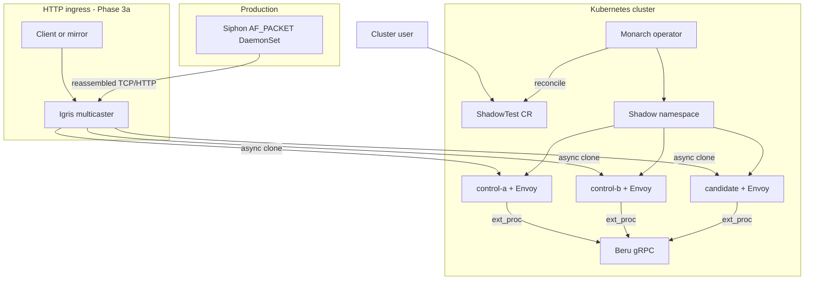
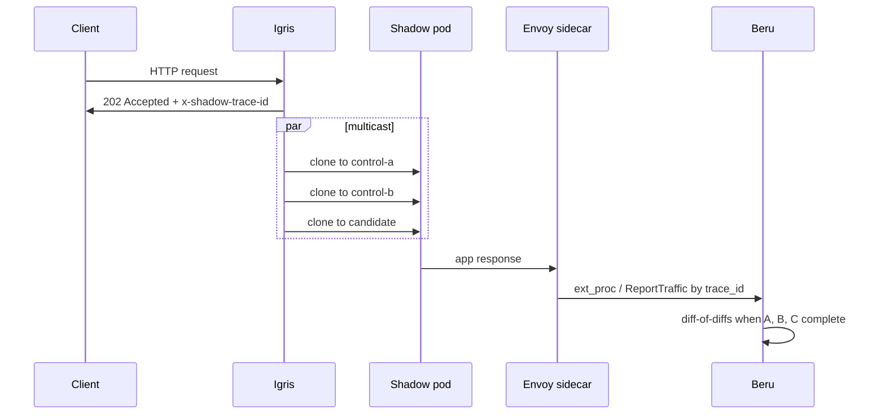
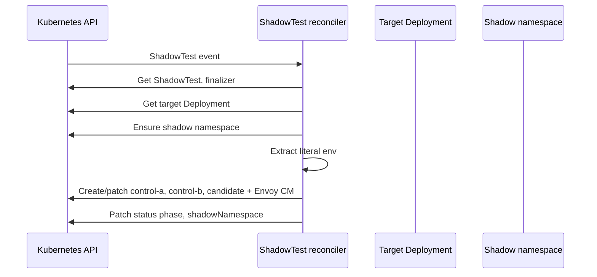
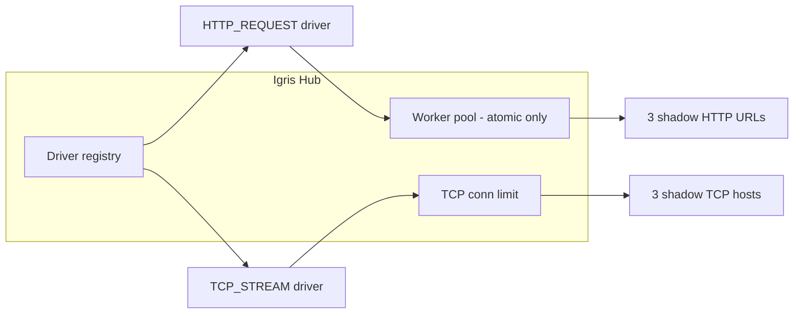

# Shadow-Diff — Architecture

Shadow-Diff is an open-source differential testing framework for Kubernetes. It replays captured or synthetic traffic across **three isolated shadow workloads** (two identical controls plus a candidate) and compares responses to find regressions while filtering non-deterministic noise.

This document describes how **Monarch**, **Igris**, and **Beru** fit together in the monorepo. For Monarch directory layout and development workflow, see [monarch/REPO_OVERVIEW.md](monarch/REPO_OVERVIEW.md).

---

## Monorepo layout

| Path | Module | Role |
|------|--------|------|
| [`monarch/`](monarch/) | `github.com/shadow-diff/monarch` | Kubernetes operator — `ShadowTest` CRD, shadow namespace, Deployments, Envoy sidecar config |
| [`igris/`](igris/) | `github.com/shadow-diff/igris` | HTTP multicaster — L7 fan-out to control-a, control-b, candidate |
| [`beru/`](beru/) | `github.com/shadow-diff/beru` | gRPC differ — ingest, correlation, diff-of-diffs |
| [`siphon/`](siphon/) | `github.com/shadow-diff/siphon` | AF_PACKET capture agent — reassembles prod HTTP and forwards to Igris |

Each service is a **separate Go module** with its own `Dockerfile` and `Makefile`. The repo root [`Makefile`](Makefile) delegates builds and tests.

---

## The three-pod strategy

| Role | Image | Purpose |
|------|-------|---------|
| **Control A** | `spec.oldImage` | Baseline (old version) |
| **Control B** | `spec.oldImage` | Identical to A — surfaces dynamic / noisy fields |
| **Candidate** | `spec.newImage` | Version under test |

Monarch materializes these as Deployments in a dedicated shadow namespace. Beru compares their **ingress responses** per trace. Igris can **clone HTTP requests** to all three in parallel when traffic enters at L7.

---

## End-to-end data flow

**Correlation header:** `x-shadow-trace-id` is set by Igris (or upstream), propagated through Envoy (`generate_request_id` / header mutation in Monarch-rendered config), and used by Beru to match the three ingress responses.

---

## Monarch (control plane)

Monarch is a **Kubebuilder / controller-runtime** operator. It runs as a manager `Deployment` and reconciles `ShadowTest` (`engine.shadow-diff.io/v1alpha1`).

### What it does

- Reads an existing **target Deployment** (`spec.targetDeployment`, `spec.targetNamespace`).
- Creates a **shadow namespace** and three **Deployments**: `<name>-control-a`, `<name>-control-b`, `<name>-candidate`.
- Injects an **Envoy sidecar** per pod with config that includes `ext_proc` to Beru, request ID / `x-shadow-trace-id` handling, and ingress on `spec.applicationPort`.
- Copies **literal `env` from the target’s first container only** (MVP); surfaces limitations in status.

### What it does not do

- Deploy **Beru** or **Igris** (apply `beru/deploy/` and run Igris separately).
- Multicast HTTP traffic (that is **Igris**).
- Run diffs (that is **Beru**).

### Reconcile loop (summary)

| CRD concern | Spec fields |
|-------------|-------------|
| Target | `targetDeployment`, `targetNamespace` |
| Images | `oldImage`, `newImage` |
| Ports | `servicePort`, `applicationPort` |
| Beru | `beruGRPCAddress` (Envoy `ext_proc` cluster) |
| Igris listeners | `inputs[]` (`port`, `driver`); default `[{port: servicePort, driver: http_request}]` |
| Igris overrides | `igris.image`, `igris.replicas`, `igris.resources` |

**Lifecycle:** A finalizer blocks CR deletion until the shadow namespace is cleaned up.

**Details:** [monarch/REPO_OVERVIEW.md](monarch/REPO_OVERVIEW.md), [monarch/DEPLOYMENT.md](monarch/DEPLOYMENT.md).

---

## Igris (universal traffic hub — driver architecture)

Igris is a **protocol-agnostic hub** with pluggable **input drivers**. The hub routes **atomic** traffic (HTTP) through a worker pool and **streaming** traffic (raw TCP) through per-connection goroutines with fan-out.

### Input drivers

| Driver | Type | Ingress unit | Dispatch |
|--------|------|--------------|----------|
| `http_request` | Atomic | One HTTP request | Worker pool → 3 parallel HTTP clones |
| `tcp_stream` | Streaming | One TCP connection | Goroutine + `io.MultiWriter` to 3 TCP targets |
| `async_message` | — | Reserved | Not implemented |

**HTTP driver:** `ParseMetadata` (trace ID), header redaction, **202 Accepted**, async multicast.

**TCP driver:** No redaction (shadow `NetworkPolicy` isolation); **idle timeout** (`IGRIS_TCP_IDLE_TIMEOUT`, default 5m) closes stale relays; **connection limit** (`IGRIS_MAX_TCP_CONNS`, default 1024).

### Configuration

| Source | Purpose |
|--------|---------|
| ConfigMap `listeners.json` | `[{"port":80,"driver":"http_request"},...]` — Monarch writes from `spec.inputs` |
| `IGRIS_LISTENERS_FILE` | Path to listeners file (default `/etc/igris/listeners.json`) |
| `CONTROL_*_URL` | HTTP multicast bases (`http://…:servicePort`) — always set |
| `CONTROL_*_ADDR` | TCP host bases (no port; Igris appends listener port) — always set |
| `IGRIS_WORKER_POOL_SIZE` | Worker pool size (optional) |
| `IGRIS_MAX_TCP_CONNS` | TCP stream semaphore (optional) |
| `IGRIS_TCP_IDLE_TIMEOUT` | Idle relay timeout (optional) |
| `IGRIS_TCP_DIAL_TIMEOUT` | Outbound TCP dial timeout (optional) |

Legacy `addon: http` in `listeners.json` maps to `http_request`. Standalone default: `[{"port":8080,"driver":"http_request"}]`.

### Shutdown (graceful drain)

On **SIGINT/SIGTERM**:

1. **`StopAccepting`** on all drivers (HTTP `Shutdown`, TCP listener close).
2. **`WaitPendingAtomic`** — drain HTTP multicasts.
3. **`WaitPendingStreams`** — drain TCP relays.
4. Stop worker pool and exit.

`terminationGracePeriodSeconds` on the Igris pod is **35s** (Monarch default).

### Monarch integration

Monarch deploys Igris with **mixed-mode env** (all six `CONTROL_*_URL` + `CONTROL_*_ADDR` vars). `spec.inputs[].driver` is auto-inferred when omitted (`servicePort` and ports 80/443/8080 → `http_request`; else `tcp_stream`). Shadow **Services** expose every port in `spec.inputs` (plus Envoy `ingress` on `servicePort`).

**Code:** [`igris/internal/core/`](igris/internal/core/), [`igris/internal/driver/`](igris/internal/driver/), [`monarch/internal/controller/shadowtest_igris.go`](monarch/internal/controller/shadowtest_igris.go).

---

## Beru (differ — Phase 2b)

Beru is a **gRPC** server that receives traffic reports from Envoy sidecars and runs **diff-of-diffs** analysis.

### APIs

| API | Purpose |
|-----|---------|
| **`TrafficReporter.ReportTraffic`** | Manual / direct reports (role, trace_id, payload) |
| **Envoy `ext_proc`** | Observe ingress response headers/body; correlate by `x-shadow-trace-id` and `SHADOW_ROLE` |

### Diff-of-diffs logic

1. **Diff(Control A, Control B)** → noise fields (change on identical builds).
2. **Diff(Control A, Candidate)** → total changes.
3. **Regressions** ≈ total changes minus noise.

The ingest **store** holds pending traces (TTL / max size from env e.g. `BERU_TRACE_TTL`, `BERU_MAX_PENDING_TRACES`) until all three roles report or timeout.

**Code:** [`beru/cmd/beru/main.go`](beru/cmd/beru/main.go), [`beru/internal/envoyextproc/`](beru/internal/envoyextproc/), [`beru/internal/ingest/`](beru/internal/ingest/).

---

## Deployment boundaries

| Component | Typical install |
|-----------|-----------------|
| Monarch | `make -C monarch deploy IMG=...` → `monarch-system` |
| Beru | `kubectl apply -f beru/deploy/` → `beru-system` |
| Igris | Deployed by Monarch into each shadow namespace; image via `spec.igris.image` (default `igris:latest`) |

ShadowTest spec field **`beruGRPCAddress`** must match the Beru Service DNS name Envoy uses in generated YAML.

---

## Technology stack

| Layer | Technologies |
|-------|----------------|
| Control plane | Go, Kubebuilder, controller-runtime |
| HTTP multicast | Go, `net/http`, `log/slog` |
| Shadow proxy | Envoy v1.26, `ext_proc`, ConfigMaps from Monarch |
| Analysis | Go, gRPC, protobuf |
| Capture | AF_PACKET (`siphon/`) — multi-interface capture, userspace filter, `gopacket/tcpassembly`, HTTP replay to Igris |

---

## MVP scope and roadmap

| Area | Current MVP | Not yet / design only |
|------|-------------|------------------------|
| Monarch env copy | First container, literal `env` only | Full `envFrom`, volumes, HPA |
| Traffic capture | AF_PACKET Siphon → Igris (DaemonSet in `siphon-system`) | TLS decrypt, per-ShadowTest sample rates |
| Beru storage | In-memory store | Redis / Postgres per design docs |
| Igris | HTTP + TCP drivers, mixed-mode env | `async_message`, metrics |

---

## Related reading

- [README.md](README.md) — quick start and component table
- [VERIFICATION.md](VERIFICATION.md) — Monarch, Beru, and Igris verification steps
- [monarch/REPO_OVERVIEW.md](monarch/REPO_OVERVIEW.md) — Monarch file layout
- [monarch/DEPLOYMENT.md](monarch/DEPLOYMENT.md) — operator install
- [project-files/architacture.md](project-files/architacture.md) — early design notes (partially superseded by this doc)
