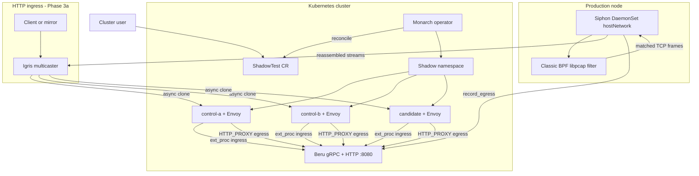
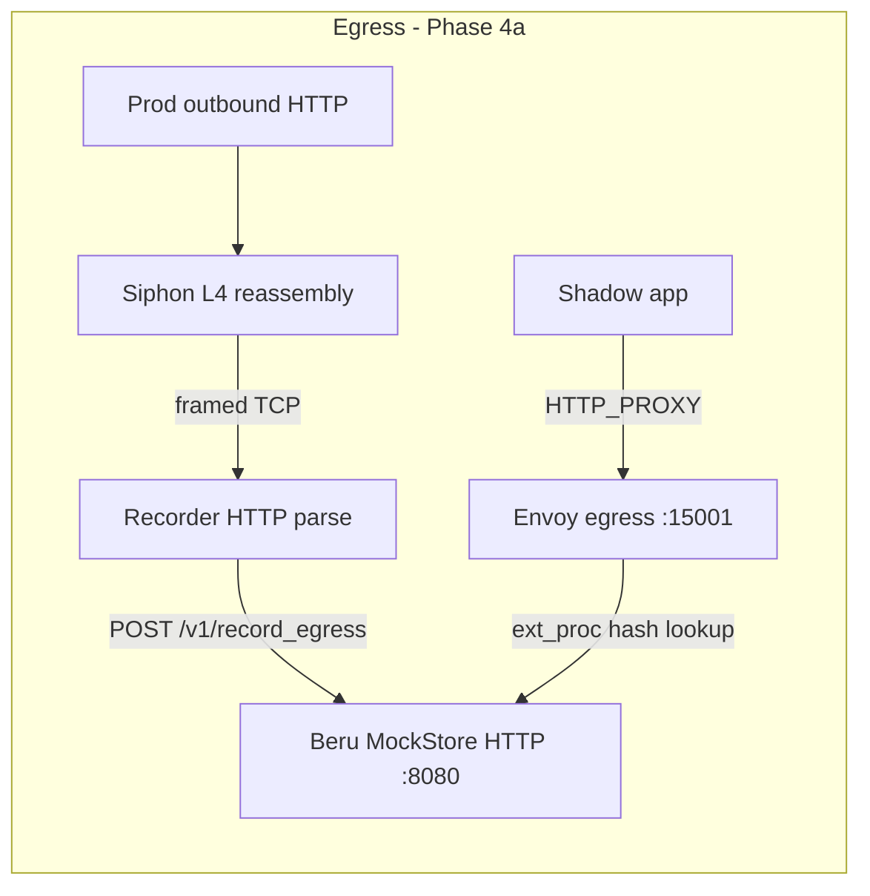
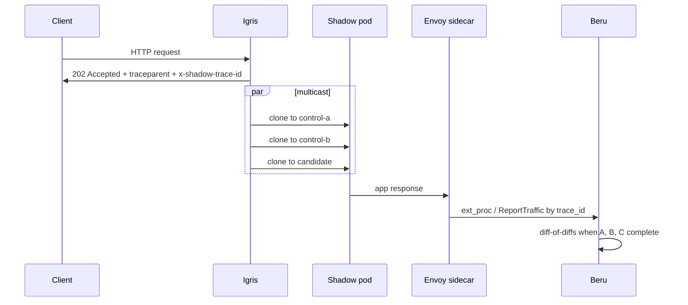
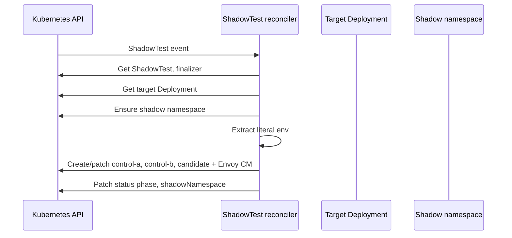
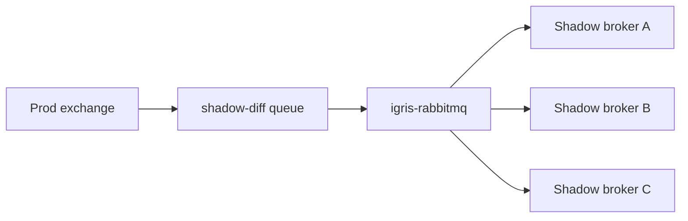
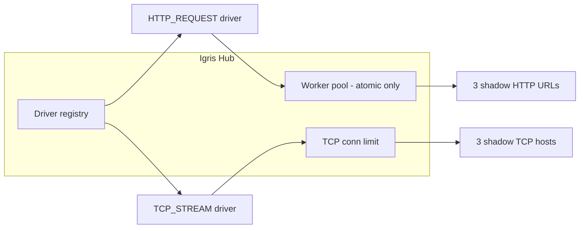
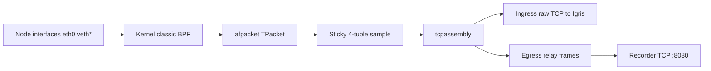
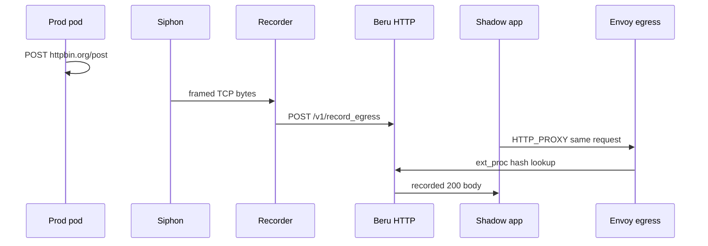

# Shadow-Diff — Architecture

Shadow-Diff is an open-source differential testing framework for Kubernetes. It replays captured or synthetic traffic across **three isolated shadow workloads** (two identical controls plus a candidate) and compares responses to find regressions while filtering non-deterministic noise.

This document describes how **Monarch**, **Igris**, **Beru**, and **Siphon** fit together in the monorepo. For Monarch directory layout and development workflow, see [monarch/REPO_OVERVIEW.md](monarch/REPO_OVERVIEW.md).

**Current MVP status (2026):** ingress capture and replay (Siphon → Igris → shadow Envoy → Beru diff-of-diffs), shadow egress strict replay (Phase 4a.1), and prod egress auto-recording into Beru’s mock store (Phase 4a.2) are implemented and covered by Kind E2E scripts. See [README.md](README.md) for a component summary and [VERIFICATION.md](VERIFICATION.md) for verification steps.

---

## Monorepo layout

| Path | Module | Role |
|------|--------|------|
| [`monarch/`](monarch/) | `github.com/shadow-diff/monarch` | Kubernetes operator — `ShadowTest` CRD, shadow namespace, Deployments, Envoy sidecar config |
| [`igris/`](igris/) | `github.com/shadow-diff/igris` | HTTP multicaster — L7 fan-out to control-a, control-b, candidate |
| [`beru/`](beru/) | `github.com/shadow-diff/beru` | gRPC differ — ingest, correlation, diff-of-diffs |
| [`siphon/`](siphon/) | `github.com/shadow-diff/siphon` | AF_PACKET capture agent — kernel classic BPF filter, TCP reassembly, HTTP replay to Igris |

Each service is a **separate Go module** with its own `Dockerfile` and `Makefile`. The repo root [`Makefile`](Makefile) delegates builds and tests.

---

## The three-pod strategy

| Role | Image | Purpose |
|------|-------|---------|
| **Control A** | `spec.oldImage` | Baseline (old version) |
| **Control B** | `spec.oldImage` | Identical to A — surfaces dynamic / noisy fields |
| **Candidate** | `spec.newImage` | Version under test |

Monarch materializes these as Deployments in a dedicated shadow namespace. Beru compares their **ingress responses** per trace. Igris can **clone HTTP requests** to all three in parallel when traffic enters at L7.

---

## End-to-end data flow

**Correlation headers:** Igris sets W3C **`traceparent`** (`00-{32-hex-trace-id}-{16-hex-span-id}-01`) and **`x-shadow-trace-id`** (same 32-char trace id, backward compatible). Beru prefers `x-shadow-trace-id`, then parses `traceparent`, then falls back to Envoy `x-request-id`. Envoy ingress/egress **pass through** `traceparent` without stripping.

**OpenTelemetry (shadow pods):** Monarch annotates shadow app pods for the [OpenTelemetry Operator](https://github.com/open-telemetry/opentelemetry-operator) (`inject-sdk` + language-specific `inject-*` from image heuristic). The auto-instrumentation agent propagates W3C context on outbound HTTP and supported database clients. Opt out via `spec.otelInjection.enabled: false`.

**Async context limitation:** Untracked goroutines or custom thread pools may drop trace context on outbound calls (no `traceparent`). That is expected; Beru can fall back to **sequence-based diffing** when trace correlation is incomplete.

---

## Monarch (control plane)

Monarch is a **Kubebuilder / controller-runtime** operator. It runs as a manager `Deployment` and reconciles `ShadowTest` (`engine.shadow-diff.io/v1alpha1`).

### What it does

- Reads an existing **target Deployment** (`spec.targetDeployment`, `spec.targetNamespace`).
- Creates a **shadow namespace** and three **Deployments**: `<name>-control-a`, `<name>-control-b`, `<name>-candidate`.
- Injects an **Envoy sidecar** per pod with config that includes `ext_proc` to Beru, request ID / `x-shadow-trace-id` handling, **W3C traceparent pass-through**, and ingress on `spec.applicationPort`.
- Enables **OTel Operator auto-instrumentation** on shadow app pods by default (`spec.otelInjection`, annotations + `OTEL_*` env for propagation-only MVP).
- Copies **literal `env` from the target’s first container only** (MVP); surfaces limitations in status.
- Ensures **Siphon** DaemonSet in `siphon-system` (image from `spec.siphon.image`), lists production pod IPs, and pushes merged capture config (`POST /v1/config`) using node **hostIP** when Siphon runs with `hostNetwork`.
- When **`spec.downstreams`** is set: injects `HTTP_PROXY=http://127.0.0.1:15001` into shadow app containers and renders Envoy **egress_proxy** listener with `ext_proc` to Beru (strict replay).
- Deploys **Recorder** per shadow namespace when **`spec.downstreams`** is set (ConfigMap `downstreams.json`, Service `:8080`).
- Maps **`spec.downstreams`** → Siphon `downstreams` + **`recorder_host`** (Recorder cluster DNS) so prod egress bytes relay to Recorder (Phase 4a.2).
- Resolves **exclude IPs** (Igris + Beru + Recorder ClusterIPs) so Siphon BPF does not capture shadow/control-plane traffic.

### What it does not do

- Deploy **Beru** (apply `beru/deploy/` separately).
- Multicast HTTP traffic (that is **Igris**).
- Run diffs or store egress mocks (that is **Beru**).
- Apply the Siphon DaemonSet manifest directly in Kind E2E — Monarch creates/patches the DaemonSet; only **`siphon/deploy/rbac.yaml`** (namespace + ServiceAccount) is applied upfront.

### Reconcile loop (summary)

| CRD concern | Spec fields |
|-------------|-------------|
| Target | `targetDeployment`, `targetNamespace` |
| Images | `oldImage`, `newImage` |
| Ports | `servicePort`, `applicationPort` |
| Beru | `beruGRPCAddress` (Envoy `ext_proc` cluster) |
| Igris listeners | `inputs[]` (`port`, `driver`); default `[{port: servicePort, driver: http_request}]` |
| RabbitMQ ingress | `inputs[]` with `driver: rabbitmq_message` + `amqp` (AMQP-only; no HTTP Igris / no Siphon ingress ports) |
| Igris overrides | `igris.image`, `igris.replicas`, `igris.resources` |
| igris-rabbitmq | `igrisRabbitmq.image` — separate Deployment when `rabbitmq_message` inputs are used |
| Siphon | `siphon.enabled`, `siphon.image`, `siphon.sampleRate` |
| Egress hosts | `downstreams[]` (`host`, `ignoreRequestPaths`) — shadow proxy trap + Siphon egress record filter |

**Lifecycle:** A finalizer blocks CR deletion until the shadow namespace is cleaned up.

**Siphon reconcile:** Monarch merges config for all Ready ShadowTests, calls `ensureSiphonDaemonSet(ctx, siphonImageFor(st))`, then `POST`s JSON to each agent’s hostIP. Status fields: `captureTargets`, `siphonPhase` (`Ready` / `Degraded` / `Disabled`), `igrisEndpoint`.

**Details:** [monarch/REPO_OVERVIEW.md](monarch/REPO_OVERVIEW.md), [monarch/DEPLOYMENT.md](monarch/DEPLOYMENT.md), [`scripts/lib/siphon-config.sh`](scripts/lib/siphon-config.sh) (E2E wait helpers).

### RabbitMQ ingress (Phase 5b)

For **AMQP-only** ShadowTests, Monarch declares a **production broker queue** once (`shadow-diff-<uid>` with `x-max-length`, `x-overflow: drop-head`, `x-expires`), stores the name in **`status.amqpQueueName`**, and deploys **`igris-rabbitmq`** in the shadow namespace. **Siphon is not used for ingress** (optional egress-only capture if `spec.downstreams` and Siphon are enabled).

`igris-rabbitmq` consumes the prod queue, injects W3C **`traceparent`** and **`x-shadow-trace-id`** on multicast (same resolution order as HTTP Igris), runs **`ExchangeDeclare`** on each shadow broker, and publishes clones to all three role-specific RabbitMQ dependencies (`spec.dependencies`). Shadow workers propagate both headers on outbound HTTP to Envoy for Beru correlation and OTel context.

---

## Igris (universal traffic hub — driver architecture)

Igris is a **protocol-agnostic hub** with pluggable **input drivers**. The hub routes **atomic** traffic (HTTP) through a worker pool and **streaming** traffic (raw TCP) through per-connection goroutines with fan-out.

### Input drivers

| Driver | Type | Ingress unit | Dispatch |
|--------|------|--------------|----------|
| `http_request` | Atomic | One HTTP request | Worker pool → 3 parallel HTTP clones |
| `tcp_stream` | Streaming | One TCP connection | Goroutine + `io.MultiWriter` to 3 TCP targets |
| `async_message` | — | Reserved | Not implemented |

**HTTP driver:** `ParseMetadata` (trace ID), header redaction, **202 Accepted**, async multicast.

**TCP driver:** No redaction (shadow `NetworkPolicy` isolation); **idle timeout** (`IGRIS_TCP_IDLE_TIMEOUT`, default 5m) closes stale relays; **connection limit** (`IGRIS_MAX_TCP_CONNS`, default 1024).

### Configuration

| Source | Purpose |
|--------|---------|
| ConfigMap `listeners.json` | `[{"port":80,"driver":"http_request"},...]` — Monarch writes from `spec.inputs` |
| `IGRIS_LISTENERS_FILE` | Path to listeners file (default `/etc/igris/listeners.json`) |
| `CONTROL_*_URL` | HTTP multicast bases (`http://…:servicePort`) — always set |
| `CONTROL_*_ADDR` | TCP host bases (no port; Igris appends listener port) — always set |
| `IGRIS_WORKER_POOL_SIZE` | Worker pool size (optional) |
| `IGRIS_MAX_TCP_CONNS` | TCP stream semaphore (optional) |
| `IGRIS_TCP_IDLE_TIMEOUT` | Idle relay timeout (optional) |
| `IGRIS_TCP_DIAL_TIMEOUT` | Outbound TCP dial timeout (optional) |

Legacy `addon: http` in `listeners.json` maps to `http_request`. Standalone default: `[{"port":8080,"driver":"http_request"}]`.

### Shutdown (graceful drain)

On **SIGINT/SIGTERM**:

1. **`StopAccepting`** on all drivers (HTTP `Shutdown`, TCP listener close).
2. **`WaitPendingAtomic`** — drain HTTP multicasts.
3. **`WaitPendingStreams`** — drain TCP relays.
4. Stop worker pool and exit.

`terminationGracePeriodSeconds` on the Igris pod is **35s** (Monarch default).

### Monarch integration

Monarch deploys Igris with **mixed-mode env** (all six `CONTROL_*_URL` + `CONTROL_*_ADDR` vars). `spec.inputs[].driver` is auto-inferred when omitted (`servicePort` and ports 80/443/8080 → `http_request`; else `tcp_stream`). Shadow **Services** expose every port in `spec.inputs` (plus Envoy `ingress` on `servicePort`).

**Code:** [`igris/internal/core/`](igris/internal/core/), [`igris/internal/driver/`](igris/internal/driver/), [`monarch/internal/controller/shadowtest_igris.go`](monarch/internal/controller/shadowtest_igris.go).

---

## Siphon (capture agent — Phase 3b + 4a.2)

Siphon is a **pure Go** node agent (`siphon-system` DaemonSet) that mirrors production TCP traffic into the shadow pipeline and **relays prod outbound bytes** to **Recorder** for egress replay. It does **not** load custom eBPF programs into the kernel; it uses **classic BPF** (the same expression language as tcpdump/libpcap), compiled in userspace and attached to an **AF_PACKET** (`TPacket`) socket. Siphon is **L4-only** (no `net/http` on the capture path).

### Dual capture paths

| Path | Direction | Action |
|------|-----------|--------|
| **Ingress replay** | Client → prod pod (dst port in `target_ports`) | TCP reassembly → raw forward to **Igris** |
| **Egress relay** | Prod pod ↔ `spec.downstreams` host (cleartext HTTP) | TCP reassembly → length-prefixed frames to **Recorder** |

Egress relay requires Monarch to push `downstreams`, `recorder_host`, and prod `target_ips` in the same `/v1/config` payload. BPF includes clauses for downstream host/port **and** `src host <prodIP>` so outbound flows from the prod pod are visible.

### Why classic BPF, not raw eBPF

| Approach | Shadow-Diff choice |
|----------|-------------------|
| **Raw eBPF** (TC/XDP/cgroup skb programs) | Not used — higher operational complexity, verifier limits, separate build/deploy per kernel |
| **Classic BPF via libpcap** | **Current** — `pcap.CompileBPFFilter` + `gopacket/afpacket` `SetBPF`; portable on typical Linux nodes with `CAP_NET_RAW` |

Filtering happens **in the kernel** (dropped packets never reach userspace). **Sticky sampling**, **TCP reassembly**, and **forwarding to Igris** stay in Go (`gopacket/tcpassembly`).

### Capture pipeline

1. **Monarch** `POST`s target pod **IPv4**, **ports**, **igris_host**, **downstreams**, **recorder_host**, **exclude_ips** to `http://<node hostIP>:8080/v1/config` (Siphon uses `hostNetwork: true`).
2. **`BuildBPFFilter`** builds e.g. `tcp and ( (host 10.244.0.21 and port 80) or ... )` — `host` matches **both directions** (client→pod and pod→client) for reassembly.
3. Filter is compiled with **`captureSnapLen`** (8192, shared with `OptFrameSize`) and attached per interface.
4. On Kind without `cni0`, **`SIPHON_INTERFACE=any`** selects `eth0` plus all `veth*` peers carrying pod traffic.
5. Sampled request-path streams are forwarded as raw bytes to **Igris** on the listener port that matches the captured destination port (e.g. **80**).

### Control API

| Endpoint | Purpose |
|----------|---------|
| `POST /v1/config` | `sample_rate`, `targets[]` (`target_ips`, `target_ports`, `igris_host`, `listeners`, `downstreams`, `recorder_host`, `exclude_ips`) |
| `GET /v1/status` | `frames_read`, `packets`, `requests_forwarded`, `interfaces`, `targets_count`, `downstreams_count`, `recorder_host_configured` |

`ApplyBPFFilter()` hot-updates all open handles when config changes (prod pod IP rollout) without restarting the DaemonSet.

### Deployment

| Setting | Value |
|---------|--------|
| `hostNetwork` | `true` |
| Capabilities | `CAP_NET_RAW`, `CAP_NET_ADMIN` (not full `privileged`) |
| `runAsUser` | `0` |
| `SIPHON_INTERFACE` | `any` (Kind: `eth0` + `veth*`); avoid `cni0` if absent on node |

**Monarch:** `spec.siphon` (`enabled`, `image`, `sampleRate`); creates/patches DaemonSet; pushes global merged config; `status.siphonPhase` / `status.captureTargets`. Config POST uses **`pod.Status.HostIP`** when `hostNetwork` is enabled.

**Kind E2E:** [`scripts/e2e-reset-kind.sh`](scripts/e2e-reset-kind.sh) applies `siphon/deploy/rbac.yaml` only, patches `spec.siphon.image` from `$SIPHON_IMG`, and verifies Monarch pushed recorder config before tests. Do not fight Monarch with manual `kubectl set image` on the DaemonSet.

**Code:** [`siphon/internal/capture/`](siphon/internal/capture/) (`bpf.go`, `capture.go`), [`siphon/internal/egress/`](siphon/internal/egress/) (session, relay), [`siphon/internal/api/`](siphon/internal/api/), [`monarch/internal/controller/shadowtest_siphon.go`](monarch/internal/controller/shadowtest_siphon.go).

---

## Recorder (egress HTTP parser — Phase 4a.2)

Recorder is a **pure Go** Deployment in each shadow namespace (alongside Igris). It accepts **length-prefixed TCP frames** from Siphon (`R` = prod→remote request leg, `S` = remote→prod response leg), pairs them via `io.Pipe`, parses HTTP with `http.ReadRequest` / `http.ReadResponse`, filters by **`downstreams.json`** (ConfigMap mount), and **`POST`s** to Beru **`/v1/record_egress`**.

| Setting | Value |
|---------|--------|
| Listen | `RECORDER_LISTEN_ADDR` (default `:8080`) |
| Beru | `BERU_HTTP_URL` (e.g. `http://beru.beru-system.svc.cluster.local:8080`) |
| Downstreams | `RECORDER_DOWNSTREAMS_FILE` (default `/etc/recorder/downstreams.json` from ConfigMap) |
| Pair TTL | `RECORDER_PAIR_TIMEOUT` (default `30s`) — evicts stalled half-streams |

**Monarch:** `reconcileRecorderConfigMap` / `Deployment` / `Service`; gates ShadowTest **Ready** on Recorder `AvailableReplicas > 0` when `spec.downstreams` is non-empty.

**Code:** [`recorder/`](recorder/), [`monarch/internal/controller/shadowtest_recorder.go`](monarch/internal/controller/shadowtest_recorder.go).

### Port alignment (E2E / http-https-echo)

| Hop | Port | Notes |
|-----|------|--------|
| Production app | **80** | BPF `target_ports`; Siphon → Igris listener **80** |
| Envoy ingress (shadow) | **8888** | Igris multicasts to shadow Services here |
| Shadow app (`applicationPort`) | **80** | Must match app listen port after Monarch copies prod `HTTP_PORT=80` |

See [`examples/e2e-shadowtest.yaml`](examples/e2e-shadowtest.yaml) and [`scripts/e2e-reset-kind.sh`](scripts/e2e-reset-kind.sh).

---

## Beru (differ — Phase 2b + egress HTTP)

Beru is a **gRPC** server that receives traffic reports from Envoy sidecars and runs **diff-of-diffs** analysis. It also exposes an **HTTP API** on `:8080` for egress mock storage and auto-recording from Siphon.

### APIs

| API | Purpose |
|-----|---------|
| **`TrafficReporter.ReportTraffic`** (gRPC) | Manual / direct ingress reports (role, trace_id, payload) |
| **Envoy `ext_proc` (ingress)** | Observe shadow app response headers/body; correlate by `x-shadow-trace-id` and `SHADOW_ROLE` |
| **Envoy `ext_proc` (egress)** | Hash outbound request (method, host, path, body; optional JSON path stripping); return mock or **HTTP 599** on miss |
| **`POST /v1/seed_mock`** (HTTP) | Manually seed egress response (Phase 4a.1 E2E) |
| **`POST /v1/record_egress`** (HTTP) | Auto-seed from Siphon prod capture — same storage as `seed_mock` (Phase 4a.2) |

### Diff-of-diffs logic (ingress)

1. **Diff(Control A, Control B)** → noise fields (change on identical builds).
2. **Diff(Control A, Candidate)** → total changes.
3. **Regressions** ≈ total changes minus noise.

The ingest **store** holds pending traces (TTL / max size from env e.g. `BERU_TRACE_TTL`, `BERU_MAX_PENDING_TRACES`) until all three roles report or timeout.

**Egress MockStore:** In-memory map keyed by request hash; shared by `seed_mock`, `record_egress`, and egress `ext_proc` lookup.

**Code:** [`beru/cmd/beru/main.go`](beru/cmd/beru/main.go), [`beru/internal/envoyextproc/`](beru/internal/envoyextproc/), [`beru/internal/ingest/`](beru/internal/ingest/), [`beru/internal/api/http.go`](beru/internal/api/http.go).

---

## Egress replay (Phase 4a)

### 4a.1 — Shadow strict replay

When `spec.downstreams` lists external hosts (e.g. `httpbin.org`):

1. Monarch injects **`HTTP_PROXY=http://127.0.0.1:15001`** into shadow app containers.
2. Envoy **egress_proxy** listener (port 15001) terminates CONNECT/HTTP proxy requests, calls Beru **ext_proc** with buffered body, and returns stored mock or **599 Egress Regression** on miss.
3. Tests seed mocks via **`POST /v1/seed_mock`** or rely on 4a.2 auto-record.

**E2E:** [`examples/e2e-egress-test.sh`](examples/e2e-egress-test.sh)

### 4a.2 — Prod auto-record

1. Prod pod makes cleartext outbound HTTP to a configured downstream host.
2. Siphon BPF matches prod-as-source flows, reassembles TCP, relays framed bytes to **Recorder**.
3. Recorder parses HTTP, pairs response, **`POST`s** `{method, host, path, body, response}` to Beru **`/v1/record_egress`**.
4. Shadow replay via `HTTP_PROXY` hits the same hash → **200** without manual `seed_mock`.

**E2E:** [`examples/e2e-record-replay.sh`](examples/e2e-record-replay.sh)

---

## Deployment boundaries

| Component | Typical install |
|-----------|-----------------|
| Monarch | `make -C monarch deploy IMG=...` → `monarch-system` |
| Beru | `kubectl apply -f beru/deploy/` → `beru-system` (gRPC `:50051`, HTTP `:8080`) |
| Igris | Deployed by Monarch into each shadow namespace; image via `spec.igris.image` (default `igris:latest`) |
| Recorder | Deployed by Monarch into each shadow namespace when `spec.downstreams` is set; default image `recorder:latest` |
| Siphon | **Monarch-managed DaemonSet** in `siphon-system`; bootstrap RBAC via `kubectl apply -f siphon/deploy/rbac.yaml`; image via `spec.siphon.image` |

ShadowTest fields **`beruGRPCAddress`** (Envoy ingress/egress ext_proc) and **`downstreams`** (egress trap + Siphon record filter) must align with deployed Beru and external hosts.

**Kind E2E:** [`scripts/e2e-reset-kind.sh`](scripts/e2e-reset-kind.sh) — full reset/deploy, patches `$SIPHON_IMG` / `$IGRIS_IMG` on ShadowTest, verifies Siphon recorder config. Tests: [`examples/e2e-pipeline-test.sh`](examples/e2e-pipeline-test.sh) (ingress), [`examples/e2e-egress-test.sh`](examples/e2e-egress-test.sh) (4a.1), [`examples/e2e-record-replay.sh`](examples/e2e-record-replay.sh) (4a.2).

---

## Technology stack

| Layer | Technologies |
|-------|----------------|
| Control plane | Go, Kubebuilder, controller-runtime |
| HTTP multicast | Go, `net/http`, `log/slog` |
| Shadow proxy | Envoy v1.26, `ext_proc`, ConfigMaps from Monarch |
| Analysis | Go, gRPC, protobuf |
| Capture | Go + `gopacket/afpacket`, **classic BPF** (libpcap compile), `tcpassembly`, ingress forward to Igris, egress relay to Recorder |
| Egress parse | Recorder: framed TCP ingest, HTTP parse, `POST` Beru `/v1/record_egress` |
| Egress replay | Envoy egress listener + Beru HTTP MockStore + Siphon auto-record |

---

## MVP scope and roadmap

| Area | Status | Notes |
|------|--------|-------|
| Monarch shadow stack | **Done (MVP)** | Three Deployments, Envoy ingress + optional egress, Igris, env copy (first container literal `env` only) |
| Ingress diff-of-diffs | **Done (MVP)** | Beru gRPC + Envoy ingress `ext_proc` |
| Igris HTTP/TCP drivers | **Done (MVP)** | Mixed-mode env; `async_message` not implemented |
| Siphon ingress capture | **Done (MVP)** | Classic BPF + AF_PACKET → Igris; sticky sampling |
| Egress strict replay (4a.1) | **Done (MVP)** | `HTTP_PROXY`, Envoy egress, `seed_mock`, HTTP 599 on miss |
| Egress auto-record (4a.2) | **Done (MVP)** | Siphon → `/v1/record_egress`; Kind E2E in `e2e-record-replay.sh` |
| Monarch env copy | Partial | Full `envFrom`, volumes, HPA not yet |
| Siphon | Partial | Global `sample_rate`; no TLS decrypt, IPv6 BPF, or raw eBPF programs |
| Beru storage | Partial | In-memory ingress store + egress MockStore; no Redis/Postgres yet |

---

## Related reading

- [README.md](README.md) — quick start and component table
- [VERIFICATION.md](VERIFICATION.md) — Monarch, Beru, and Igris verification steps
- [monarch/REPO_OVERVIEW.md](monarch/REPO_OVERVIEW.md) — Monarch file layout
- [monarch/DEPLOYMENT.md](monarch/DEPLOYMENT.md) — operator install
- [project-files/architacture.md](project-files/architacture.md) — early design notes (partially superseded by this doc)
