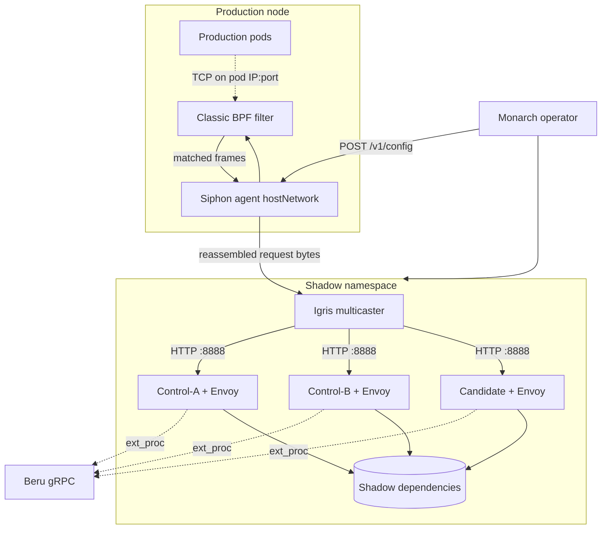

# Architecture: Shadow-Diff System (target state)

This document is the **product-level blueprint** for Shadow-Diff: how **Monarch**, **Igris**, **Beru**, and **Siphon** work together. For day-to-day monorepo layout, reconcile details, and verification commands, see [ARCHITECTURE.md](ARCHITECTURE.md) and [VERIFICATION.md](VERIFICATION.md).

**Capture agent note:** The original design called for a kernel **eBPF** (TC/XDP-style) siphon. The **implemented and verified** path uses **classic BPF** (libpcap/tcpdump expressions) compiled in Go and attached to **AF_PACKET** sockets—no custom eBPF bytecode in the cluster. Raw eBPF remains a possible future optimization, not the current MVP.

---

## 1. Vision

Shadow-Diff is a Kubernetes-native **differential shadowing** platform. Developers test a new image against traffic shaped like production without serving real users from the candidate. The system compares **Candidate** vs two identical **Control** pods to separate real regressions from noise (timestamps, IDs, ordering).

---

## 2. System overview

| Component | Role |
|-----------|------|
| **Monarch** | K8s operator — `ShadowTest` CRD, shadow namespace, Envoy sidecars, Igris + Siphon orchestration |
| **Siphon** | Node DaemonSet — passive capture, kernel BPF filter, TCP reassembly, forward to Igris |
| **Igris** | Protocol hub — redact (HTTP), multicast to three shadows, `202 Accepted` |
| **Beru** | Diff engine — correlate by `x-shadow-trace-id`, diff-of-diffs |

### High-level component diagram



---

## 3. The 3-way diff logic (noise filter)

1. **Noise discovery:** Beru diffs Control-A vs Control-B (same `oldImage`). Fields that differ are treated as noise.
2. **Regression detection:** Beru diffs Control-A vs Candidate.
3. **Result:** `(A vs Candidate) − noise mask = candidate regressions`.

Correlation uses **`x-shadow-trace-id`** (from Igris / Envoy `x-request-id` mutation).

---

## 4. Core components

### A. Monarch (orchestrator)

KubeBuilder operator for `ShadowTest` (`engine.shadow-diff.io/v1alpha1`).

- Provisions shadow namespace and three Deployments with **Envoy** sidecars (`ext_proc` → Beru).
- Deploys **Igris** in the shadow namespace; writes `listeners.json` from `spec.inputs`.
- Ensures **Siphon** DaemonSet in `siphon-system`; merges targets from all Ready ShadowTests and pushes **`POST /v1/config`** (via node **hostIP** when Siphon uses `hostNetwork`).
- Copies **literal env** from the target Deployment’s first container (MVP).
- **Ready** gating: shadows, Igris, and capture config reconciled before `status.phase: Ready`.

**Key spec (ports example — http-https-echo on Kind):**

| Field | Typical value | Meaning |
|-------|----------------|---------|
| `servicePort` | 8888 | Envoy ingress; Igris → shadow multicast |
| `applicationPort` | 80 | Envoy → app container (must match copied `HTTP_PORT`) |
| `inputs[].port` | 80, 8888 | Igris listeners; **80** = Siphon replay path |

### B. Igris (modular multicaster)

- Drivers: `http_request` (atomic, worker pool), `tcp_stream` (streaming).
- HTTP: header redaction, **202 Accepted**, async clone to three shadow base URLs at **`servicePort`**.
- Injects / preserves **`x-shadow-trace-id`** for Beru.
- Graceful shutdown: drain atomic work and TCP relays before exit.

### C. Beru (diff engine)

- gRPC **`ReportTraffic`** and Envoy **ext_proc** ingress reports.
- In-memory store with TTL; diff-of-diffs when A, B, C report for one trace.
- JSON payloads from echo/HTTP shadows; non-JSON bodies logged and skipped for structural diff.

### D. Siphon (capture agent) — classic BPF + Go

**Not raw eBPF.** Siphon is implemented in Go with **`github.com/google/gopacket`**:

| Layer | Technology |
|-------|------------|
| Socket | `afpacket.TPacket` (`hostNetwork`, `CAP_NET_RAW` / `CAP_NET_ADMIN`) |
| Filter | **Classic BPF** string → `pcap.CompileBPFFilter` → `SetBPF` (IPv4 `host` + `port`, OR across targets) |
| Match policy | Kernel drops non-matching frames before userspace |
| Sampling | Sticky hash on TCP 4-tuple + TTL map (`sample_rate` %) |
| Reassembly | `gopacket/tcpassembly` (relaxed flush on return path) |
| Egress | TCP connection pool to **Igris** per `igris_host` + listener port |

**Config (HTTP API):**

```json
{
  "sample_rate": 100,
  "targets": [{
    "shadowtest": "default/my-app-shadow",
    "target_ips": ["10.244.0.51"],
    "target_ports": [80],
    "igris_host": "my-app-shadow-igris.shadow-default-my-app-shadow.svc.cluster.local",
    "listeners": [{ "port": 80, "driver": "http_request" }]
  }]
}
```

**Operational constraints:**

- **IPv4 only** for BPF expressions today; IPv6 skipped at build time.
- **`captureSnapLen`** (8192) must match TPacket frame size and pcap compile snaplen.
- **Kind:** no `cni0` on many nodes — use `SIPHON_INTERFACE=any` to capture **`eth0` + `veth*`**.
- After `kind load`, **`kubectl rollout restart`** the DaemonSet so pods pick up the new image digest.

**Zero-impact intent:** Siphon is read-only on the wire; production forwarding is unchanged. Agent failure must not break prod paths (capture stops; prod continues).

#### Planned vs implemented (capture)

| Original plan (design) | Current MVP |
|------------------------|-------------|
| eBPF TC/XDP program + maps for IP/port | Classic BPF via libpcap on AF_PACKET |
| eBPF map per ShadowTest | Single merged filter string from Monarch |
| In-kernel sample rate | Userspace sticky sampling after BPF |
| TLS termination in agent | Not implemented |

---

## 5. Security and isolation

- Shadow workloads in a dedicated namespace; **NetworkPolicy** can block real-world egress (when applied).
- Igris redacts sensitive HTTP headers before shadow multicast.
- Shadow dependencies are ephemeral or mocked — no production write-back.
- Siphon runs as root on the node only for capture capabilities; not `privileged` full.

---

## 6. Traffic lifecycle (verified E2E)

1. **Request hits production** (pod IP, e.g. `:80`).
2. **Kernel BPF** on node interfaces allows frames to/from that IP:port.
3. **Siphon** samples the flow, reassembles TCP, forwards HTTP bytes to **Igris:80**.
4. **Igris** returns **202**, multicasts to **control-a / control-b / candidate** at **Envoy :8888**.
5. **Envoy** forwards to app **:80**; responses reported to **Beru** via ext_proc.
6. **Beru** completes diff-of-diffs when all three roles reported.

**Operator / Kind testing:**

```bash
./scripts/e2e-reset-kind.sh --run-test    # deploy stack + pipeline
./examples/e2e-pipeline-test.sh           # traffic only (uses node hostIP for Siphon API)
```

---

## 7. Extensibility

- **Igris:** new `ProtocolDriver` (e.g. Kafka, SQL) in `igris/internal/driver/`.
- **Beru:** new payload codecs in `beru/internal/payload/`.
- **Monarch:** CRD `inputs[].driver`, optional shadow dependency provisioning.
- **Siphon:** extend `BuildBPFFilter` (IPv6 `ip6 host`, more clauses); optional future **raw eBPF** for lower overhead at very high PPS.

---

## 8. Extension guide: adding a new protocol

### Step 1: Monarch

- Allow protocol in `spec.inputs` validation.
- Map listener ports in `shadowtest_igris.go` / `shadowServicePorts`.
- Add capture ports to Siphon target list via `buildSiphonTarget` (`target_ports` from resolved inputs).

### Step 2: Igris

- Implement driver under `igris/internal/driver/`.
- Register in hub; handle atomic vs streaming semantics.
- For DB-like protocols: stateful relay, scrub secrets in `Transform` / metadata parse.

### Step 3: Beru

- Add codec for non-JSON bodies; register in codec registry.

### Step 4: Siphon

- Ensure Monarch includes the **production listen port** in `target_ports` for BPF.
- If not HTTP, wire `tcp_stream` listener and forwarding driver in assembly layer.

---

## 9. Implementation checklist for new protocols

| Component | Task | Responsibility |
|-----------|------|----------------|
| **Monarch** | CRD / inputs | Declare port + driver |
| **Monarch** | Shadow app port | `applicationPort` matches real container listen port |
| **Siphon** | BPF clauses | `host <podIP> and port <prodPort>` per target |
| **Igris** | Driver | Parse, redact, multicast or stream |
| **Beru** | Codec | Normalize payloads for diff |

---

## 10. Related documents

| Document | Contents |
|----------|----------|
| [ARCHITECTURE.md](ARCHITECTURE.md) | Monorepo components, reconcile summary, Siphon/BPF detail |
| [VERIFICATION.md](VERIFICATION.md) | Install and E2E verification (Phase 3b BPF, Kind notes) |
| [examples/e2e-shadowtest.yaml](examples/e2e-shadowtest.yaml) | Reference ShadowTest with correct ports |
| [scripts/e2e-reset-kind.sh](scripts/e2e-reset-kind.sh) | Kind reset/deploy script |

Because each service keeps **plumbing** separate from **protocol logic**, new protocols mainly add an Igris driver + Beru codec + Monarch port wiring; Siphon only needs the production **IP:port** included in the BPF filter set.
