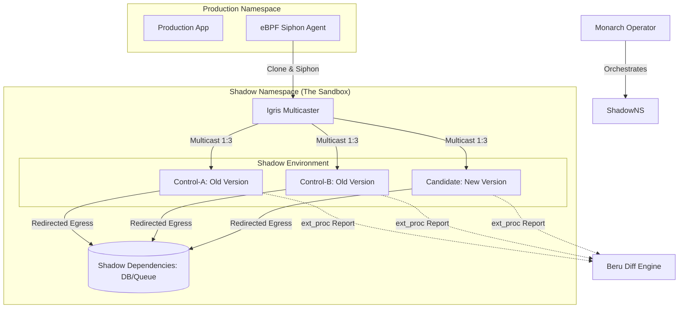

This `ARCHITECTURE.md` file provides a high-level technical blueprint of the final product. It explains how **Monarch**, **Igris**, **Beru**, and the **eBPF Siphon** work together to create a safe, generic, and automated shadow testing platform.

---

# Architecture: Shadow-Diff System

## 1. Vision
Shadow-Diff is a Kubernetes-native **Differential Shadowing** platform. It allows developers to test new versions of a service against real production traffic without impacting users. The system identifies regressions by comparing the behavior of a "Candidate" version against two identical "Control" versions to filter out non-deterministic noise (timestamps, random IDs).

## 2. System Overview
The system consists of four primary components:
1.  **Monarch (Orchestrator):** A K8s Operator that manages the lifecycle of shadow environments.
2.  **Igris (Modular Multicaster):** A protocol-aware traffic hub that redacts PII and fans out requests.
3.  **Beru (Diff Engine):** The "Brain" that performs 3-way comparison and noise filtering.
4.  **eBPF Siphon (Capture Agent):** A high-performance kernel-level agent that clones production traffic.

### High-Level Component Diagram


---

## 3. The 3-Way Diff Logic (The "Noise Filter")
To avoid false positives, the system uses two baseline pods (**Control-A** and **Control-B**) running the exact same version of the code.

1.  **Noise Discovery:** Beru compares `Response(A)` vs `Response(B)`. Any field that differs (e.g., a timestamp) is marked as **Noise**.
2.  **Regression Detection:** Beru compares `Response(A)` vs `Response(Candidate)`. 
3.  **Final Result:** `(A vs Candidate Diff) - (Noise Mask) = Real Regression`.

---

## 4. Core Components

### A. Monarch (The Orchestrator)
Built with KubeBuilder, Monarch manages the `ShadowTest` Custom Resource (CRD).
*   **Provisioning:** Clones the production deployment and injects Envoy sidecars.
*   **Dependency Virtualization:** Creates ephemeral shadow databases (e.g., Mongo, Redis) and overwrites connection strings in the shadow pods.
*   **Ready Gating:** Ensures the environment is only marked "Ready" when Igris and all 3 shadow pods are available.

### B. Igris (The Modular Multicaster)
A modular Go service that handles traffic distribution.
*   **Protocol Add-ons:** Uses a driver-based architecture to handle HTTP, TCP, and eventually DB-specific protocols (Mongo, Redis).
*   **Security:** Redacts sensitive PII (Authorization, Cookies) from HTTP traffic.
*   **Trace ID Propagation:** Injects a unique `x-shadow-trace-id` into all cloned requests to ensure Beru can correlate the results.
*   **Fire-and-Forget:** Returns a `202 Accepted` to the Siphon agent immediately to minimize capture overhead.

### C. Beru (The Diff Engine)
A high-concurrency Go service that acts as the judge.
*   **ext_proc Integration:** Receives real-time reports from the Envoy sidecars in the shadow pods.
*   **Ingest Store:** Buffers reports for a specific Trace ID and cleans up expired data via a TTL worker.
*   **Structural Diffing:** Performs deep JSON comparison to find exact paths of divergence.

### D. eBPF Siphon (The Capture Agent)
A lightweight agent running on Kubernetes nodes.
*   **Passive Capture:** Uses eBPF (Socket Filter or TC) to clone packets at the kernel level.
*   **Zero-Impact:** Does not block production traffic. If the agent fails, production traffic continues unaffected.
*   **Targeted Filtering:** Uses eBPF Maps to only capture traffic on ports and IPs specified by Monarch.

---

## 5. Security and Isolation
The system is built on **Zero Trust** principles:
*   **Network Isolation:** All shadow components live in a dedicated namespace with a `NetworkPolicy` preventing outbound access to the real world.
*   **Data Redaction:** Igris strips credentials before traffic enters the shadow environment.
*   **No Production Write-back:** Shadow pods are redirected to ephemeral databases or mocked dependencies to prevent production data corruption.

## 6. Traffic Lifecycle
1.  **Request Hits Production:** A real user hits the production service.
2.  **eBPF Siphon:** Clones the packet and sends it to **Igris**.
3.  **Igris Multicast:** Igris redacts headers, adds a Trace ID, and sends the request to **Control-A, Control-B, and Candidate**.
4.  **Shadow Processing:** The shadow pods process the request and talk to **Shadow Dependencies**.
5.  **Envoy Reporting:** The Envoy sidecars in the shadow pods report the results to **Beru**.
6.  **Comparison:** Beru identifies if the new code (Candidate) behaved differently than the old code (Control) after filtering for noise.

---

## 7. Extensibility
The modular architecture allows for easy extension:
*   **New Protocols:** Add a new `ProtocolDriver` to Igris (e.g., for Kafka or SQL).
*   **New Persistance:** Add a Redis/Postgres backend to Beru for long-term regression analytics.
*   **New Mocks:** Add downstream mocking rules to Monarch to simulate 3rd party API failures.

To make the system truly extensible, I have added a **"Developer’s Guide: Adding a New Protocol"** section to the architecture documentation. 

This section explains the specific code changes required in **Monarch**, **Igris**, and **Beru** to support a new technology (e.g., adding PostgreSQL or Kafka support).

---

## 8. Extension Guide: Adding a New Protocol
To add support for a new protocol (e.g., **PostgreSQL**), follow this 3-step implementation path.

### Step 1: Monarch (The Orchestrator)
**File:** `api/v1alpha1/shadowtest_types.go`
1.  **Update the CRD:** Add the new protocol to the `Addon` enum validation in the `InputSpec` or `OutputSpec`.
    ```go
    // +kubebuilder:validation:Enum=http;mongodb;postgresql
    Addon string `json:"addon"`
    ```
**File:** `internal/controller/shadowtest_igris.go`
2.  **Update Listener Logic:** Ensure the `igrisListenersJSON` helper recognizes the new protocol and maps it to the correct port for the Igris ConfigMap.

---

### Step 2: Igris (The Traffic Hub)
**File:** `internal/addon/`
1.  **Create a New Add-on:** Create a new package (e.g., `/igris/internal/addon/postgresql/`).
2.  **Implement the `AddOn` Interface:**
    *   **`ParseMetadata`:** Define how to extract a Trace ID from the PostgreSQL stream (or generate one if it's a new connection).
    *   **`Transform`:** Implement "Handshake Scrubbing." For DBs, this usually means zeroing out the password bytes in the initial connection packets.
    *   **`RespondEarly`:** For DBs, this is usually `false` (DBs require a stateful, long-lived connection, unlike HTTP's "Fire and Forget").
**File:** `cmd/igris/main.go`
3.  **Register the Add-on:**
    ```go
    registry["postgresql"] = postgres.NewAddon()
    ```

---

### Step 3: Beru (The Diff Engine)
**File:** `internal/payload/`
1.  **Implement a New Codec:** If the protocol is not JSON, create a new `Codec` (e.g., `PostgresCodec`).
    *   **`Normalize`:** Convert the raw binary SQL packets into a structured format (like a JSON string of the query) so the diffing engine can compare them.
2.  **Register the Codec:** Add the codec to the `CodecRegistry` so Beru knows how to decode traffic based on the `content_type` or `protocol` metadata.

---

## 9. Implementation Checklist for New Protocols

| Component | Task | Responsibility |
| :--- | :--- | :--- |
| **Monarch** | CRD Validation | Allow the new protocol name in YAML. |
| **Monarch** | Provisioning | (Optional) Add a "Shadow Instance" deployment for the new DB. |
| **Igris** | Driver | Implement the binary parsing and secret redaction. |
| **Igris** | Multicast | Define if the protocol is "Request/Response" or "Streaming." |
| **Beru** | Codec | Translate binary packets into a diffable structure (JSON/Text). |
| **Siphon** | Port Map | Ensure the eBPF agent knows to capture the new port. |

### Summary of Extensibility
Because the **Core Engine** in each service handles the "Plumbing" (K8s reconciliation, TCP streaming, and 3-way matching), a developer only needs to implement the **"Protocol Logic"** (the Add-on and the Codec) to add a new shadowing capability to the entire platform.
