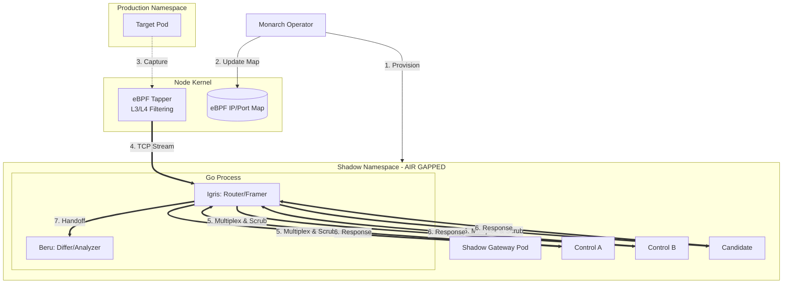

This is the **Monarch V2 Core Architecture** document. It synthesizes our brainstorming into a single source of truth for the project, covering implementation, data flow, and the "Air-Gapped" security model.

***

# Monarch V2: Core Architecture & Implementation Plan

Monarch is an open-source, cloud-native shadow testing engine designed for **all things TCP**. It uses eBPF for transparent traffic mirroring and a modular plugin system to analyze any protocol—from HTTP/gRPC to SQL and Message Queues—without modifying application code.

## 1. Design Principles
1. **Zero Intrusion:** No sidecars, no code changes, no service mesh required.
2. **Protocol Agnostic:** Move L7 intelligence into Go plugins; keep the core (eBPF/Operator) "dumb."
3. **Side-Effect Free:** Physical isolation of shadow environments to prevent production data corruption.
4. **Noise Cancellation:** The A/B/Candidate model to eliminate non-deterministic false positives.

---

## 2. System Architecture



---

## 3. Component Breakdown

### A. Monarch (The Orchestrator)
*   **Role:** K8s Operator.
*   **Logic:** Manages the lifecycle of the `ShadowTest` CRD. 
*   **Security:** Automatically provisions the shadow namespace and injects **Deny-All Egress** NetworkPolicies. It clones Secrets/ConfigMaps so shadow pods boot correctly but are network-isolated.

### B. The Tapper (eBPF Data Plane)
*   **Role:** High-performance packet mirroring.
*   **Logic:** A C program attached to the node's network interface. It checks a BPF Map for target IPs/Ports. If a match is found, it clones the packet and sends it to user-space via a RingBuffer.

### C. Igris (The Router & Replayer)
*   **Role:** TCP Framing and Egress Virtualization.
*   **Logic:** 
    *   Uses **Plugins** to identify request boundaries in a raw TCP stream.
    *   **Multiplexing:** Opens 3 connections to A, B, and C.
    *   **Scrubbing:** Removes PII/Sensitive headers (Authorization, Cookies) before sending traffic to Beru.
    *   **Virtualization (Roadmap):** Acts as a mock for outbound database/API calls.

### D. Beru (The Differ)
*   **Role:** Noise-canceling comparison engine.
*   **Logic:** Compares `Control A vs Control B` to find "dynamic noise" (timestamps, IDs). It then compares the `Candidate` against the controls, ignoring that noise to find real regressions.

---

## 4. Security & Blast Radius Model

Monarch is designed with a **Zero-Trust** approach to shadow testing.

| Threat Scenario | Monarch Defense | Result |
| :--- | :--- | :--- |
| **Shadow Pod Compromise** | No ServiceAccount tokens + Deny-All Egress. | Attacker is trapped in a network-less sandbox. |
| **Data Leakage (PII)** | Igris Scrubbing Plugin. | Sensitive data is masked before being logged or diffed. |
| **Production Corruption** | NetworkPolicy + Igris Write-Blocking. | Shadow pods physically cannot reach production DBs. |
| **Kernel Instability** | eBPF Verifier + Resource Limits. | Tapper cannot crash the node or consume infinite CPU. |

---

## 5. Implementation Roadmap

### Phase 1: Foundation (The Operator)
*   Initialize `ShadowTest` CRD.
*   Implement Namespace and Deployment replication logic.
*   Implement "Air-Gap" NetworkPolicy injection.

### Phase 2: The Pipe (eBPF)
*   Write C-based eBPF probe for L4 mirroring.
*   Build Go-based DaemonSet agent to read from RingBuffer.
*   Establish secure transport from Node Agent to Igris Gateway.

### Phase 3: The Brain (Igris & Beru)
*   Define the `ProtocolPlugin` interface.
*   Build the HTTP/1.1 MVP Plugin.
*   Implement A/B/C multiplexing and the Beru diffing algorithm.

### Phase 4: Advanced Behavioral Diffing
*   **Egress Interception:** Handle "Reads" from DBs via Igris passthrough.
*   **Async Support:** Support RabbitMQ/Kafka by diffing outbound "Publish" attempts.
*   **Context Replay:** Record external API responses from production and replay them to shadow pods.

---

## 6. The Plugin Interface (Go)

To add support for a new technology (e.g., PostgreSQL), a contributor only needs to implement this interface:

```go
type ProtocolPlugin interface {
    // Framing: Chunks raw TCP into requests
    ExtractMessage(rawStream []byte) (messages [][]byte, bytesConsumed int)

    // Security: Strips PII/Credentials
    Scrub(payload []byte) (safePayload []byte)

    // Analysis: Normalizes noise (timestamps/IDs) and diffs
    Normalize(response []byte) (normalizedResponse []byte)
    Diff(controlA, controlB, candidate []byte) DiffResult
}
```

---

## 7. Operational Flow Summary
1.  **User** applies a `ShadowTest` CRD.
2.  **Monarch** creates an air-gapped namespace, clones the target service (A, B, and Candidate), and updates the **eBPF Map**.
3.  **eBPF** mirrors traffic from the production pod to **Igris**.
4.  **Igris** frames the TCP stream, scrubs sensitive data, and replays it to the three shadow pods.
5.  **Beru** analyzes the responses, establishment a noise baseline, and alerts on regressions.
