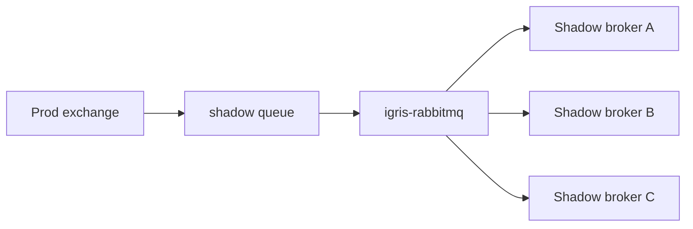
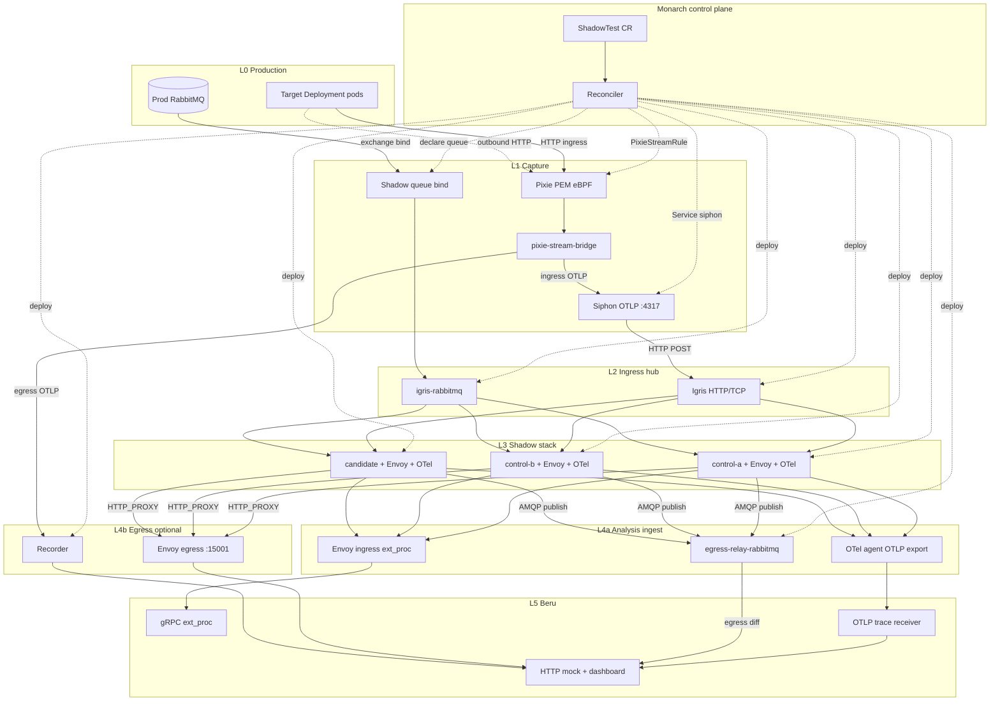
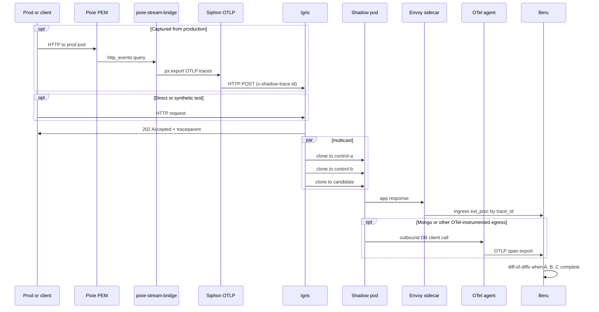
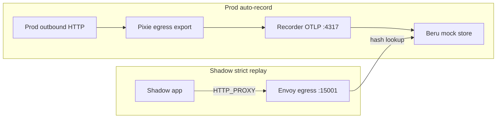
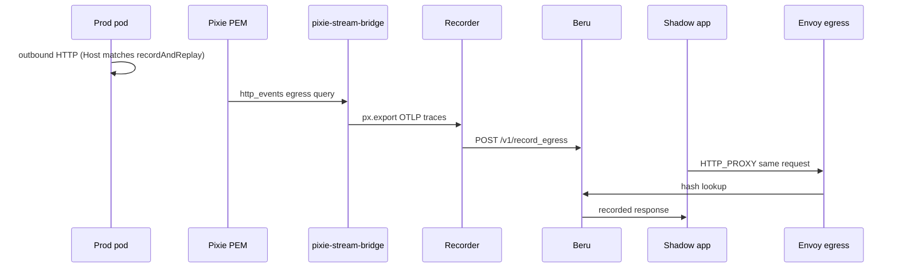

# Shadow-Diff — Architecture

Shadow-Diff is an open-source differential testing framework for Kubernetes. It replays captured or synthetic traffic across **three isolated shadow workloads** (two identical controls plus a candidate) and compares responses to find regressions while filtering non-deterministic noise.

This document describes **how the components fit together and how data flows**. For install steps, CRD fields, and verification, see [DEPLOYMENT.md](../../pipeline/monarch/DEPLOYMENT.md), [VERIFICATION.md](../verification/VERIFICATION.md), and per-service READMEs under `pipeline/`.

---

## Monorepo layout

| Path | Role |
|------|------|
| [`pipeline/monarch/`](../../pipeline/monarch/) | Kubernetes operator — reconciles `ShadowTest`, wires every layer |
| [`pipeline/igrises/igris-http/`](../../pipeline/igrises/igris-http/) | HTTP/TCP ingress hub — fan-out to three shadow pods |
| [`pipeline/igrises/igris-rabbitmq/`](../../pipeline/igrises/igris-rabbitmq/) | AMQP ingress multicaster — prod queue → three shadow brokers |
| [`pipeline/beru/`](../../pipeline/beru/) | Differ + mock store — ingress diff-of-diffs, OTLP egress diff, egress replay, dashboard |
| [`pipeline/siphon/`](../../pipeline/siphon/) | OTLP ingress receiver — Pixie ingress export → HTTP POST to Igris |
| [`pipeline/recorder/`](../../pipeline/recorder/) | Prod egress HTTP — Pixie OTLP or legacy TCP → Beru mock store (record/replay) |
| [`pipeline/egress-relay-rabbitmq/`](../../pipeline/egress-relay-rabbitmq/) | Shadow broker Firehose → Beru egress diff (AMQP ShadowTests) |

Each service is a separate Go module. The repo root [`Makefile`](../../Makefile) delegates builds and tests.

---

## Architecture layers

Shadow-Diff is a **pipeline of layers**. **Monarch** is the control plane that wires them from a single `ShadowTest` CR. **Beru** is always the analysis sink. The **egress record/replay layer** is optional and activates when downstream hosts are configured.

### Layer stack

```
┌─────────────────────────────────────────────────────────────────────────────┐
│  L0  Production     Target Deployment pods (real traffic / AMQP publishers)   │
└───────────────────────────────────┬─────────────────────────────────────────┘
                                    │
┌───────────────────────────────────▼─────────────────────────────────────────┐
│  L1  Capture        Driver-specific prod ingress tap:                          │
│                     • HTTP ingress → Pixie eBPF → OTLP → Siphon → Igris     │
│                     • AMQP → RabbitMQ native routing (shadow queue bind)      │
│                     • HTTP egress record → Pixie eBPF → OTLP → Recorder     │
│                       (when spec.recordAndReplay is set)                    │
└───────────────────────────────────┬─────────────────────────────────────────┘
                                    │
┌───────────────────────────────────▼─────────────────────────────────────────┐
│  L2  Ingress hub    Igris (HTTP/TCP)  OR  igris-rabbitmq (AMQP)             │
│                     Multicast same logical message to three shadow roles    │
└───────────────────────────────────┬─────────────────────────────────────────┘
                                    │
┌───────────────────────────────────▼─────────────────────────────────────────┐
│  L3  Shadow stack   Three Deployments × (app + Envoy + OTel agent) + deps   │
│                     control-a, control-b (oldImage), candidate (newImage) │
└───────────────────────────────────┬─────────────────────────────────────────┘
                                    │
                    ┌───────────────┴───────────────┐
                    │                               │
┌───────────────────▼──────────────┐   ┌────────────▼──────────────────────────┐
│  L4a  Analysis ingest          │   │  L4b  Egress record/replay (optional) │
│  HTTP ingress: Envoy ext_proc  │   │  Shadow HTTP replay: HTTP_PROXY →      │
│  → Beru diff-of-diffs          │   │  Envoy :15001 → Beru mock lookup       │
│  DB egress: OTel agent OTLP    │   │  Prod HTTP record: Pixie OTLP →        │
│  → Beru egress diff            │   │  Recorder :4317 → Beru mock store      │
│  AMQP egress: egress-relay-    │   │                                        │
│  rabbitmq → Beru egress diff   │   │                                        │
└───────────────────┬──────────────┘   └────────────┬──────────────────────────┘
                    │                               │
                    └───────────────┬───────────────┘
                                    │
┌───────────────────────────────────▼─────────────────────────────────────────┐
│  L5  Beru           gRPC ext_proc + OTLP receiver + HTTP mock + dashboard    │
└─────────────────────────────────────────────────────────────────────────────┘

        ┌──────────────────────────────────────────────────────────┐
        │  Monarch (control plane, all layers)                      │
        │  Reconciles ShadowTest → namespaces, Deployments,         │
        │  Envoy + OTel config, Igris/Recorder/Siphon/AMQP wiring   │
        └──────────────────────────────────────────────────────────┘
```

**L1 — capture is input-driven.** HTTP **ingress** uses **Pixie** eBPF on prod pods: Monarch writes a `PixieStreamRule` with `otelEndpoint`, **pixie-stream-bridge** runs ingress `px.export` OTLP to per-shadow **Siphon** (`:4317`), and Siphon POSTs parsed requests to Igris. HTTP **egress record** (when `spec.recordAndReplay` is set) uses the same Pixie PEM with a separate egress PxL export: OTLP traces go to shadow **Recorder** (`:4317`), which seeds Beru's mock store. RabbitMQ ingress uses **broker-native routing** (Monarch binds a shadow queue on the prod broker — no Pixie on the AMQP path).

**L4a — analysis ingest is workload-driven.** HTTP ingress responses reach Beru through **Envoy ingress `ext_proc`**. Database egress (MongoDB) is captured by the **OpenTelemetry agent** on shadow pods and exported to Beru via **OTLP** — Beru parses `db.statement` spans and runs egress diff-of-diffs. When shadow workers **publish AMQP messages**, **egress-relay-rabbitmq** reads RabbitMQ Firehose on each **shadow broker** and posts egress diff reports to Beru — the broker equivalent of diff-of-diffs, not prod capture or mock seeding.

### HTTP ingress path

| Step | Layer | Component | What happens |
|------|-------|-----------|--------------|
| 1 | Production | Target pods | Real clients hit prod (e.g. `my-prod-app` Service) |
| 2 | Capture | **Pixie PEM** + **pixie-stream-bridge** | eBPF `http_events`; `px.export` OTLP traces with `x-shadow-trace-id` |
| 3 | Capture | **Siphon** | OTLP gRPC `:4317` → parse span attrs → HTTP POST to Igris |
| 4 | Ingress hub | **Igris** | Accepts replayed traffic; **202** + `traceparent`; clones to three shadow Services |
| 5 | Shadow stack | App + **Envoy** + **OTel agent** | App handles request; OTel agent propagates W3C context; Envoy observes ingress response |
| 6 | Analysis | **Beru** | Ingress `ext_proc` collects control-a, control-b, candidate → **diff-of-diffs** |

Synthetic tests can skip Pixie/Siphon and send traffic directly to Igris.

### HTTP egress record path (prod auto-record)

| Step | Layer | Component | What happens |
|------|-------|-----------|--------------|
| 1 | Production | Target pods | Outbound HTTP to a configured downstream (`Host` must match `spec.recordAndReplay`) |
| 2 | Capture | **Pixie PEM** + **pixie-stream-bridge** | Egress PxL filters `http_events` by `req_host`; `px.export` OTLP to Recorder |
| 3 | Capture | **Recorder** | OTLP gRPC `:4317` (gzip) → parse span attrs (`http.host`, bodies, status) → `POST /v1/record_egress` |
| 4 | Replay prep | **Beru** | Mock store keyed by request hash — shadow apps replay via Envoy egress `:15001` |

Monarch sets `PixieStreamRule.recorderOtelEndpoint` to `<shadowtest>-recorder.<shadow-ns>.svc.cluster.local:4317` and `recordAndReplayHosts` from `spec.recordAndReplay`. **pixie-stream-bridge** runs ingress and egress exports independently when the rule exposes both endpoints.

### RabbitMQ ingress path

| Step | Layer | Component | What happens |
|------|-------|-----------|--------------|
| 1 | Production | Publisher + broker | Messages to prod exchange/routing key |
| 2 | Capture | **RabbitMQ routing** | Monarch declares a prod shadow queue bound to the same exchange/routing key |
| 3 | Ingress hub | **igris-rabbitmq** | Consumes prod queue; injects W3C `traceparent`; publishes to three shadow brokers |
| 4 | Shadow stack | Worker + **Envoy** + **OTel agent** | OTel extracts inbound context; app runs side effects (Mongo via OTLP, HTTP via Envoy) |
| 5 | Analysis | **Beru** | HTTP ingress → Envoy `ext_proc`; Mongo egress → **OTLP**; AMQP publishes → **egress-relay-rabbitmq** |



### Egress layer (optional)

When downstream hosts are configured, two parallel mechanisms apply:

| Path | Flow | Purpose |
|------|------|---------|
| **Shadow HTTP replay** | Shadow app → `HTTP_PROXY` → Envoy **:15001** → Beru | Strict replay: hash outbound request, return mock or **599** on miss |
| **Prod HTTP auto-record** | Prod pod → **Pixie** egress export → **Recorder** OTLP `:4317` → Beru | Seed mocks from real prod outbound HTTP (`Host` must match `spec.recordAndReplay`) |
| **Shadow AMQP egress diff** | Shadow publish → broker Firehose → **egress-relay-rabbitmq** → Beru | Compare outbound AMQP publishes across the three roles |

**egress-relay-rabbitmq** observes **shadow** broker publishes for diff analysis. Prod HTTP auto-record is **Pixie → Recorder**, not Siphon TCP relay (legacy TCP framing on Recorder `:8080` remains for older deployments).

### Full stack (wiring view)



**Note on sidecars:** Each L3 pod runs **two** injected sidecars alongside the app:

| Sidecar | Role |
|---------|------|
| **Envoy** | Ingress listener → app → `ext_proc` to Beru; optional egress `:15001` for HTTP replay; optional Mongo TCP proxy on `:27017` |
| **OTel agent** | OpenTelemetry Operator auto-instrumentation (`spec.otelInjection`, default on). Propagates W3C `tracecontext`; exports MongoDB client spans to Beru OTLP when a Mongo dependency is declared |

`ExtProc`, `EgrEnv :15001`, and `OTLP` in the diagram label *what each sidecar does*, not additional deployables.

| Listener | Port | Role |
|----------|------|------|
| **Ingress** | Shadow Service port (e.g. `:8888`) | Igris sends cloned traffic here → Envoy forwards to the app → **`ext_proc` sends the response to Beru** for ingress diff-of-diffs |
| **Egress** (optional) | `127.0.0.1:15001` | Shadow app sets `HTTP_PROXY` → outbound HTTP hits this listener → **`ext_proc` asks Beru** for a mock by request hash; Beru returns the recorded response or **599** on miss. Envoy never calls the real downstream. |
| **Mongo** (optional) | `127.0.0.1:27017` | App connects via `mongodb://127.0.0.1:27017` → Envoy TCP proxy to role-local Mongo; OTel agent captures `db.statement` spans and exports to Beru OTLP |

---

## The three-pod strategy

| Role | Purpose |
|------|---------|
| **Control A** | Baseline (old version) |
| **Control B** | Identical to A — surfaces dynamic / noisy fields |
| **Candidate** | Version under test |

Monarch materializes these as Deployments in a dedicated shadow namespace. Beru compares responses per trace using **diff-of-diffs**: diff(A, B) reveals noise; diff(A, C) reveals regressions beyond noise.

---

## End-to-end data flow

### HTTP ingress sequence



### Egress record and replay

Shadow replay and prod auto-record run **in parallel**:





### Trace correlation

Beru receives shadow traffic through **complementary ingest paths**:

| Path | Source | Correlation |
|------|--------|-------------|
| **Ingress diff-of-diffs** | Envoy ingress `ext_proc` | Trace id: `x-shadow-trace-id` → W3C `traceparent` → Envoy `x-request-id`; role from `x-shadow-role` |
| **Egress diff (MongoDB)** | OTel agent → Beru OTLP (`:4317` gRPC or `:8080/v1/traces` HTTP) | Trace id from span; role from `OTEL_SERVICE_NAME` suffix (`-control-a`, `-control-b`, `-candidate`) |
| **Egress diff (AMQP)** | egress-relay-rabbitmq | Trace id from message headers (`traceparent` or `x-shadow-trace-id`) |

**Ingress multicast.** Igris and igris-rabbitmq inject W3C **`traceparent`** on cloned traffic (and echo **`x-shadow-trace-id`** for backward compatibility). Envoy forwards these headers unchanged and reports ingress responses to Beru — apps usually need no trace code on the HTTP ingress path.

**OpenTelemetry sidecar.** When `spec.otelInjection` is enabled (default), Monarch reconciles an `Instrumentation/shadow-diff-telemetry` CR in the shadow namespace (exporter → Beru OTLP), gates on CR visibility before creating shadow app pods, sanitizes any production `instrumentation.opentelemetry.io/*` annotations, and force-overwrites `OTEL_*` env vars so hardcoded SDKs cannot dial prod collectors. Monarch annotates shadow app pods to bind the OpenTelemetry Operator to that CR, which injects a language-specific auto-instrumentation agent. The agent extracts inbound W3C context from Igris/AMQP headers, propagates `tracecontext` on instrumented outbound calls, and — when a Mongo dependency is declared — exports MongoDB client spans (`db.statement`) directly to Beru OTLP. Monarch sets `OTEL_EXPORTER_OTLP_ENDPOINT` to Beru; Python uses HTTP/protobuf, Node/Java use gRPC.

Manual copying of `traceparent` / `x-shadow-trace-id` in application code is **no longer the primary model** — it remains as a fallback for untracked goroutines, disabled OTel injection, or libraries the agent cannot instrument. Python `pika` auto-instrumentation is enabled; **egress-relay-rabbitmq** deduplicates duplicate Firehose publishes from OTel double-wrap within a short window.

When trace context is missing entirely, Beru can fall back to sequence-based diffing.

---

## Components (roles in the pipeline)

### Monarch

Kubebuilder operator in `monarch-system`. Reads `ShadowTest` and materializes the full pipeline: shadow namespace, three app Deployments with Envoy and OTel-injection annotations, ingress hub (Igris or igris-rabbitmq), **`PixieStreamRule`** (ingress `otelEndpoint` and/or egress `recorderOtelEndpoint` + `recordAndReplayHosts`) + shadow **`Service/siphon`**, optional Recorder and egress-relay-rabbitmq, and ephemeral dependencies (Redis, RabbitMQ with Firehose tracing, MongoDB, etc.) per role. Does **not** deploy Pixie Vizier, pixie-stream-bridge, the Siphon OTLP Deployment, Beru, or the OpenTelemetry Operator — those are installed separately.

### Igris (HTTP/TCP)

Pluggable ingress hub. **HTTP driver** accepts atomic requests, returns 202 immediately, and multicasts clones to three shadow URLs in parallel. **TCP driver** relays streaming connections to three shadow hosts. Monarch writes listener config from the ShadowTest inputs.

### igris-rabbitmq

AMQP ingress hub. Consumes the prod shadow queue, injects W3C `traceparent` on multicast, and publishes the same logical message to three shadow RabbitMQ brokers (one per role).

### Siphon

Per-shadow-namespace **OTLP gRPC receiver** on `:4317`. Accepts gzip-compressed OTLP traces from Pixie `px.export` (via **pixie-stream-bridge**), parses HTTP fields from span attributes (`url.path`, `x-shadow-trace-id`, `http.request.method`, `http.request.body`), and **HTTP POST**s to **igris-http**. Monarch reconciles the cluster DNS target (`Service/siphon`) and `PixieStreamRule`; you deploy the Siphon Deployment with `SIPHON_IGRIS_BASE_URL` pointing at the shadow Igris Service.

### Recorder

Shadow-namespace service. **Primary path:** accepts **OTLP gRPC** on `:4317` from Pixie egress `px.export`, parses HTTP span attributes, filters by `spec.recordAndReplay` hosts, and posts to Beru `POST /v1/record_egress`. **Legacy path:** TCP framing on `:8080` from Siphon egress relay (length-prefixed R/S frames). Shadow pods replay recorded responses via Envoy egress `:15001`.

### egress-relay-rabbitmq

Shadow-namespace service for AMQP ShadowTests. Subscribes to RabbitMQ Firehose on each shadow broker, extracts trace id from message headers, and posts egress diff reports to Beru when shadow workers publish AMQP messages.

### Beru

Analysis sink. **Ingress:** Envoy `ext_proc` reports per role → diff-of-diffs. **Egress (MongoDB):** OTLP trace receiver parses instrumented `db.statement` spans → egress diff-of-diffs. **Egress (AMQP):** egress-relay-rabbitmq HTTP ingest. **Egress (HTTP replay):** mock store keyed by request hash — shadow replay via Envoy egress lookup; prod seeding via Recorder or manual API. Dashboard for inspecting traces and diffs.

### OpenTelemetry agent (sidecar)

Injected by the **OpenTelemetry Operator** when `spec.otelInjection` is enabled (default). Monarch reconciles `Instrumentation/shadow-diff-telemetry` in the shadow namespace, adds `instrumentation.opentelemetry.io/inject-*` pod annotations bound to that CR (stripping production injection targets), and force-overwrites per-role `OTEL_SERVICE_NAME` / exporter env over values copied from the prod Deployment. The agent auto-instruments supported libraries (HTTP, MongoDB drivers, `amqplib`, etc.), propagates W3C `tracecontext`, and exports spans to Beru OTLP when a Mongo dependency is present. Disable with `spec.otelInjection.enabled: false` if the operator is not installed.

**Node.js entrypoint wrapper.** When `spec.language` is `nodejs` (or unset and the image tag looks Node-based), Monarch wraps the shadow app boot vector at reconcile time — no Dockerfile or `package.json` changes. A `telemetry-wrapper-writer` initContainer writes `wrapper.js` into an `emptyDir` volume mounted at `/telemetry-override`; the app container runs `node /telemetry-override/wrapper.js` instead of the production entrypoint. The wrapper bootstraps `NodeSDK` with `MongoDBInstrumentation({ enhancedDatabaseReporting: true })` via stable public APIs (not `process.env` or prototype patching), calls `sdk.start()`, then `require()`-s the resolved production entrypoint module (absolute path or directory, derived from the target Deployment's `command`, `args`, and `workingDir`). Operator `OTEL_NODE_ENABLED_INSTRUMENTATIONS` omits `mongodb` when the wrapper is active so Mongo is not double-instrumented. OTel `inject-nodejs` annotations remain scoped to the `app` container only (`nodejs-container-names: app`), so the Envoy sidecar is never instrumented.

### Envoy (sidecar)

Injected into every shadow pod. **Ingress listener:** observes app responses, forwards to Beru via `ext_proc`. **Egress listener (optional):** intercepts `HTTP_PROXY` traffic for strict downstream replay. **Mongo listener (optional):** TCP proxy on `:27017` when a Mongo dependency is declared — apps connect via `mongodb://127.0.0.1:27017`; OTel captures statements on the client side.

---

## Technology stack

| Layer | Technologies |
|-------|----------------|
| Control plane | Go, Kubebuilder, controller-runtime |
| Ingress multicast | Go (`igris-http`, `igris-rabbitmq`) |
| Shadow proxy | Envoy, `ext_proc`, ConfigMaps from Monarch |
| Auto-instrumentation | OpenTelemetry Operator, language SDK agents, OTLP |
| Analysis | Go, gRPC, Beru OTLP + HTTP mock store |
| Capture | Pixie eBPF + `PixieStreamRule`; pixie-stream-bridge (ingress + egress OTLP); Siphon → Igris; Recorder OTLP → Beru mocks |
| Egress parse | Recorder — OTLP span attrs or legacy TCP → Beru mock store |

---

## Related reading

- [README.md](../../README.md) — quick start
- [VERIFICATION.md](../verification/VERIFICATION.md) — verification steps
- [pipeline/monarch/DEPLOYMENT.md](../../pipeline/monarch/DEPLOYMENT.md) — install, ShadowTest fields, troubleshooting
- [pipeline/monarch/REPO_OVERVIEW.md](../../pipeline/monarch/REPO_OVERVIEW.md) — Monarch layout and dev workflow
- Per-service READMEs under `pipeline/*/`
