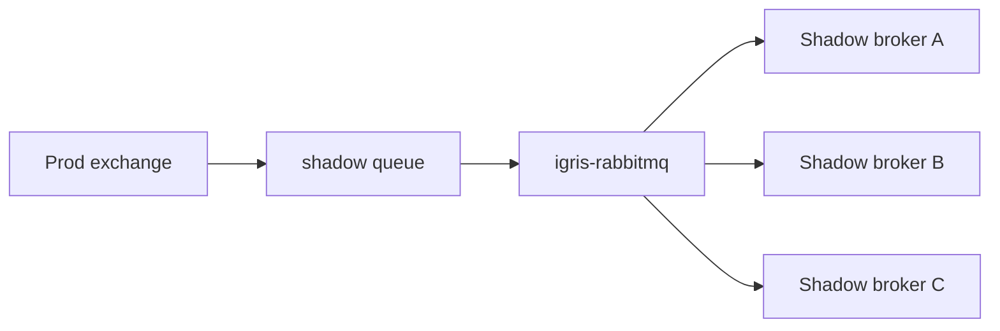
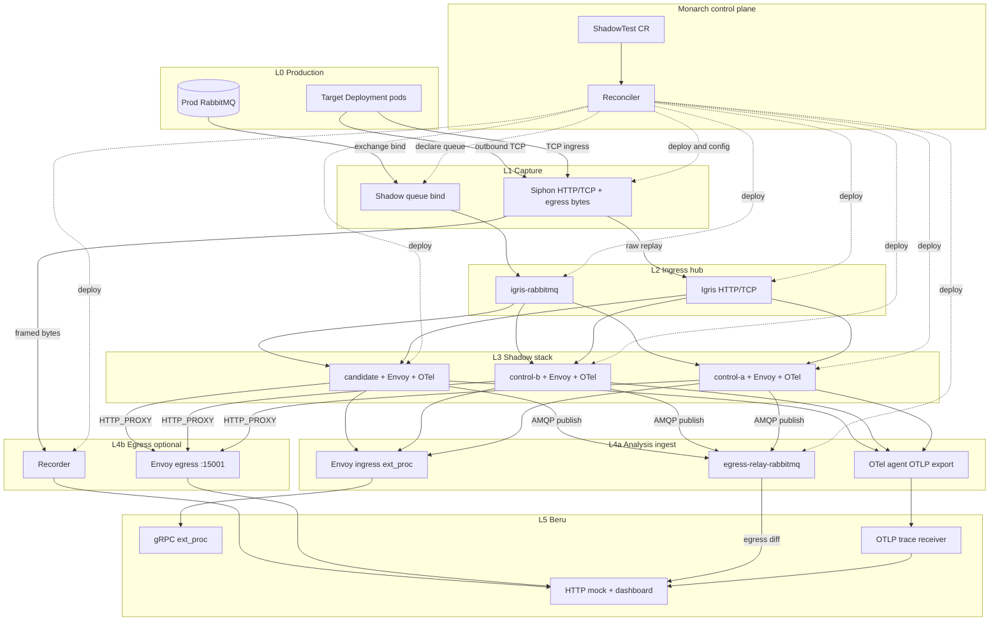
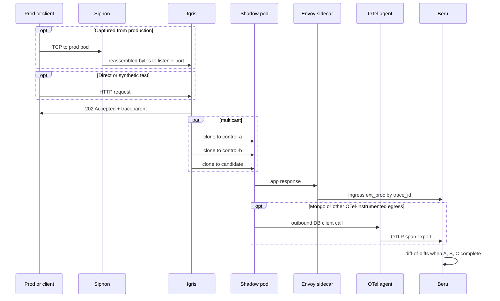
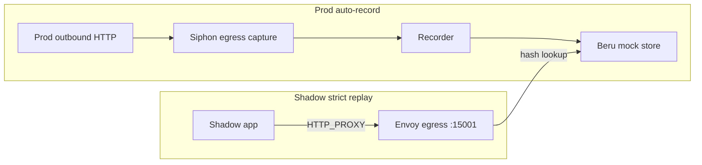
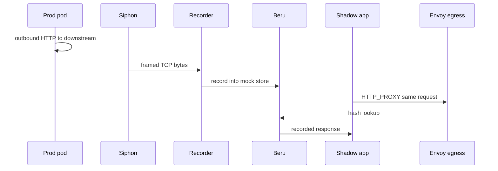

# Shadow-Diff — Architecture

Shadow-Diff is an open-source differential testing framework for Kubernetes. It replays captured or synthetic traffic across **three isolated shadow workloads** (two identical controls plus a candidate) and compares responses to find regressions while filtering non-deterministic noise.

This document describes **how the components fit together and how data flows**. For install steps, CRD fields, and verification, see [DEPLOYMENT.md](../../pipeline/monarch/DEPLOYMENT.md), [VERIFICATION.md](../verification/VERIFICATION.md), and per-service READMEs under `pipeline/`.

---

## Monorepo layout

| Path | Role |
|------|------|
| [`pipeline/monarch/`](../../pipeline/monarch/) | Kubernetes operator — reconciles `ShadowTest`, wires every layer |
| [`pipeline/igrises/igris-http/`](../../pipeline/igrises/igris-http/) | HTTP/TCP ingress hub — fan-out to three shadow pods |
| [`pipeline/igrises/igris-rabbitmq/`](../../pipeline/igrises/igris-rabbitmq/) | AMQP ingress multicaster — prod queue → three shadow brokers |
| [`pipeline/beru/`](../../pipeline/beru/) | Differ + mock store — ingress diff-of-diffs, OTLP egress diff, egress replay, dashboard |
| [`pipeline/siphon/`](../../pipeline/siphon/) | Node capture agent — BPF, TCP reassembly, forward to Igris / Recorder |
| [`pipeline/recorder/`](../../pipeline/recorder/) | Parses prod egress HTTP from Siphon → seeds Beru mock store |
| [`pipeline/egress-relay-rabbitmq/`](../../pipeline/egress-relay-rabbitmq/) | Shadow broker Firehose → Beru egress diff (AMQP ShadowTests) |

Each service is a separate Go module. The repo root [`Makefile`](../../Makefile) delegates builds and tests.

---

## Architecture layers

Shadow-Diff is a **pipeline of layers**. **Monarch** is the control plane that wires them from a single `ShadowTest` CR. **Beru** is always the analysis sink. The **egress record/replay layer** is optional and activates when downstream hosts are configured.

### Layer stack

```
┌─────────────────────────────────────────────────────────────────────────────┐
│  L0  Production     Target Deployment pods (real traffic / AMQP publishers)   │
└───────────────────────────────────┬─────────────────────────────────────────┘
                                    │
┌───────────────────────────────────▼─────────────────────────────────────────┐
│  L1  Capture        Driver-specific prod ingress tap; Siphon also captures   │
│                     prod egress for record/replay when downstreams set:       │
│                     • HTTP/TCP → Siphon (BPF on prod node)                    │
│                     • AMQP → RabbitMQ native routing (shadow queue bind)      │
│                     (additional input drivers planned)                        │
└───────────────────────────────────┬─────────────────────────────────────────┘
                                    │
┌───────────────────────────────────▼─────────────────────────────────────────┐
│  L2  Ingress hub    Igris (HTTP/TCP)  OR  igris-rabbitmq (AMQP)             │
│                     Multicast same logical message to three shadow roles    │
└───────────────────────────────────┬─────────────────────────────────────────┘
                                    │
┌───────────────────────────────────▼─────────────────────────────────────────┐
│  L3  Shadow stack   Three Deployments × (app + Envoy + OTel agent) + deps   │
│                     control-a, control-b (oldImage), candidate (newImage) │
└───────────────────────────────────┬─────────────────────────────────────────┘
                                    │
                    ┌───────────────┴───────────────┐
                    │                               │
┌───────────────────▼──────────────┐   ┌────────────▼──────────────────────────┐
│  L4a  Analysis ingest          │   │  L4b  Egress record/replay (optional) │
│  HTTP ingress: Envoy ext_proc  │   │  Shadow HTTP replay: HTTP_PROXY →      │
│  → Beru diff-of-diffs          │   │  Envoy :15001 → Beru mock lookup       │
│  DB egress: OTel agent OTLP    │   │  Prod HTTP record: Siphon → Recorder   │
│  → Beru egress diff            │   │  → Beru mock store                     │
│  AMQP egress: egress-relay-    │   │                                        │
│  rabbitmq → Beru egress diff   │   │                                        │
└───────────────────┬──────────────┘   └────────────┬──────────────────────────┘
                    │                               │
                    └───────────────┬───────────────┘
                                    │
┌───────────────────────────────────▼─────────────────────────────────────────┐
│  L5  Beru           gRPC ext_proc + OTLP receiver + HTTP mock + dashboard    │
└─────────────────────────────────────────────────────────────────────────────┘

        ┌──────────────────────────────────────────────────────────┐
        │  Monarch (control plane, all layers)                      │
        │  Reconciles ShadowTest → namespaces, Deployments,         │
        │  Envoy + OTel config, Igris/Recorder/Siphon/AMQP wiring   │
        └──────────────────────────────────────────────────────────┘
```

**L1 — capture is input-driven.** Siphon taps HTTP/TCP ingress and relays prod egress bytes for record/replay. RabbitMQ ingress uses **broker-native routing** (Monarch binds a shadow queue on the prod broker — no Siphon on the AMQP ingress path). Future input drivers will add their own capture at L1.

**L4a — analysis ingest is workload-driven.** HTTP ingress responses reach Beru through **Envoy ingress `ext_proc`**. Database egress (MongoDB) is captured by the **OpenTelemetry agent** on shadow pods and exported to Beru via **OTLP** — Beru parses `db.statement` spans and runs egress diff-of-diffs. When shadow workers **publish AMQP messages**, **egress-relay-rabbitmq** reads RabbitMQ Firehose on each **shadow broker** and posts egress diff reports to Beru — the broker equivalent of diff-of-diffs, not prod capture or mock seeding.

### HTTP ingress path

| Step | Layer | Component | What happens |
|------|-------|-----------|--------------|
| 1 | Production | Target pods | Real clients hit prod |
| 2 | Capture | **Siphon** | BPF on prod node; TCP reassembly; forwards ingress bytes to Igris; optionally captures prod egress |
| 3 | Ingress hub | **Igris** | Accepts replayed or synthetic traffic; **202** + `traceparent`; clones to three shadow Services |
| 4 | Shadow stack | App + **Envoy** + **OTel agent** | App handles request; OTel agent propagates W3C context; Envoy observes ingress response |
| 5 | Analysis | **Beru** | Ingress `ext_proc` collects control-a, control-b, candidate → **diff-of-diffs** |

Synthetic tests can skip Siphon and send traffic directly to Igris.

### RabbitMQ ingress path

| Step | Layer | Component | What happens |
|------|-------|-----------|--------------|
| 1 | Production | Publisher + broker | Messages to prod exchange/routing key |
| 2 | Capture | **RabbitMQ routing** | Monarch declares a prod shadow queue bound to the same exchange/routing key |
| 3 | Ingress hub | **igris-rabbitmq** | Consumes prod queue; injects W3C `traceparent`; publishes to three shadow brokers |
| 4 | Shadow stack | Worker + **Envoy** + **OTel agent** | OTel extracts inbound context; app runs side effects (Mongo via OTLP, HTTP via Envoy) |
| 5 | Analysis | **Beru** | HTTP ingress → Envoy `ext_proc`; Mongo egress → **OTLP**; AMQP publishes → **egress-relay-rabbitmq** |



### Egress layer (optional)

When downstream hosts are configured, two parallel mechanisms apply:

| Path | Flow | Purpose |
|------|------|---------|
| **Shadow HTTP replay** | Shadow app → `HTTP_PROXY` → Envoy **:15001** → Beru | Strict replay: hash outbound request, return mock or **599** on miss |
| **Prod HTTP auto-record** | Prod pod → **Siphon** → **Recorder** → Beru mock store | Seed mocks from real prod outbound HTTP |
| **Shadow AMQP egress diff** | Shadow publish → broker Firehose → **egress-relay-rabbitmq** → Beru | Compare outbound AMQP publishes across the three roles |

**egress-relay-rabbitmq** observes **shadow** broker publishes for diff analysis. It is separate from prod HTTP auto-record via Siphon and Recorder.

### Full stack (wiring view)



**Note on sidecars:** Each L3 pod runs **two** injected sidecars alongside the app:

| Sidecar | Role |
|---------|------|
| **Envoy** | Ingress listener → app → `ext_proc` to Beru; optional egress `:15001` for HTTP replay; optional Mongo TCP proxy on `:27017` |
| **OTel agent** | OpenTelemetry Operator auto-instrumentation (`spec.otelInjection`, default on). Propagates W3C `tracecontext`; exports MongoDB client spans to Beru OTLP when a Mongo dependency is declared |

`ExtProc`, `EgrEnv :15001`, and `OTLP` in the diagram label *what each sidecar does*, not additional deployables.

| Listener | Port | Role |
|----------|------|------|
| **Ingress** | Shadow Service port (e.g. `:8888`) | Igris sends cloned traffic here → Envoy forwards to the app → **`ext_proc` sends the response to Beru** for ingress diff-of-diffs |
| **Egress** (optional) | `127.0.0.1:15001` | Shadow app sets `HTTP_PROXY` → outbound HTTP hits this listener → **`ext_proc` asks Beru** for a mock by request hash; Beru returns the recorded response or **599** on miss. Envoy never calls the real downstream. |
| **Mongo** (optional) | `127.0.0.1:27017` | App connects via `mongodb://127.0.0.1:27017` → Envoy TCP proxy to role-local Mongo; OTel agent captures `db.statement` spans and exports to Beru OTLP |

---

## The three-pod strategy

| Role | Purpose |
|------|---------|
| **Control A** | Baseline (old version) |
| **Control B** | Identical to A — surfaces dynamic / noisy fields |
| **Candidate** | Version under test |

Monarch materializes these as Deployments in a dedicated shadow namespace. Beru compares responses per trace using **diff-of-diffs**: diff(A, B) reveals noise; diff(A, C) reveals regressions beyond noise.

---

## End-to-end data flow

### HTTP ingress sequence



### Egress record and replay

Shadow replay and prod auto-record run **in parallel**:





### Trace correlation

Beru receives shadow traffic through **complementary ingest paths**:

| Path | Source | Correlation |
|------|--------|-------------|
| **Ingress diff-of-diffs** | Envoy ingress `ext_proc` | Trace id: `x-shadow-trace-id` → W3C `traceparent` → Envoy `x-request-id`; role from `x-shadow-role` |
| **Egress diff (MongoDB)** | OTel agent → Beru OTLP (`:4317` gRPC or `:8080/v1/traces` HTTP) | Trace id from span; role from `OTEL_SERVICE_NAME` suffix (`-control-a`, `-control-b`, `-candidate`) |
| **Egress diff (AMQP)** | egress-relay-rabbitmq | Trace id from message headers (`traceparent` or `x-shadow-trace-id`) |

**Ingress multicast.** Igris and igris-rabbitmq inject W3C **`traceparent`** on cloned traffic (and echo **`x-shadow-trace-id`** for backward compatibility). Envoy forwards these headers unchanged and reports ingress responses to Beru — apps usually need no trace code on the HTTP ingress path.

**OpenTelemetry sidecar.** When `spec.otelInjection` is enabled (default), Monarch annotates shadow app pods for the **OpenTelemetry Operator**, which injects a language-specific auto-instrumentation agent. The agent extracts inbound W3C context from Igris/AMQP headers, propagates `tracecontext` on instrumented outbound calls, and — when a Mongo dependency is declared — exports MongoDB client spans (`db.statement`) directly to Beru OTLP. Monarch sets `OTEL_EXPORTER_OTLP_ENDPOINT` to Beru; Python uses HTTP/protobuf, Node/Java use gRPC.

Manual copying of `traceparent` / `x-shadow-trace-id` in application code is **no longer the primary model** — it remains as a fallback for untracked goroutines, disabled OTel injection, or libraries the agent cannot instrument (e.g. Python `pika`, where auto-instrumentation is disabled to avoid duplicate Firehose events).

When trace context is missing entirely, Beru can fall back to sequence-based diffing.

---

## Components (roles in the pipeline)

### Monarch

Kubebuilder operator in `monarch-system`. Reads `ShadowTest` and materializes the full pipeline: shadow namespace, three app Deployments with Envoy and OTel-injection annotations, ingress hub (Igris or igris-rabbitmq), Siphon config, optional Recorder and egress-relay-rabbitmq, and ephemeral dependencies (Redis, RabbitMQ, MongoDB, etc.) per role. Does **not** deploy Beru or the OpenTelemetry Operator — those are installed separately; Monarch only annotates shadow pods and sets OTel env vars.

### Igris (HTTP/TCP)

Pluggable ingress hub. **HTTP driver** accepts atomic requests, returns 202 immediately, and multicasts clones to three shadow URLs in parallel. **TCP driver** relays streaming connections to three shadow hosts. Monarch writes listener config from the ShadowTest inputs.

### igris-rabbitmq

AMQP ingress hub. Consumes the prod shadow queue, injects W3C `traceparent` on multicast, and publishes the same logical message to three shadow RabbitMQ brokers (one per role).

### Siphon

Node DaemonSet using classic BPF and TCP reassembly. **Ingress path:** mirrors prod inbound TCP to Igris. **Egress path:** relays prod outbound TCP bytes to Recorder when downstreams are configured. L4-only — no HTTP parsing on the capture path.

### Recorder

Shadow-namespace service. Receives framed TCP from Siphon, pairs request/response legs, parses HTTP, and writes into Beru's mock store so shadow pods can replay prod egress without manual seeding.

### egress-relay-rabbitmq

Shadow-namespace service for AMQP ShadowTests. Subscribes to RabbitMQ Firehose on each shadow broker, extracts trace id from message headers, and posts egress diff reports to Beru when shadow workers publish AMQP messages.

### Beru

Analysis sink. **Ingress:** Envoy `ext_proc` reports per role → diff-of-diffs. **Egress (MongoDB):** OTLP trace receiver parses instrumented `db.statement` spans → egress diff-of-diffs. **Egress (AMQP):** egress-relay-rabbitmq HTTP ingest. **Egress (HTTP replay):** mock store keyed by request hash — shadow replay via Envoy egress lookup; prod seeding via Recorder or manual API. Dashboard for inspecting traces and diffs.

### OpenTelemetry agent (sidecar)

Injected by the **OpenTelemetry Operator** when `spec.otelInjection` is enabled (default). Monarch adds `instrumentation.opentelemetry.io/inject-*` pod annotations and per-role `OTEL_SERVICE_NAME` / exporter env. The agent auto-instruments supported libraries (HTTP, MongoDB drivers, `amqplib`, etc.), propagates W3C `tracecontext`, and exports spans to Beru OTLP when a Mongo dependency is present. Disable with `spec.otelInjection.enabled: false` if the operator is not installed.

### Envoy (sidecar)

Injected into every shadow pod. **Ingress listener:** observes app responses, forwards to Beru via `ext_proc`. **Egress listener (optional):** intercepts `HTTP_PROXY` traffic for strict downstream replay. **Mongo listener (optional):** TCP proxy on `:27017` when a Mongo dependency is declared — apps connect via `mongodb://127.0.0.1:27017`; OTel captures statements on the client side.

---

## Technology stack

| Layer | Technologies |
|-------|----------------|
| Control plane | Go, Kubebuilder, controller-runtime |
| Ingress multicast | Go (`igris-http`, `igris-rabbitmq`) |
| Shadow proxy | Envoy, `ext_proc`, ConfigMaps from Monarch |
| Auto-instrumentation | OpenTelemetry Operator, language SDK agents, OTLP |
| Analysis | Go, gRPC, Beru OTLP + HTTP mock store |
| Capture | Go, classic BPF (`gopacket/afpacket`), TCP reassembly |
| Egress parse | Recorder — framed TCP ingest, HTTP parse |

---

## Related reading

- [README.md](../../README.md) — quick start
- [VERIFICATION.md](../verification/VERIFICATION.md) — verification steps
- [pipeline/monarch/DEPLOYMENT.md](../../pipeline/monarch/DEPLOYMENT.md) — install, ShadowTest fields, troubleshooting
- [pipeline/monarch/REPO_OVERVIEW.md](../../pipeline/monarch/REPO_OVERVIEW.md) — Monarch layout and dev workflow
- Per-service READMEs under `pipeline/*/`
