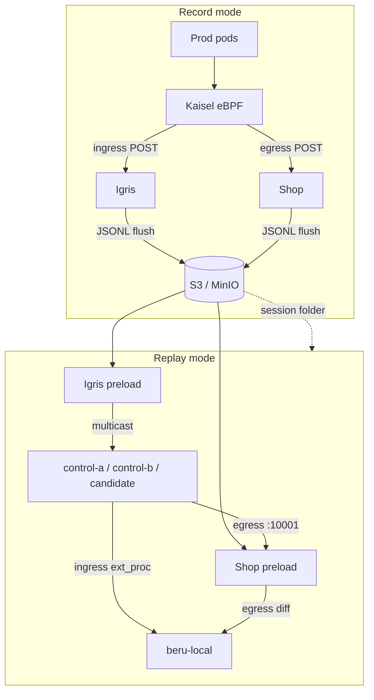
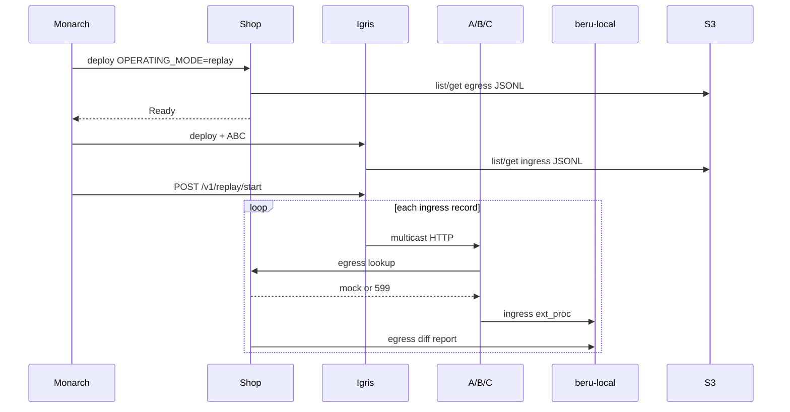
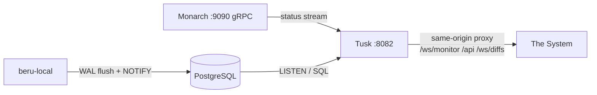

---

## type: Architecture Specification
title: Shadow-Diff Architecture
description: Asynchronous record/replay architecture — S3-backed capture, on-demand A/B/C differential testing, Monarch orchestration, shared Postgres, Tusk BFF, and The System UI.
resource: [https://github.com/shadow-diff/monarch](https://github.com/shadow-diff/monarch)
tags: [architecture, record-replay, s3, monarch, beru, shop, kaisel, igris, postgres, tusk, the-system]
timestamp: 2026-08-02T17:45:00Z

# Shadow-Diff — Architecture

Shadow-Diff is a differential testing framework for Kubernetes. It **records** production traffic into object storage, then **replays** that session across three isolated shadow workloads (two identical controls plus a candidate) and compares responses with a diff-of-diffs engine. Noise is `Diff(control-a, control-b)`; regressions are `Diff(control-a, candidate) − noise`.

A single `ShadowTest` CR drives the whole stack. Capture and analysis are **decoupled**: record mode is lightweight and always-on capable; replay mode spins A/B/C on demand against a pinned S3 session. Cluster-wide **Postgres**, **Tusk**, and **The System** surface live topology and durable verdicts outside any one shadow namespace.

For CRD fields and install, see [/control-plane/monarch-controller.md](/control-plane/monarch-controller.md), [DEPLOYMENT.md](../../pipeline/monarch/DEPLOYMENT.md), and [/verification/VERIFICATION.md](/verification/VERIFICATION.md). Design rationale: [/refactor/async-record-replay.md](/refactor/async-record-replay.md).

---


## Monorepo layout


| Path                                                                         | Role                                                                                                                                |
| ---------------------------------------------------------------------------- | ----------------------------------------------------------------------------------------------------------------------------------- |
| `[pipeline/monarch/](../../pipeline/monarch/)`                               | Operator — reconciles `ShadowTest` (`record` | `replay`), S3 env, mode GC, replay trigger, retention finalizer, status gRPC `:9090` |
| `[pipeline/pkg/s3utils/](../../pipeline/pkg/s3utils/)`                       | Shared S3 BatchUploader / S3Reader / DeletePrefix (JSONL, path-style for MinIO)                                                     |
| `[pipeline/kaisel/](../../pipeline/kaisel/)`                                 | eBPF HTTP capture — dumb pipe: POST ingress → Igris, POST egress pairs → Shop                                                       |
| `[pipeline/igrises/igris-http/](../../pipeline/igrises/igris-http/)`         | HTTP/TCP hub — record: buffer ingress to S3; replay: preload + multicast from S3                                                    |
| `[pipeline/shop/](../../pipeline/shop/)`                                     | HTTP egress mock store — record: buffer to S3; replay: preload mocks + Envoy ext_proc                                               |
| `[pipeline/beru/](../../pipeline/beru/)`                                     | Diff-of-diffs sink — deployed as **beru-local** per ShadowTest (ingress ext_proc, egress HTTP/AMQP/DB) → shared Postgres            |
| `[pipeline/shadow-soldier/](../../pipeline/shadow-soldier/)`                 | DB egress TCP proxy sidecar (replay stack) → beru-local                                                                             |
| `[pipeline/igrises/igris-rabbitmq/](../../pipeline/igrises/igris-rabbitmq/)` | AMQP hub — record: prod queue → S3; replay: S3 → three shadow brokers                                                               |
| `[pipeline/tusk/](../../pipeline/tusk/)`                                     | Cluster BFF — Monarch gRPC → topology WS; shared Postgres → ShadowDiff REST/WS `:8082`                                              |
| `[pipeline/the-system/](../../pipeline/the-system/)`                         | Dashboard UI — Monitor, ShadowDiff, ShadowTest YAML editor (Nginx → Tusk same-origin)                                               |
| `[pipeline/pkg/trace/](../../pipeline/pkg/trace/)`                           | Shared W3C `traceparent` parse / admit helpers                                                                                      |
| `[pipeline/pkg/replay/](../../pipeline/pkg/replay/)`                         | Shared JSONL preload + replay engine + admin `POST /v1/replay/start`                                                                |
| `[pipeline/pkg/monarchpb/](../../pipeline/pkg/monarchpb/)`                   | Shared gRPC wire contract for Monarch status → Tusk                                                                                 |
| `[pipeline/egress-relay-rabbitmq/](../../pipeline/egress-relay-rabbitmq/)`   | Shadow broker Firehose → beru-local AMQP egress diff                                                                                |


---


## Two operating modes

Every ShadowTest is `spec.mode: record` or `replay` (default `record`). `spec.storage` is **required** (BYOB S3). Optional `spec.sessionID` pins the session folder; record mints `status.currentSessionID` when unset; replay requires a resolvable session.


```mermaid
flowchart TB
  subgraph recordMode [Record mode]
    ProdR[Prod pods] --> KaiselR[Kaisel eBPF]
    KaiselR -->|ingress POST| IgrisR[Igris]
    KaiselR -->|egress POST| ShopR[Shop]
    IgrisR -->|JSONL flush| S3[(S3 / MinIO)]
    ShopR -->|JSONL flush| S3
  end

  subgraph replayMode [Replay mode]
    S3 --> ShopP[Shop preload]
    S3 --> IgrisP[Igris preload]
    IgrisP -->|multicast| ABC[control-a / control-b / candidate]
    ABC -->|egress :10001| ShopP
    ABC -->|ingress ext_proc| Beru[beru-local]
    ShopP -->|egress diff| Beru
  end

  S3 -.->|session folder| replayMode
```


| Mode       | Running stack                           | Not running                         |
| ---------- | --------------------------------------- | ----------------------------------- |
| **Record** | KaiselRule, Igris, Shop, beru-local     | A/B/C shadow app pods               |
| **Replay** | Shop, Igris, A/B/C (+ deps), beru-local | KaiselRule (`kaiselPhase=Disabled`) |


Monarch garbage-collects the opposite mode’s resources when `spec.mode` changes. See [/control-plane/monarch-controller.md](/control-plane/monarch-controller.md).

---


## Layer stack

```
┌─────────────────────────────────────────────────────────────────────────────┐
│  L0  Production     Target Deployment (real clients / publishers)           │
└───────────────────────────────────┬─────────────────────────────────────────┘
                                    │
┌───────────────────────────────────▼─────────────────────────────────────────┐
│  L1  Capture        Kaisel eBPF (HTTP ingress + egress pairing)             │
│                     AMQP: prod shadow-queue bind (hybrid / RMQ inputs)      │
└───────────────────────────────────┬─────────────────────────────────────────┘
                                    │
┌───────────────────────────────────▼─────────────────────────────────────────┐
│  L2  Storage gateways                                                       │
│      Record: Igris + Shop → S3 JSONL under sessions/<id>/{ingress\|egress}/ │
│      Replay: Igris + Shop ← S3 preload; Igris admin :9090 /v1/replay/start  │
└───────────────────────────────────┬─────────────────────────────────────────┘
                                    │  (replay only)
┌───────────────────────────────────▼─────────────────────────────────────────┐
│  L3  Shadow stack   control-a, control-b (oldImage), candidate (newImage)   │
│                     + Envoy sidecar (+ shadow-soldier when DB deps)         │
└───────────────────────────────────┬─────────────────────────────────────────┘
                                    │
┌───────────────────────────────────▼─────────────────────────────────────────┐
│  L4  Analysis       beru-local (per ShadowTest) — ingress ext_proc +        │
│                     HTTP/AMQP/DB egress diffs; Shop — egress mock + report  │
│                     → Bbolt WAL → shared PostgreSQL (verdicts + UI tables)  │
└───────────────────────────────────┬─────────────────────────────────────────┘
                                    │
┌───────────────────────────────────▼─────────────────────────────────────────┐
│  L5  Observability  Postgres (cluster BYO) ← beru-local writes              │
│                     Tusk BFF — Monarch gRPC topology + Postgres LISTEN/REST │
│                     The System — Monitor / ShadowDiff / YAML editor SPA     │
└─────────────────────────────────────────────────────────────────────────────┘

        ┌──────────────────────────────────────────────────────────┐
        │  Monarch — ShadowTest reconcile, mode GC, S3 secret sync,│
        │  auto replay start, retention finalizer, status gRPC     │
        └──────────────────────────────────────────────────────────┘
```

Cluster-wide (survive ShadowTest delete): Monarch, Kaisel, Tusk, The System, shared Postgres. Per-test (torn down with the shadow ns): Igris, Shop, beru-local, A/B/C, deps.

---


## Record mode — capture to S3

No A/B/C pods. Kaisel remains a dumb pipe; Igris and Shop are the S3 writers (`OPERATING_MODE=record`, shared `[s3utils.BatchUploader](../../pipeline/pkg/s3utils/)` — JSONL, flush every 5s or 100 records).

### HTTP ingress → S3


| Step | Component  | What happens                                                              |
| ---- | ---------- | ------------------------------------------------------------------------- |
| 1    | Prod       | Client hits target Deployment                                             |
| 2    | **Kaisel** | eBPF admit/sample on `traceparent`; POST request to Igris                 |
| 3    | **Igris**  | Build `IngressCapture` (trace, method, path, headers, body); buffer to S3 |
| 4    | **S3**     | Object under `…/sessions/<id>/ingress/{unixMilli}-{uuid}.jsonl`           |


### HTTP egress → S3


| Step | Component  | What happens                                                   |
| ---- | ---------- | -------------------------------------------------------------- |
| 1    | Prod       | Outbound HTTP with propagated `traceparent`                    |
| 2    | **Kaisel** | Pair request + response; `POST /v1/record_egress` → Shop       |
| 3    | **Shop**   | Validate; return mock `hash`; buffer payload to S3             |
| 4    | **S3**     | Object under `…/sessions/<id>/egress/{unixMilli}-{uuid}.jsonl` |


Mock key (Shop / Envoy): `trace:<traceID>:<METHOD>:<host-without-port>:<path>`.

---


## Replay mode — deterministic differential test

Monarch provisions Shop → Igris → A/B/C. Shop preloads egress JSONL before becoming Ready (`/healthz` 503 while loading). Igris preloads ingress JSONL. When the stack is roll-ready and `status.replayState` is empty, Monarch `POST`s `http://<igris>.<shadow-ns>.svc:9090/v1/replay/start` (202/409 → `replayState=started`).

### Execution


| Step | Component       | What happens                                                                                                            |
| ---- | --------------- | ----------------------------------------------------------------------------------------------------------------------- |
| 1    | **Igris**       | Replay loop: reconstruct HTTP requests FIFO; stamp preserved `traceparent`; fan-out to three roles with `x-shadow-role` |
| 2    | **Shadow apps** | Handle ingress; outbound HTTP redirected (iptables → Envoy `:10001`)                                                    |
| 3    | **Shop**        | ext_proc ImmediateResponse from preloaded mock, or **599** on miss                                                      |
| 4    | **beru-local**  | Ingress ext_proc + Shop async `POST /api/v1/egress/diff` → diff-of-diffs                                                |


Time-skew noise (expired JWTs, `now()`) hits all three roles together and is filtered as environmental noise.


```mermaid
sequenceDiagram
  participant M as Monarch
  participant Shop as Shop
  participant Igris as Igris
  participant ABC as A/B/C
  participant Beru as beru-local
  participant S3 as S3

  M->>Shop: deploy OPERATING_MODE=replay
  Shop->>S3: list/get egress JSONL
  Shop-->>M: Ready
  M->>Igris: deploy + ABC
  Igris->>S3: list/get ingress JSONL
  M->>Igris: POST /v1/replay/start
  loop each ingress record
    Igris->>ABC: multicast HTTP
    ABC->>Shop: egress lookup
    Shop-->>ABC: mock or 599
    ABC->>Beru: ingress ext_proc
    Shop->>Beru: egress diff report
  end
```


---


## Object storage (BYOB)

Monarch never creates or deletes buckets. The CR supplies endpoint, bucket, region, credentials Secret, and `retentionPolicy`.

```text
s3://<bucket>/shadow-diff/<cr-namespace>/<cr-name>/sessions/<session-id>/
  ingress/*.jsonl
  egress/*.jsonl
```


| Policy   | On `kubectl delete shadowtest`                                 |
| -------- | -------------------------------------------------------------- |
| `Retain` | Leave objects under the test prefix                            |
| `Delete` | Finalizer `shadow-diff.io/s3-cleanup` deletes that prefix only |


Local DX: `[e2e-reset-minikube.sh](../../testing/tools/e2e-reset-minikube.sh)` deploys MinIO in `monarch-system` + Secret `shadow-diff-s3` (not managed by Monarch).

---


## Control plane — Monarch

Reconcile (simplified):

1. Validate `spec.storage` + `spec.mode`
2. Ensure shadow namespace `shadow-<crNs>-<crName>`
3. Mint/pin session; sync credentials Secret into shadow ns
4. **Record:** KaiselRule → Igris → Shop; delete ABC; clear `replayState`
5. **Replay:** delete KaiselRule; Shop → Igris → deps → ABC; trigger `/v1/replay/start`
6. Patch status (`phase`, `kaiselPhase`, `currentSessionID`, `replayState`, …)

Shadow namespace layout (replay): three role Deployments (app + Envoy [+ shadow-soldier]), Shop, Igris, **beru-local**, per-role dependency Services.

---


## Analysis — beru-local

**beru-local** is the analysis sink Monarch deploys into each shadow namespace (one pod per ShadowTest). Replay (and any path that reports diffs) talks only to that in-namespace Service:

- **Ingress:** Envoy `ext_proc` → gRPC `:50051`
- **HTTP egress:** Shop → `POST /api/v1/egress/diff`
- **AMQP / DB egress:** egress-relay-rabbitmq / shadow-soldier → same HTTP ingest (`:8081` from app sidecars)
- **Engine:** FNV-shard by trace ID → Bbolt WAL → Postgres flush → re-evaluate full history → verdict

Postgres is the sole DB engine (`BERU_DB_SECRET` on the manager is replicated into the shadow ns). Diff history in PostgreSQL outlives the ShadowTest; the EmptyDir WAL at `/data` does not. See [/data-plane/beru-postgres-storage.md](/data-plane/beru-postgres-storage.md).

---


## Observability — Postgres, Tusk, The System

L5 is the cluster-wide read path. Capture artifacts stay in S3; verdicts and UI projections live in **shared PostgreSQL**. Tusk and The System never sit in the shadow namespace.


```mermaid
flowchart LR
  Beru[beru-local] -->|WAL flush + NOTIFY| PG[(PostgreSQL)]
  M[Monarch :9090 gRPC] -->|status stream| Tusk[Tusk :8082]
  PG -->|LISTEN / SQL| Tusk
  Tusk -->|"same-origin proxy<br/>/ws/monitor /api /ws/diffs"| UI[The System]
```


| Piece          | Scope                      | Role                                                                                                                                                                                                                    |
| -------------- | -------------------------- | ----------------------------------------------------------------------------------------------------------------------------------------------------------------------------------------------------------------------- |
| **PostgreSQL** | BYO cluster DB             | Source of truth for `raw_reports`, `verdicts`, and UI tables (`shadow_sessions`, `traces`, `diff_reports`). Partitioned by `shadow_test_name` + `session_id`. Emits `NOTIFY verdict_events`.                            |
| **Tusk**       | `monarch-system` singleton | Topology BFF: one Monarch gRPC stream → React Flow graphs over `GET /ws/monitor`. Diff BFF: REST hydrate + `LISTEN verdict_events` → `GET /ws/diffs`. Without Postgres env, topology still works; diff APIs return 503. |
| **The System** | `monarch-system` singleton | React SPA (Nginx): **Monitor** (live topology), **ShadowDiff** (session / verdict / payload inspector), **Editor** (ShadowTest YAML). Proxies `/api/` and `/ws/` to Tusk so the browser stays same-origin.              |


Wire details: [/control-plane/tusk-bff.md](/control-plane/tusk-bff.md), [/control-plane/the-system.md](/control-plane/the-system.md), [/control-plane/monarch-status-stream.md](/control-plane/monarch-status-stream.md). Helm values for `postgres.*` / `tusk.*`: [/infrastructure/helm-charts.md](/infrastructure/helm-charts.md).

---


## Design principles


| Principle                   | Practice                                                              |
| --------------------------- | --------------------------------------------------------------------- |
| **Diff-of-diffs**           | Noise = A vs B; regression = A vs candidate minus noise               |
| **Signature correlation**   | Egress matched by `protocol:operation:target`, not arrival index      |
| **Re-diff on arrival**      | Late reports re-evaluate the full trace                               |
| **Kaisel stays thin**       | No AWS SDK in the DaemonSet — Igris/Shop own S3                       |
| **BYOB + cluster boundary** | Production payloads stay in the user’s bucket and cluster             |
| **Fail-open capture**       | Envoy `failure_mode_allow`; parser errors must not break prod sockets |


---


## Verification entry points


| Goal                   | Command / doc                                                             |
| ---------------------- | ------------------------------------------------------------------------- |
| Record → MinIO objects | `make test-bats-record`                                                   |
| Mode stack + switch GC | `make test-bats-one FILE=integration/monarch/lifecycle_*.bats`            |
| S3 Retain vs Delete    | `make test-bats-one FILE=integration/monarch/lifecycle_s3_retention.bats` |
| Step-by-step           | [/verification/VERIFICATION.md](/verification/VERIFICATION.md)            |


---


## Citations

- [/refactor/async-record-replay.md](/refactor/async-record-replay.md) — ADR for the record/replay pivot
- [/control-plane/monarch-controller.md](/control-plane/monarch-controller.md) — reconcile contract, modes, finalizer
- [/control-plane/monarch-status-stream.md](/control-plane/monarch-status-stream.md) — Monarch gRPC status contract for Tusk
- [/control-plane/tusk-bff.md](/control-plane/tusk-bff.md) — topology + ShadowDiff BFF
- [/control-plane/the-system.md](/control-plane/the-system.md) — dashboard UI
- [/data-plane/beru-postgres-storage.md](/data-plane/beru-postgres-storage.md) — WAL, Postgres schema, `verdict_events`
- [/data-plane/kaisel-ebpf.md](/data-plane/kaisel-ebpf.md) — Kaisel capture pipeline
- [/data-plane/egress-record-replay.md](/data-plane/egress-record-replay.md) — Shop / Envoy egress path
- [/architecture/ARCHITECTURE-OLD.md](/architecture/ARCHITECTURE-OLD.md) — prior live-coupled layer stack (historical)

