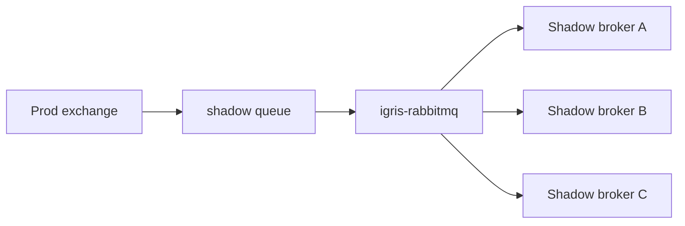
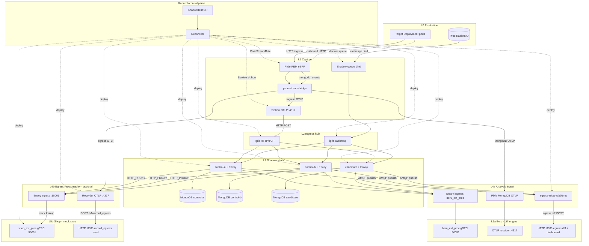
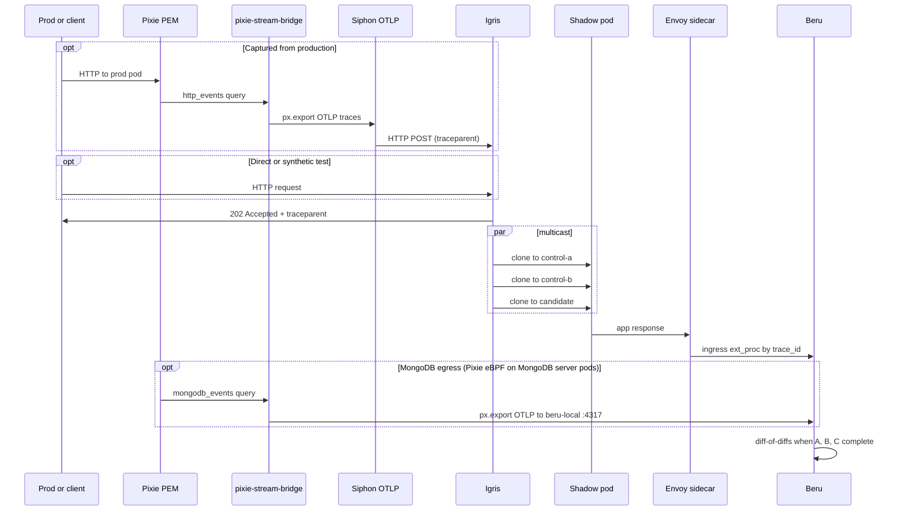
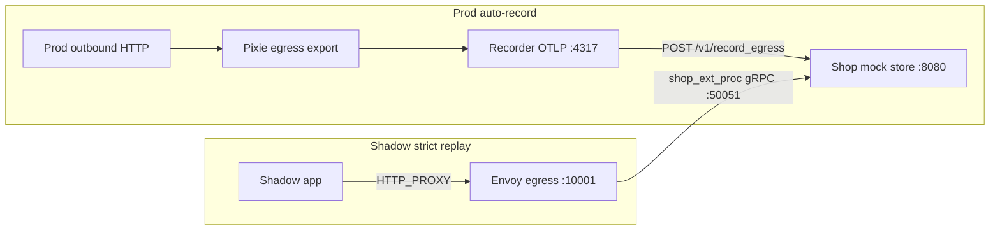
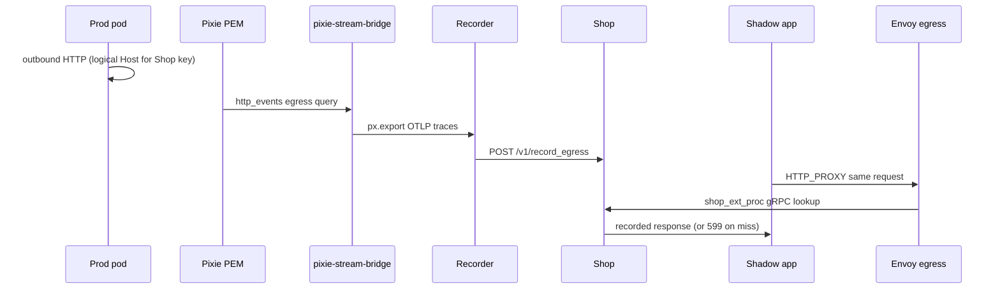

# Shadow-Diff — Architecture

Shadow-Diff is an open-source differential testing framework for Kubernetes. It replays captured or synthetic traffic across **three isolated shadow workloads** (two identical controls plus a candidate) and compares responses to find regressions while filtering non-deterministic noise.

This document describes **how the components fit together and how data flows**. For install steps, CRD fields, and verification, see [DEPLOYMENT.md](../../pipeline/monarch/DEPLOYMENT.md), [VERIFICATION.md](../verification/VERIFICATION.md), and per-service READMEs under `pipeline/`.

---

## Monorepo layout

| Path | Role |
|------|------|
| [`pipeline/monarch/`](../../pipeline/monarch/) | Kubernetes operator — reconciles `ShadowTest`, wires every layer |
| [`pipeline/igrises/igris-http/`](../../pipeline/igrises/igris-http/) | HTTP/TCP ingress hub — fan-out to three shadow pods |
| [`pipeline/igrises/igris-rabbitmq/`](../../pipeline/igrises/igris-rabbitmq/) | AMQP ingress multicaster — prod queue → three shadow brokers |
| [`pipeline/beru/`](../../pipeline/beru/) | Diff engine — ingress diff-of-diffs, MongoDB OTLP ingest, AMQP egress diff, dashboard |
| [`pipeline/shop/`](../../pipeline/shop/) | Mock store — records prod HTTP egress responses; serves them back to shadow apps via Envoy egress ext_proc |
| [`pipeline/siphon/`](../../pipeline/siphon/) | OTLP ingress receiver — Pixie ingress export → HTTP POST to Igris |
| [`pipeline/recorder/`](../../pipeline/recorder/) | Prod egress HTTP — Pixie OTLP → Shop mock store (record/replay) |
| [`pipeline/egress-relay-rabbitmq/`](../../pipeline/egress-relay-rabbitmq/) | Shadow broker Firehose → Beru egress diff (AMQP ShadowTests) |

Each service is a separate Go module. The repo root [`Makefile`](../../Makefile) delegates builds and tests.

---

## Architecture layers

Shadow-Diff is a **pipeline of layers**. **Monarch** is the control plane that wires them from a single `ShadowTest` CR. **Beru** is always the analysis sink. **Shop** + **Recorder** are always deployed per ShadowTest for HTTP egress record/replay (no `spec.recordAndReplay` field).

### Layer stack

```
┌─────────────────────────────────────────────────────────────────────────────┐
│  L0  Production     Target Deployment pods (real traffic / AMQP publishers)   │
└───────────────────────────────────┬─────────────────────────────────────────┘
                                    │
┌───────────────────────────────────▼─────────────────────────────────────────┐
│  L1  Capture        Driver-specific prod ingress tap:                          │
│                     • HTTP ingress → Pixie eBPF → OTLP → Siphon → Igris     │
│                     • AMQP → RabbitMQ native routing (shadow queue bind)      │
│                     • HTTP egress record → Pixie eBPF → OTLP → Recorder     │
│                       (always-on Shop + Recorder per shadow namespace)         │
└───────────────────────────────────┬─────────────────────────────────────────┘
                                    │
┌───────────────────────────────────▼─────────────────────────────────────────┐
│  L2  Ingress hub    Igris (HTTP/TCP)  OR  igris-rabbitmq (AMQP)             │
│                     Multicast same logical message to three shadow roles    │
└───────────────────────────────────┬─────────────────────────────────────────┘
                                    │
┌───────────────────────────────────▼─────────────────────────────────────────┐
│  L3  Shadow stack   Three Deployments × (app + Envoy sidecar) + deps          │
│                     control-a, control-b (oldImage), candidate (newImage) │
└───────────────────────────────────┬─────────────────────────────────────────┘
                                    │
                    ┌───────────────┴───────────────┐
                    │                               │
┌───────────────────▼──────────────┐   ┌────────────▼──────────────────────────┐
│  L4a  Analysis ingest          │   │  L4b  Egress record/replay (optional) │
│  HTTP ingress: Envoy ext_proc  │   │  Shadow HTTP replay: HTTP_PROXY →      │
│  → Beru diff-of-diffs          │   │  Envoy :10001 → Shop gRPC lookup       │
│  MongoDB egress: Pixie eBPF on │   │  Prod HTTP record: Pixie OTLP →        │
│  MongoDB pods → beru-local     │   │  Recorder :4317 → Shop mock store      │
│  OTLP :4317 → egress diff      │   │                                        │
│  AMQP egress: egress-relay-    │   │                                        │
│  rabbitmq → Beru egress diff   │   │                                        │
└───────────────────┬──────────────┘   └────────────┬──────────────────────────┘
                    │                               │
                    └───────────────┬───────────────┘
                                    │
┌───────────────────────────────────▼─────────────────────────────────────────┐
│  L5  Beru           gRPC ext_proc + OTLP receiver + HTTP egress diff + dashboard │
└─────────────────────────────────────────────────────────────────────────────┘

        ┌──────────────────────────────────────────────────────────┐
        │  Monarch (control plane, all layers)                      │
        │  Reconciles ShadowTest → namespaces, Deployments,         │
        │  Envoy + OTel config, Igris/Recorder/Siphon/AMQP wiring   │
        └──────────────────────────────────────────────────────────┘
```

**L1 — capture is input-driven.** HTTP **ingress** uses **Pixie** eBPF on prod pods: Monarch writes a `PixieStreamRule` with `otelEndpoint` when HTTP/TCP inputs enable Siphon, **pixie-stream-bridge** runs ingress `px.export` OTLP to per-shadow **Siphon** (`:4317`), and Siphon POSTs parsed requests to Igris. HTTP **egress record** is always-on: the same Pixie PEM runs a dual-branch egress PxL export to shadow **Recorder** (`:4317`), which seeds **Shop** via `POST /v1/record_egress` (Shop Put keeps first 2xx). RabbitMQ ingress uses **broker-native routing** (Monarch binds a shadow queue on the prod broker — no Pixie on the AMQP path).

**L4a — analysis ingest is workload-driven.** HTTP ingress responses reach Beru through **Envoy ingress `ext_proc`**. MongoDB egress is captured by **Pixie eBPF on the MongoDB server pods** (server-side events, `trace_role == 2`) and exported via `pixie-stream-bridge` as OTLP to the per-ShadowTest **beru-local** OTLP port `:4317` — the traceparent injected into the MongoDB `$comment` field correlates each write to its shadow trace. When shadow workers **publish AMQP messages**, **egress-relay-rabbitmq** reads RabbitMQ Firehose on each **shadow broker** and posts egress diff reports to Beru.

### HTTP ingress path

| Step | Layer | Component | What happens |
|------|-------|-----------|--------------|
| 1 | Production | Target pods | Real clients hit prod (e.g. `my-prod-app` Service) |
| 2 | Capture | **Pixie PEM** + **pixie-stream-bridge** | eBPF `http_events`; `px.export` OTLP traces with `traceparent` |
| 3 | Capture | **Siphon** | OTLP gRPC `:4317` → parse span attrs → HTTP POST to Igris |
| 4 | Ingress hub | **Igris** | Accepts replayed traffic; **202** + `traceparent`; clones to three shadow Services |
| 5 | Shadow stack | App + **Envoy** | App handles request; `traceparent` propagated in headers; Envoy observes ingress response |
| 6 | Analysis | **Beru** | Ingress `ext_proc` collects control-a, control-b, candidate → **diff-of-diffs** |

Synthetic tests can skip Pixie/Siphon and send traffic directly to Igris.

### HTTP egress record path (prod auto-record)

| Step | Layer | Component | What happens |
|------|-------|-----------|--------------|
| 1 | Production | Target / downstream pods | Outbound HTTP (logical `Host` header for Shop keying) |
| 2 | Capture | **Pixie PEM** + **pixie-stream-bridge** | Dual-branch egress PxL: `trace_role==1` on worker (external) + `trace_role==2` scoped by remote client pod (in-cluster) |
| 3 | Capture | **Recorder** (always-on) | OTLP gRPC `:4317` → parse span attrs → `POST /v1/record_egress` to **Shop** (all hosts) |
| 4 | Replay prep | **Shop** (always-on) | Mock store keyed by `trace:<traceID>:<METHOD>:<host>:<path>` — Envoy `:10001` → Shop gRPC ext_proc |

Monarch always sets `PixieStreamRule.recorderOtelEndpoint` to `<shadowtest>-recorder.<shadow-ns>.svc.cluster.local:4317`. There is no `recordAndReplayHosts` field. **pixie-stream-bridge** runs ingress and egress exports independently when the corresponding endpoints are set. See [/data-plane/egress-record-replay.md](/data-plane/egress-record-replay.md).

### RabbitMQ ingress path

| Step | Layer | Component | What happens |
|------|-------|-----------|--------------|
| 1 | Production | Publisher + broker | Messages to prod exchange/routing key |
| 2 | Capture | **RabbitMQ routing** | Monarch declares a prod shadow queue bound to the same exchange/routing key |
| 3 | Ingress hub | **igris-rabbitmq** | Consumes prod queue; injects W3C `traceparent`; publishes to three shadow brokers |
| 4 | Shadow stack | Worker + **Envoy** | App runs side effects; `traceparent` propagated in outbound headers and MongoDB `$comment` |
| 5 | Analysis | **Beru** | HTTP ingress → Envoy `ext_proc`; MongoDB egress → **Pixie eBPF → beru-local OTLP**; AMQP publishes → **egress-relay-rabbitmq** |


```mermaid
flowchart LR
  ProdEx[Prod exchange] --> ShadowQ[shadow queue]
  ShadowQ --> IgrisRMQ[igris-rabbitmq]
  IgrisRMQ --> RMQ_A[Shadow broker A]
  IgrisRMQ --> RMQ_B[Shadow broker B]
  IgrisRMQ --> RMQ_C[Shadow broker C]
```

### MongoDB egress diff path

| Step | Layer | Component | What happens |
|------|-------|-----------|--------------|
| 1 | Shadow stack | Worker | Inserts document into role-specific MongoDB with `traceparent` in `$comment` field |
| 2 | Capture | **Pixie PEM** | eBPF captures `mongodb_events` on MongoDB server pods (`trace_role == 2`) including `req_body` |
| 3 | Capture | **pixie-stream-bridge** | Runs `mongodb-export.pxl.tmpl` → filters by `namespace` + `"comment"` presence; `px.export` OTLP to beru-local |
| 4 | Analysis | **beru-local OTLP `:4317`** | Extracts traceparent from `req_body`, document body from second JSON object, role from MongoDB pod name; routes to TraceRouter |
| 5 | Analysis | **Beru** | Diff-of-diffs on document body (after stripping `_id`, `lsid`, `comment`, `$db`) |

Monarch sets `PixieStreamRule.mongoOtelEndpoint` to `beru-local.<shadow-ns>.svc.cluster.local:4317` when a MongoDB dependency is declared. The Pixie query uses a `−30s` rolling window; the E2E test waits for Pixie `CS_HEALTHY` before publishing traffic to avoid window misses.

### Egress layer (optional)

When downstream hosts are configured, two parallel mechanisms apply:

| Path | Flow | Purpose |
|------|------|---------|
| **Shadow HTTP replay** | Shadow app → `HTTP_PROXY` → Envoy **:10001** → **Shop** gRPC ext_proc | Strict replay: look up mock by trace ID + request, return recorded response or **599** on miss |
| **Prod HTTP auto-record** | Prod path → **Pixie** egress export → **Recorder** OTLP `:4317` → **Shop** `POST /v1/record_egress` | Always-on seed of Shop from prod outbound HTTP |
| **Shadow AMQP egress diff** | Shadow publish → broker Firehose → **egress-relay-rabbitmq** → Beru | Compare outbound AMQP publishes across the three roles |

**egress-relay-rabbitmq** observes **shadow** broker publishes for diff analysis. Prod HTTP auto-record is **Pixie → Recorder → Shop**, not Siphon TCP relay. Shop is deployed by Monarch per-ShadowTest into the shadow namespace alongside Recorder.

### Full stack (wiring view)


```mermaid
flowchart TB
  subgraph monarch [Monarch control plane]
    CR[ShadowTest CR]
    M[Reconciler]
    CR --> M
  end

  subgraph prod [L0 Production]
    ProdPod[Target Deployment pods]
    ProdBroker[(Prod RabbitMQ)]
  end

  subgraph capture [L1 Capture]
    Pixie[Pixie PEM eBPF]
    Bridge[pixie-stream-bridge]
    Siphon[Siphon OTLP :4317]
    RMQBind[Shadow queue bind]
  end

  subgraph ingress [L2 Ingress hub]
    IgrisHTTP[Igris HTTP/TCP]
    IgrisRMQ[igris-rabbitmq]
  end

  subgraph shadow [L3 Shadow stack]
    A[control-a + Envoy]
    B[control-b + Envoy]
    C[candidate + Envoy]
    MongoA[(MongoDB control-a)]
    MongoB[(MongoDB control-b)]
    MongoC[(MongoDB candidate)]
  end

  subgraph analysis [L4a Analysis ingest]
    ExtProc[Envoy ingress beru_ext_proc]
    PixieMongo[Pixie MongoDB OTLP]
    EgrRelay[egress-relay-rabbitmq]
  end

  subgraph egressopt [L4b Egress record/replay - optional]
    Rec[Recorder OTLP :4317]
    EgrEnv[Envoy egress :10001]
  end

  subgraph beru [L5a Beru - diff engine]
    BeruGRPC[beru_ext_proc gRPC :50051]
    BeruOTLP[OTLP receiver :4317]
    BeruHTTP[HTTP :8080 egress diff + dashboard]
  end

  subgraph shop [L5b Shop - mock store]
    ShopGRPC[shop_ext_proc gRPC :50051]
    ShopHTTP[HTTP :8080 record_egress seed]
  end

  M -.->|PixieStreamRule| Pixie
  M -.->|Service siphon| Siphon
  M -.->|declare queue| RMQBind
  M -.->|deploy| IgrisHTTP
  M -.->|deploy| IgrisRMQ
  M -.->|deploy| A
  M -.->|deploy| B
  M -.->|deploy| C
  M -.->|deploy| Rec
  M -.->|deploy| ShopGRPC
  M -.->|deploy| EgrRelay

  ProdPod -->|HTTP ingress| Pixie
  Pixie --> Bridge
  Bridge -->|ingress OTLP| Siphon
  Siphon -->|HTTP POST| IgrisHTTP
  Bridge -->|egress OTLP| Rec
  ProdBroker -->|exchange bind| RMQBind
  RMQBind --> IgrisRMQ

  IgrisHTTP --> A
  IgrisHTTP --> B
  IgrisHTTP --> C
  IgrisRMQ --> A
  IgrisRMQ --> B
  IgrisRMQ --> C

  A --> MongoA
  B --> MongoB
  C --> MongoC
  Pixie -->|mongodb_events| Bridge
  Bridge -->|MongoDB OTLP| PixieMongo
  PixieMongo --> BeruOTLP

  A --> ExtProc
  B --> ExtProc
  C --> ExtProc
  ExtProc --> BeruGRPC

  A -->|AMQP publish| EgrRelay
  B -->|AMQP publish| EgrRelay
  C -->|AMQP publish| EgrRelay
  EgrRelay -->|egress diff POST| BeruHTTP

  A -->|HTTP_PROXY| EgrEnv
  B -->|HTTP_PROXY| EgrEnv
  C -->|HTTP_PROXY| EgrEnv
  EgrEnv -->|mock lookup| ShopGRPC

  ProdPod -.->|outbound HTTP| Pixie
  Rec -->|POST /v1/record_egress| ShopHTTP
```

**Note on sidecars:** Each L3 pod runs **one** injected sidecar alongside the app:

| Sidecar | Role |
|---------|------|
| **Envoy** | Ingress listener → app → `beru_ext_proc` for HTTP diff-of-diffs; optional egress `:10001` → `shop_ext_proc` for HTTP replay |

MongoDB capture does **not** use an OTel agent sidecar. Pixie eBPF captures wire-protocol events directly on the MongoDB server pods without any application-side instrumentation.

| Listener | Port | Role |
|----------|------|------|
| **Ingress** | Shadow Service port (e.g. `:8888`) | Igris sends cloned traffic here → Envoy forwards to the app → **`beru_ext_proc` sends the response to Beru** for ingress diff-of-diffs |
| **Egress** (optional) | `127.0.0.1:10001` | Shadow app sets `HTTP_PROXY` → outbound HTTP hits this listener → **`shop_ext_proc` asks Shop** for a mock; Shop returns the recorded response or **599** on miss. Envoy never calls the real downstream. |

---

## The three-pod strategy

| Role | Purpose |
|------|---------|
| **Control A** | Baseline (old version) |
| **Control B** | Identical to A — surfaces dynamic / noisy fields |
| **Candidate** | Version under test |

Monarch materializes these as Deployments in a dedicated shadow namespace. Beru compares responses per trace using **diff-of-diffs**: diff(A, B) reveals noise; diff(A, C) reveals regressions beyond noise.

---

## End-to-end data flow

### HTTP ingress sequence


```mermaid
sequenceDiagram
  participant P as Prod or client
  participant Pix as Pixie PEM
  participant Br as pixie-stream-bridge
  participant S as Siphon OTLP
  participant I as Igris
  participant Sh as Shadow pod
  participant E as Envoy sidecar
  participant B as Beru

  opt Captured from production
    P->>Pix: HTTP to prod pod
    Pix->>Br: http_events query
    Br->>S: px.export OTLP traces
    S->>I: HTTP POST (traceparent)
  end
  opt Direct or synthetic test
    P->>I: HTTP request
  end
  I->>P: 202 Accepted + traceparent
  par multicast
    I->>Sh: clone to control-a
    I->>Sh: clone to control-b
    I->>Sh: clone to candidate
  end
  Sh->>E: app response
  E->>B: ingress ext_proc by trace_id
  opt MongoDB egress (Pixie eBPF on MongoDB server pods)
    Pix->>Br: mongodb_events query
    Br->>B: px.export OTLP to beru-local :4317
  end
  B->>B: diff-of-diffs when A, B, C complete
```

### Egress record and replay

Shadow replay and prod auto-record run **in parallel**:


```mermaid
flowchart LR
  subgraph record [Prod auto-record]
    ProdOut[Prod outbound HTTP]
    PixieEgr[Pixie egress export]
    RecorderSvc[Recorder OTLP :4317]
    ShopStore[Shop mock store :8080]
    ProdOut --> PixieEgr
    PixieEgr --> RecorderSvc
    RecorderSvc -->|POST /v1/record_egress| ShopStore
  end
  subgraph replay [Shadow strict replay]
    ShadowApp[Shadow app]
    EgrEnv[Envoy egress :10001]
    ShadowApp -->|HTTP_PROXY| EgrEnv
    EgrEnv -->|shop_ext_proc gRPC :50051| ShopStore
  end
```


```mermaid
sequenceDiagram
  participant P as Prod pod
  participant Pix as Pixie PEM
  participant Br as pixie-stream-bridge
  participant R as Recorder
  participant S as Shop
  participant Sh as Shadow app
  participant E as Envoy egress

  P->>P: outbound HTTP (logical Host for Shop key)
  Pix->>Br: http_events egress query
  Br->>R: px.export OTLP traces
  R->>S: POST /v1/record_egress
  Sh->>E: HTTP_PROXY same request
  E->>S: shop_ext_proc gRPC lookup
  S->>Sh: recorded response (or 599 on miss)
```

### Trace correlation

Beru and Shop receive shadow traffic through **complementary ingest paths**:

| Path | Source | Sink | Correlation |
|------|--------|------|-------------|
| **Ingress diff-of-diffs** | Envoy ingress `beru_ext_proc` | **Beru** | Trace id: `traceparent` → W3C `traceparent` → Envoy `x-request-id`; role from `x-shadow-role` |
| **Egress diff (MongoDB)** | Pixie eBPF `mongodb_events` → beru-local OTLP | **Beru** | Trace id from `$comment` field in MongoDB wire payload; role from MongoDB pod name pattern |
| **Egress diff (AMQP)** | egress-relay-rabbitmq | **Beru** | Trace id from message headers (`traceparent` or `traceparent`) |
| **Egress replay (HTTP)** | Envoy egress `shop_ext_proc` gRPC | **Shop** | Trace id from W3C `traceparent` in Envoy request headers; mock key includes `traceID:METHOD:host:path` |

**Ingress multicast.** **Igris** and **igris-rabbitmq** are the unified trace context source at ingress: `ResolveContext` runs once per event, then the **same** W3C `traceparent` and `traceparent` are stamped on all three shadow clones. Applications propagate `traceparent` on outbound MongoDB writes via the `$comment` field; Pixie captures the wire bytes and beru-local extracts the trace id server-side.

---

## Components (roles in the pipeline)

### Monarch

Kubebuilder operator in `monarch-system`. Reads `ShadowTest` and materializes the full pipeline: shadow namespace, three app Deployments with Envoy sidecars, ingress hub (Igris or igris-rabbitmq), **`PixieStreamRule`** (ingress `otelEndpoint` when HTTP capture is enabled; always `recorderOtelEndpoint`; `mongoOtelEndpoint` when Mongo deps exist) + shadow **`Service/siphon`** when ingress Siphon is on, **always-on Shop + Recorder**, optional egress-relay-rabbitmq, and ephemeral dependencies per role. Envoy always includes `shop_ext_proc` for egress replay. Does **not** deploy Pixie Vizier, pixie-stream-bridge, the Siphon OTLP Deployment, or the cluster-wide Beru — those are installed separately. There is **no** `spec.recordAndReplay` field.

### Igris (HTTP/TCP)

Pluggable ingress hub. **HTTP driver** accepts atomic requests, resolves W3C trace context once (`ResolveContext`), returns 202 immediately, and multicasts clones with identical `traceparent` to three shadow URLs in parallel. **TCP driver** relays streaming connections to three shadow hosts. Monarch writes listener config from the ShadowTest inputs.

### igris-rabbitmq

AMQP ingress hub. Consumes the prod shadow queue, injects W3C `traceparent` on multicast, and publishes the same logical message to three shadow RabbitMQ brokers (one per role).

### Siphon

Per-shadow-namespace **OTLP gRPC receiver** on `:4317`. Accepts gzip-compressed OTLP traces from Pixie `px.export` (via **pixie-stream-bridge**), parses HTTP fields from span attributes (`url.path`, `traceparent`, `http.request.method`, `http.request.body`), and **HTTP POST**s to **igris-http**. Monarch reconciles the cluster DNS target (`Service/siphon`) and `PixieStreamRule`; you deploy the Siphon Deployment with `SIPHON_IGRIS_BASE_URL` pointing at the shadow Igris Service.

### Recorder

Shadow-namespace service **always** deployed by Monarch. **Primary path:** accepts **OTLP gRPC** on `:4317` from Pixie egress `px.export`, parses HTTP span attributes, and posts **all** spans to **Shop** `POST /v1/record_egress` (`SHOP_HTTP_URL`). **Legacy path:** TCP framing on `:8080`.

### Shop

Per-ShadowTest **in-memory mock store** **always** deployed by Monarch alongside Recorder. Two ports:

| Port | Protocol | Role |
|------|----------|------|
| `:8080` | HTTP | `POST /v1/record_egress` seeded by Recorder; `GET /healthz` |
| `:50051` | gRPC | `shop_ext_proc` — Envoy egress ext_proc stream; returns recorded response or `PERMISSION_DENIED` / **599** on miss |

Mock key: `trace:<traceID>:<METHOD>:<host>:<path>`. The trace ID comes from the `traceparent` / `traceparent` header injected by Igris before multicasting to shadow pods. All state lives in memory (`sync.RWMutex` map) — state is lost on pod restart.

### egress-relay-rabbitmq

Shadow-namespace service for AMQP ShadowTests. Subscribes to RabbitMQ Firehose on each shadow broker, extracts trace id from message headers, and posts egress diff reports to Beru when shadow workers publish AMQP messages.

### Beru

Analysis sink. **Ingress:** Envoy `beru_ext_proc` reports per role → diff-of-diffs. **Egress (MongoDB):** OTLP receiver on `:4317` accepts Pixie eBPF captures from pixie-stream-bridge; `db.raw_payload` contains the two-object MongoDB wire format — command doc (for `insert:orders` signature) and document body (for content diff). `_id`, `lsid`, `comment`, and `$db` are stripped before comparison. **Egress (AMQP):** egress-relay-rabbitmq HTTP ingest on `:8080`. Dashboard for inspecting traces and diffs. Beru does **not** manage the HTTP mock store — that is Shop's role.

### Envoy (sidecar)

Injected into every shadow pod. **Ingress listener:** observes app responses, forwards to Beru via `beru_ext_proc`. **Egress listener (optional):** intercepts `HTTP_PROXY` traffic on `:10001`, calls `shop_ext_proc` to look up the recorded response from Shop. No MongoDB proxy — MongoDB capture is handled entirely by Pixie eBPF on the server side.

### pixie-stream-bridge

Host process (not a k8s pod) that polls `PixieStreamRule` CRs every 3 seconds and runs `px run -f <pxl>` for each active rule. Handles three independent export streams when a rule exposes the corresponding endpoints:

| Stream | PxL template | Destination |
|--------|-------------|-------------|
| HTTP ingress | `http-ingress-export.pxl.tmpl` | Siphon OTLP `:4317` |
| HTTP egress record | `http-egress-export.pxl.tmpl` | Recorder OTLP `:4317` |
| MongoDB egress diff | `mongodb-export.pxl.tmpl` | beru-local OTLP `:4317` |

The MongoDB template filters `mongodb_events` by shadow namespace, `trace_role == 2` (server-side events on MongoDB pods — client-side events from worker pods are not reliably available), and presence of `"comment"` in `req_body`. The traceparent value in `$comment` correlates each database write to its shadow trace.

---

## Technology stack

| Layer | Technologies |
|-------|----------------|
| Control plane | Go, Kubebuilder, controller-runtime |
| Ingress multicast | Go (`igris-http`, `igris-rabbitmq`) |
| Shadow proxy | Envoy, `ext_proc`, ConfigMaps from Monarch |
| Capture | Pixie eBPF + `PixieStreamRule`; pixie-stream-bridge (HTTP ingress, HTTP egress, MongoDB egress OTLP); Siphon → Igris; Recorder OTLP → Shop mocks |
| Analysis | Go, gRPC, Beru OTLP + diff engine, SQLite |
| Mock store | Shop — in-memory `sync.RWMutex` map; seeded by Recorder; served via gRPC ext_proc on `:50051` |
| Egress parse | Recorder — OTLP span attrs → Shop `POST /v1/record_egress`; pixie-stream-bridge MongoDB OTLP → beru-local diff |

---

## Related reading

- [README.md](../../README.md) — quick start
- [VERIFICATION.md](../verification/VERIFICATION.md) — verification steps
- [pipeline/monarch/DEPLOYMENT.md](../../pipeline/monarch/DEPLOYMENT.md) — install, ShadowTest fields, troubleshooting
- [pipeline/monarch/REPO_OVERVIEW.md](../../pipeline/monarch/REPO_OVERVIEW.md) — Monarch layout and dev workflow
- Per-service READMEs under `pipeline/*/`
