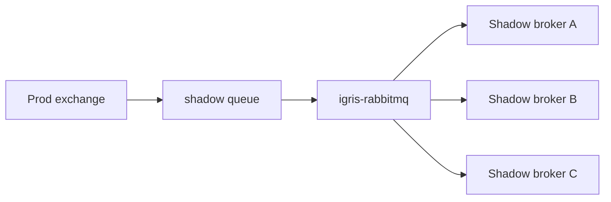
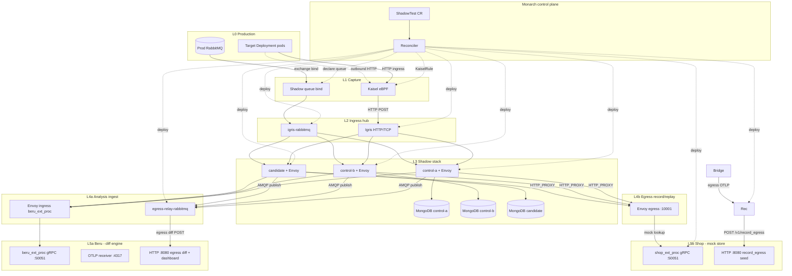
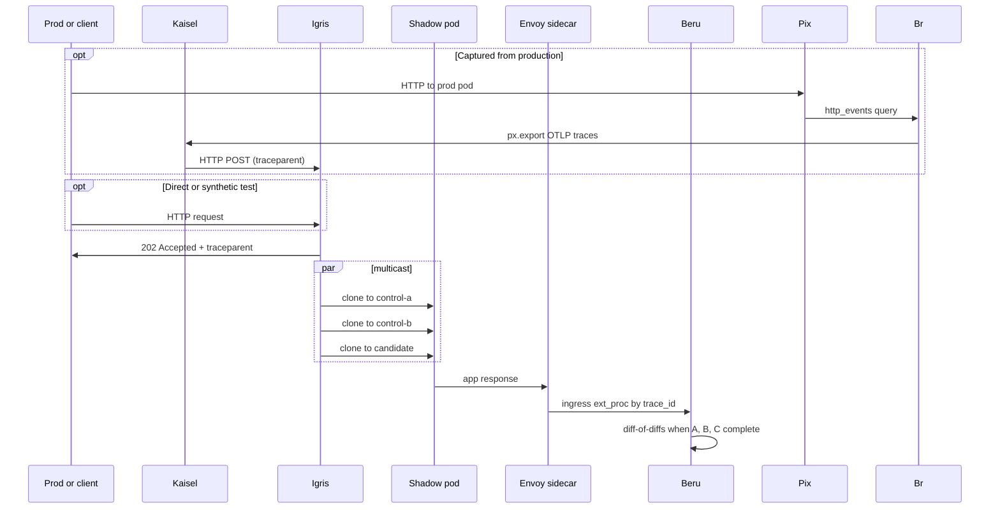
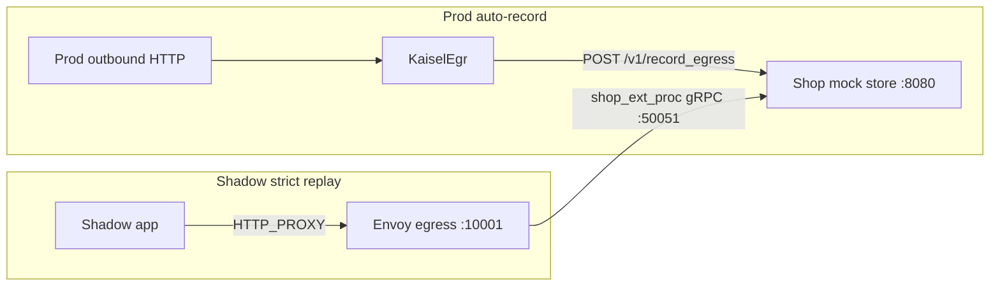
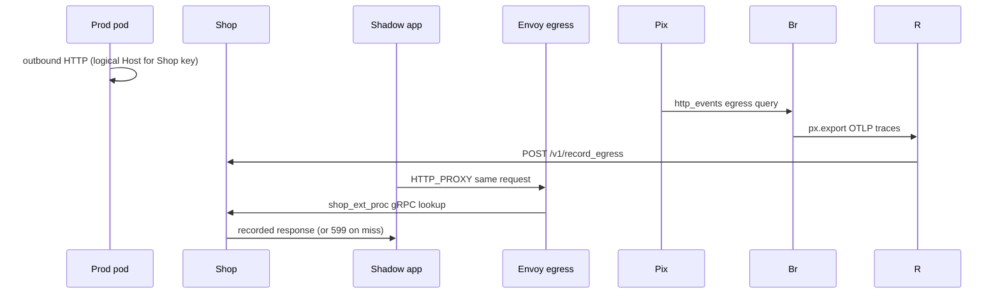

# Shadow-Diff — Architecture

Shadow-Diff is an open-source differential testing framework for Kubernetes. It replays captured or synthetic traffic across **three isolated shadow workloads** (two identical controls plus a candidate) and compares responses to find regressions while filtering non-deterministic noise.

This document describes **how the components fit together and how data flows**. For install steps, CRD fields, and verification, see [DEPLOYMENT.md](../../pipeline/monarch/DEPLOYMENT.md), [VERIFICATION.md](../verification/VERIFICATION.md), and per-service READMEs under `pipeline/`.

---

## Monorepo layout

| Path | Role |
|------|------|
| [`pipeline/monarch/`](../../pipeline/monarch/) | Kubernetes operator — reconciles `ShadowTest`, wires every layer |
| [`pipeline/igrises/igris-http/`](../../pipeline/igrises/igris-http/) | HTTP/TCP ingress hub — fan-out to three shadow pods |
| [`pipeline/igrises/igris-rabbitmq/`](../../pipeline/igrises/igris-rabbitmq/) | AMQP ingress multicaster — prod queue → three shadow brokers |
| [`pipeline/beru/`](../../pipeline/beru/) | Diff engine — ingress diff-of-diffs, MongoDB OTLP ingest, AMQP egress diff, dashboard |
| [`pipeline/shop/`](../../pipeline/shop/) | Mock store — records prod HTTP egress responses; serves them back to shadow apps via Envoy egress ext_proc |
| [`pipeline/kaisel/`](../../pipeline/kaisel/) | eBPF HTTP ingress capture — admit/sample → POST to Igris |
| [`pipeline/egress-relay-rabbitmq/`](../../pipeline/egress-relay-rabbitmq/) | Shadow broker Firehose → Beru egress diff (AMQP ShadowTests) |

Each service is a separate Go module. The repo root [`Makefile`](../../Makefile) delegates builds and tests.

---

## Architecture layers

Shadow-Diff is a **pipeline of layers**. **Monarch** is the control plane that wires them from a single `ShadowTest` CR. **Beru** is always the analysis sink. **Shop** is always deployed per ShadowTest for HTTP egress record/replay.

### Layer stack

```
┌─────────────────────────────────────────────────────────────────────────────┐
│  L0  Production     Target Deployment pods (real traffic / AMQP publishers)   │
└───────────────────────────────────┬─────────────────────────────────────────┘
                                    │
┌───────────────────────────────────▼─────────────────────────────────────────┐
│  L1  Capture        Driver-specific prod ingress tap:                          │
│                     • HTTP ingress → Kaisel eBPF → Igris                    │
│                     • AMQP → RabbitMQ native routing (shadow queue bind)      │
│                     • HTTP egress record → Kaisel eBPF → Shop               │
│                       (always-on Shop per shadow namespace)                    │
└───────────────────────────────────┬─────────────────────────────────────────┘
                                    │
┌───────────────────────────────────▼─────────────────────────────────────────┐
│  L2  Ingress hub    Igris (HTTP/TCP)  OR  igris-rabbitmq (AMQP)             │
│                     Multicast same logical message to three shadow roles    │
└───────────────────────────────────┬─────────────────────────────────────────┘
                                    │
┌───────────────────────────────────▼─────────────────────────────────────────┐
│  L3  Shadow stack   Three Deployments × (app + Envoy sidecar) + deps          │
│                     control-a, control-b (oldImage), candidate (newImage) │
└───────────────────────────────────┬─────────────────────────────────────────┘
                                    │
                    ┌───────────────┴───────────────┐
                    │                               │
┌───────────────────▼──────────────┐   ┌────────────▼──────────────────────────┐
│  L4a  Analysis ingest          │   │  L4b  Egress record/replay             │
│  HTTP ingress: Envoy ext_proc  │   │  Shadow HTTP replay: HTTP_PROXY →      │
│  → Beru diff-of-diffs          │   │  Envoy :10001 → Shop gRPC lookup       │
│  AMQP egress: egress-relay-    │   │  Prod HTTP record: Kaisel pairs        │
│  rabbitmq → Beru egress diff   │   │  request+response → Shop mock store    │
│                                │   │                                        │
└───────────────────┬──────────────┘   └────────────┬──────────────────────────┘
                    │                               │
                    └───────────────┬───────────────┘
                                    │
┌───────────────────────────────────▼─────────────────────────────────────────┐
│  L5  Beru           gRPC ext_proc + OTLP receiver + HTTP egress diff + dashboard │
└─────────────────────────────────────────────────────────────────────────────┘

        ┌──────────────────────────────────────────────────────────┐
        │  Monarch (control plane, all layers)                      │
        │  Reconciles ShadowTest → namespaces, Deployments,         │
        │  Envoy + OTel config, Igris/Kaisel/AMQP wiring            │
        └──────────────────────────────────────────────────────────┘
```

**L1 — capture is input-driven.** HTTP **ingress** uses **Kaisel** eBPF: Monarch writes a `KaiselRule` with target pod IPs and `igrisBaseURL`; Kaisel admits/samples and POSTs to igris-http. HTTP **egress record** is always-on via **Kaisel**, which pairs each outbound request with its response and POSTs the pair to **Shop**. RabbitMQ ingress uses **broker-native routing** (Monarch binds a shadow queue on the prod broker).

**L4a — analysis ingest is workload-driven.** HTTP ingress responses reach Beru through **Envoy ingress `ext_proc`**. When shadow workers **publish AMQP messages**, **egress-relay-rabbitmq** reads RabbitMQ Firehose on each **shadow broker** and posts egress diff reports to Beru. Beru's OTLP receiver on `:4317` is retained but has no producer — see [/data-plane/pixie-removal.md](/data-plane/pixie-removal.md).

### HTTP ingress path

| Step | Layer | Component | What happens |
|------|-------|-----------|--------------|
| 1 | Production | Target pods | Real clients hit prod (e.g. `my-prod-app` Service) |
| 2 | Capture | **Kaisel** | AF_PACKET socket filter; TCP reassembly; admit/sample on `traceparent` |
| 3 | Capture | **Kaisel** | eBPF capture → admit/sample → HTTP POST to Igris |
| 4 | Ingress hub | **Igris** | Accepts replayed traffic; **202** + `traceparent`; clones to three shadow Services |
| 5 | Shadow stack | App + **Envoy** | App handles request; `traceparent` propagated in headers; Envoy observes ingress response |
| 6 | Analysis | **Beru** | Ingress `ext_proc` collects control-a, control-b, candidate → **diff-of-diffs** |

Synthetic tests can send traffic directly to Igris.

### HTTP egress record path (prod auto-record)

| Step | Layer | Component | What happens |
|------|-------|-----------|--------------|
| 1 | Production | Target / downstream pods | Outbound HTTP (logical `Host` header for Shop keying) |
| 2 | Capture | **Kaisel** | Source-address match = egress; per-connection FIFO pairing of request with response |
| 3 | Capture | **Kaisel** | `POST /v1/record_egress` to **Shop** (all hosts); Shop derives the mock key |
| 4 | Replay prep | **Shop** (always-on) | Mock store keyed by `trace:<traceID>:<METHOD>:<host>:<path>` — Envoy `:10001` → Shop gRPC ext_proc |

Monarch sets `KaiselRule.spec.egressBaseURL` to `http://shop.<shadow-ns>.svc.cluster.local:8080`. Kaisel POSTs every paired transaction to Shop. See [/data-plane/egress-record-replay.md](/data-plane/egress-record-replay.md).

### RabbitMQ ingress path

| Step | Layer | Component | What happens |
|------|-------|-----------|--------------|
| 1 | Production | Publisher + broker | Messages to prod exchange/routing key |
| 2 | Capture | **RabbitMQ routing** | Monarch declares a prod shadow queue bound to the same exchange/routing key |
| 3 | Ingress hub | **igris-rabbitmq** | Consumes prod queue; injects W3C `traceparent`; publishes to three shadow brokers |
| 4 | Shadow stack | Worker + **Envoy** | App runs side effects; `traceparent` propagated in outbound headers and MongoDB `$comment` |
| 5 | Analysis | **Beru** | HTTP ingress → Envoy `ext_proc`; AMQP publishes → **egress-relay-rabbitmq** |


```mermaid
flowchart LR
  ProdEx[Prod exchange] --> ShadowQ[shadow queue]
  ShadowQ --> IgrisRMQ[igris-rabbitmq]
  IgrisRMQ --> RMQ_A[Shadow broker A]
  IgrisRMQ --> RMQ_B[Shadow broker B]
  IgrisRMQ --> RMQ_C[Shadow broker C]
```

### Egress layer

HTTP record/replay and AMQP egress diff run as parallel mechanisms:

| Path | Flow | Purpose |
|------|------|---------|
| **Shadow HTTP replay** | Shadow app → `HTTP_PROXY` → Envoy **:10001** → **Shop** gRPC ext_proc | Strict replay: look up mock by trace ID + request, return recorded response or **599** on miss |
| **Prod HTTP auto-record** | Prod path → **Kaisel** pairs request+response → **Shop** `POST /v1/record_egress` | Always-on seed of Shop from prod outbound HTTP |
| **Shadow AMQP egress diff** | Shadow publish → broker Firehose → **egress-relay-rabbitmq** → Beru | Compare outbound AMQP publishes across the three roles |

**egress-relay-rabbitmq** observes **shadow** broker publishes for AMQP egress diff. Prod HTTP auto-record is **Kaisel → Shop**. Monarch deploys Shop into each shadow namespace.

### Full stack (wiring view)


```mermaid
flowchart TB
  subgraph monarch [Monarch control plane]
    CR[ShadowTest CR]
    M[Reconciler]
    CR --> M
  end

  subgraph prod [L0 Production]
    ProdPod[Target Deployment pods]
    ProdBroker[(Prod RabbitMQ)]
  end

  subgraph capture [L1 Capture]
    Kaisel[Kaisel eBPF]
    RMQBind[Shadow queue bind]
  end

  subgraph ingress [L2 Ingress hub]
    IgrisHTTP[Igris HTTP/TCP]
    IgrisRMQ[igris-rabbitmq]
  end

  subgraph shadow [L3 Shadow stack]
    A[control-a + Envoy]
    B[control-b + Envoy]
    C[candidate + Envoy]
    MongoA[(MongoDB control-a)]
    MongoB[(MongoDB control-b)]
    MongoC[(MongoDB candidate)]
  end

  subgraph analysis [L4a Analysis ingest]
    ExtProc[Envoy ingress beru_ext_proc]
    EgrRelay[egress-relay-rabbitmq]
  end

  subgraph egressopt [L4b Egress record/replay]
    EgrEnv[Envoy egress :10001]
  end

  subgraph beru [L5a Beru - diff engine]
    BeruGRPC[beru_ext_proc gRPC :50051]
    BeruOTLP[OTLP receiver :4317]
    BeruHTTP[HTTP :8080 egress diff + dashboard]
  end

  subgraph shop [L5b Shop - mock store]
    ShopGRPC[shop_ext_proc gRPC :50051]
    ShopHTTP[HTTP :8080 record_egress seed]
  end

  M -.->|KaiselRule| Kaisel
  M -.->|declare queue| RMQBind
  M -.->|deploy| IgrisHTTP
  M -.->|deploy| IgrisRMQ
  M -.->|deploy| A
  M -.->|deploy| B
  M -.->|deploy| C
  M -.->|deploy| Rec
  M -.->|deploy| ShopGRPC
  M -.->|deploy| EgrRelay

  ProdPod -->|HTTP ingress| Kaisel
  Kaisel -->|HTTP POST| IgrisHTTP
  Bridge -->|egress OTLP| Rec
  ProdBroker -->|exchange bind| RMQBind
  RMQBind --> IgrisRMQ

  IgrisHTTP --> A
  IgrisHTTP --> B
  IgrisHTTP --> C
  IgrisRMQ --> A
  IgrisRMQ --> B
  IgrisRMQ --> C

  A --> MongoA
  B --> MongoB
  C --> MongoC

  A --> ExtProc
  B --> ExtProc
  C --> ExtProc
  ExtProc --> BeruGRPC

  A -->|AMQP publish| EgrRelay
  B -->|AMQP publish| EgrRelay
  C -->|AMQP publish| EgrRelay
  EgrRelay -->|egress diff POST| BeruHTTP

  A -->|HTTP_PROXY| EgrEnv
  B -->|HTTP_PROXY| EgrEnv
  C -->|HTTP_PROXY| EgrEnv
  EgrEnv -->|mock lookup| ShopGRPC

  ProdPod -.->|outbound HTTP| Kaisel
  Rec -->|POST /v1/record_egress| ShopHTTP
```

**Note on sidecars:** Each L3 pod runs **one** injected sidecar alongside the app:

| Sidecar | Role |
|---------|------|
| **Envoy** | Ingress listener → app → `beru_ext_proc` for HTTP diff-of-diffs; egress `:10001` → `shop_ext_proc` for HTTP replay |

MongoDB egress diffing is currently unavailable — its capture path was removed with Pixie. See [/data-plane/pixie-removal.md](/data-plane/pixie-removal.md).

| Listener | Port | Role |
|----------|------|------|
| **Ingress** | Shadow Service port (e.g. `:8888`) | Igris sends cloned traffic here → Envoy forwards to the app → **`beru_ext_proc` sends the response to Beru** for ingress diff-of-diffs |
| **Egress** | `127.0.0.1:10001` | Shadow app sets `HTTP_PROXY` → outbound HTTP hits this listener → **`shop_ext_proc` asks Shop** for a mock; Shop returns the recorded response or **599** on miss. Envoy does not call the real downstream. |

---

## The three-pod strategy

| Role | Purpose |
|------|---------|
| **Control A** | Baseline (old version) |
| **Control B** | Identical to A — surfaces dynamic / noisy fields |
| **Candidate** | Version under test |

Monarch materializes these as Deployments in a dedicated shadow namespace. Beru compares responses per trace using **diff-of-diffs**: diff(A, B) reveals noise; diff(A, C) reveals regressions beyond noise.

---

## End-to-end data flow

### HTTP ingress sequence


```mermaid
sequenceDiagram
  participant P as Prod or client
  participant S as Kaisel
  participant I as Igris
  participant Sh as Shadow pod
  participant E as Envoy sidecar
  participant B as Beru

  opt Captured from production
    P->>Pix: HTTP to prod pod
    Pix->>Br: http_events query
    Br->>S: px.export OTLP traces
    S->>I: HTTP POST (traceparent)
  end
  opt Direct or synthetic test
    P->>I: HTTP request
  end
  I->>P: 202 Accepted + traceparent
  par multicast
    I->>Sh: clone to control-a
    I->>Sh: clone to control-b
    I->>Sh: clone to candidate
  end
  Sh->>E: app response
  E->>B: ingress ext_proc by trace_id
  B->>B: diff-of-diffs when A, B, C complete
```

### Egress record and replay

Shadow replay and prod auto-record run **in parallel**:


```mermaid
flowchart LR
  subgraph record [Prod auto-record]
    ProdOut[Prod outbound HTTP]
    ShopStore[Shop mock store :8080]
    ProdOut --> KaiselEgr
    KaiselEgr -->|POST /v1/record_egress| ShopStore
  end
  subgraph replay [Shadow strict replay]
    ShadowApp[Shadow app]
    EgrEnv[Envoy egress :10001]
    ShadowApp -->|HTTP_PROXY| EgrEnv
    EgrEnv -->|shop_ext_proc gRPC :50051| ShopStore
  end
```


```mermaid
sequenceDiagram
  participant P as Prod pod
  participant S as Shop
  participant Sh as Shadow app
  participant E as Envoy egress

  P->>P: outbound HTTP (logical Host for Shop key)
  Pix->>Br: http_events egress query
  Br->>R: px.export OTLP traces
  R->>S: POST /v1/record_egress
  Sh->>E: HTTP_PROXY same request
  E->>S: shop_ext_proc gRPC lookup
  S->>Sh: recorded response (or 599 on miss)
```

### Trace correlation

Beru and Shop receive shadow traffic through **complementary ingest paths**:

| Path | Source | Sink | Correlation |
|------|--------|------|-------------|
| **Ingress diff-of-diffs** | Envoy ingress `beru_ext_proc` | **Beru** | Trace id: `traceparent` → W3C `traceparent` → Envoy `x-request-id`; role from `x-shadow-role` |
| **Egress diff (AMQP)** | egress-relay-rabbitmq | **Beru** | Trace id from message headers (`traceparent` or `traceparent`) |
| **Egress replay (HTTP)** | Envoy egress `shop_ext_proc` gRPC | **Shop** | Trace id from W3C `traceparent` in Envoy request headers; mock key includes `traceID:METHOD:host:path` |

**Ingress multicast.** **Igris** and **igris-rabbitmq** resolve trace context once per event (`ResolveContext`), then stamp the **same** W3C `traceparent` on all three shadow clones. **igris-http** requires a valid inbound `traceparent` (no mint).

---

## Components (roles in the pipeline)

### Monarch

Kubebuilder operator in `monarch-system`. Reads `ShadowTest` and materializes the full pipeline: shadow namespace, three app Deployments with Envoy sidecars, ingress hub (Igris or igris-rabbitmq), **`KaiselRule`** (HTTP ingress `igrisBaseURL` + egress `egressBaseURL`), **always-on Shop**, egress-relay-rabbitmq for AMQP ShadowTests, and ephemeral dependencies per role. Envoy always includes `shop_ext_proc` for egress replay. The Kaisel DaemonSet and cluster-wide Beru are installed separately.

### Igris (HTTP/TCP)

Pluggable ingress hub. **HTTP driver** accepts atomic requests, resolves W3C trace context once (`ResolveContext`), returns 202 immediately, and multicasts clones with identical `traceparent` to three shadow URLs in parallel. **TCP driver** relays streaming connections to three shadow hosts. Monarch writes listener config from the ShadowTest inputs.

### igris-rabbitmq

AMQP ingress hub. Consumes the prod shadow queue, injects W3C `traceparent` on multicast, and publishes the same logical message to three shadow RabbitMQ brokers (one per role).

### Kaisel

Cluster-wide eBPF DaemonSet. Captures HTTP to target pod IPs from `KaiselRule`, admits traced/sampled requests, and POSTs to the per-ShadowTest igris-http Service.


### Shop

Per-ShadowTest **in-memory mock store**, **always** deployed by Monarch. Two ports:

| Port | Protocol | Role |
|------|----------|------|
| `:8080` | HTTP | `POST /v1/record_egress` seeded by Kaisel; `GET /healthz` |
| `:50051` | gRPC | `shop_ext_proc` — Envoy egress ext_proc stream; returns recorded response or `PERMISSION_DENIED` / **599** on miss |

Mock key: `trace:<traceID>:<METHOD>:<host>:<path>`. The trace ID comes from the `traceparent` / `traceparent` header injected by Igris before multicasting to shadow pods. All state lives in memory (`sync.RWMutex` map) — state is lost on pod restart.

### egress-relay-rabbitmq

Shadow-namespace service for AMQP ShadowTests. Subscribes to RabbitMQ Firehose on each shadow broker, extracts trace id from message headers, and posts egress diff reports to Beru when shadow workers publish AMQP messages.

### Beru

Analysis sink. **Ingress:** Envoy `beru_ext_proc` reports per role → diff-of-diffs. **Egress (MongoDB):** the OTLP receiver on `:4317` and its MongoDB wire parser are retained but dormant — no capture path currently produces MongoDB spans. **Egress (AMQP):** egress-relay-rabbitmq HTTP ingest on `:8080`. Dashboard for inspecting traces and diffs. The HTTP mock store is Shop's role.

### Envoy (sidecar)

Injected into every shadow pod. **Ingress listener:** observes app responses, forwards to Beru via `beru_ext_proc`. **Egress listener:** intercepts `HTTP_PROXY` traffic on `:10001`, calls `shop_ext_proc` to look up the recorded response from Shop.

## Technology stack

| Layer | Technologies |
|-------|----------------|
| Control plane | Go, Kubebuilder, controller-runtime |
| Ingress multicast | Go (`igris-http`, `igris-rabbitmq`) |
| Shadow proxy | Envoy, `ext_proc`, ConfigMaps from Monarch |
| Capture | Kaisel eBPF + `KaiselRule`; HTTP ingress → Igris; HTTP egress request/response pairs → Shop mocks |
| Analysis | Go, gRPC, Beru OTLP + diff engine, SQLite |
| Mock store | Shop — in-memory `sync.RWMutex` map; seeded by Kaisel; served via gRPC ext_proc on `:50051` |
| Egress parse | Kaisel — per-connection request/response pairing → Shop `POST /v1/record_egress` |

---

## Related reading

- [README.md](../../README.md) — quick start
- [VERIFICATION.md](../verification/VERIFICATION.md) — verification steps
- [pipeline/monarch/DEPLOYMENT.md](../../pipeline/monarch/DEPLOYMENT.md) — install, ShadowTest fields, troubleshooting
- [pipeline/monarch/REPO_OVERVIEW.md](../../pipeline/monarch/REPO_OVERVIEW.md) — Monarch layout and dev workflow
- Per-service READMEs under `pipeline/*/`
