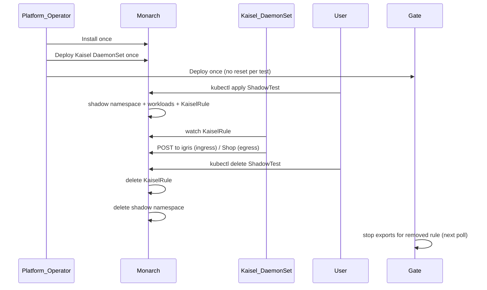

# Platform Bootstrap and ShadowTest Lifecycle

Shadow-Diff splits **platform install** (once per cluster) from **ShadowTest lifecycle** (on demand). Monarch, Beru and **Kaisel** are cluster infrastructure — they are **not** torn down when a ShadowTest is deleted, and they do **not** need to be reinstalled or reset between tests.

## Mental model

| Layer | Installed | Lifecycle |
|-------|-----------|-----------|
| **Monarch** operator | Once (`monarch-system`) | Survives all ShadowTests |
| **Kaisel** DaemonSet | Once (`kaisel-system`) | Survives all ShadowTests; watches `KaiselRule` CRs |
| **Beru** (`beru-system` or per-shadow `beru-local`) | Once shared, or per test via Monarch | `beru-local` removed with shadow namespace |
| **ShadowTest** CR | Per test | Create → Ready → Delete |

Monarch writes a **`KaiselRule`** custom resource per ShadowTest carrying live target pod IPs and the URLs to forward to. It does **not** touch the kernel. The **Kaisel** DaemonSet watches those CRs and updates its eBPF maps in place — no daemon restart when pod IPs change.



---

## Phase 1 — Platform bootstrap (one time)

Install these components **before** any ShadowTest.

### 1. Monarch operator

```bash
make -C pipeline/monarch install    # ShadowTest + KaiselRule CRDs
make -C pipeline/monarch deploy IMG=<registry>/monarch:<tag>
```

Set `MONARCH_MODE=dev` on the controller Deployment when using local `:dev` helper images (Minikube/Kind E2E). Production charts should pin image tags via CR overrides or operator env vars.

### 2. Beru analysis sink

```bash
kubectl apply -f pipeline/beru/deploy/
```

When `spec.beruGRPCAddress` is unset on a ShadowTest, Monarch provisions **beru-local** inside each shadow namespace automatically.

### 3. Kaisel DaemonSet (HTTP ingress and egress)

Install Kaisel once per cluster (`kubectl apply -k pipeline/kaisel/deploy/`). When HTTP ingress capture is enabled, Monarch creates a `KaiselRule` with target pod IPs, ports, `igrisBaseURL`, and `samplePercentage`. Kaisel POSTs admitted requests to the shadow Igris Service.

MongoDB egress and AMQP paths do not use Kaisel.

### Bootstrap verification

```bash
kubectl get pods -n monarch-system
kubectl get pods -n kaisel-system -l app=kaisel
kubectl get pods -n pl -l name=vizier-pem
kubectl get pods -n kaisel-system -l app=kaisel
px get viziers    # expect CS_HEALTHY
```

---

## Phase 2 — Creating a ShadowTest (no platform reset)

Once the platform is up, users only apply a ShadowTest CR. **Do not** restart the Kaisel DaemonSet unless troubleshooting.

### Apply the CR

```bash
kubectl apply -f my-shadowtest.yaml
kubectl wait --for=condition=Ready shadowtest/my-app-shadow -n default --timeout=300s
```

Example fields: `targetDeployment`, `oldImage` / `newImage`, `inputs`, `dependencies` (MongoDB, RabbitMQ, etc.). See [pipeline/monarch/DEPLOYMENT.md](https://github.com/shadow-diff/monarch/tree/main/pipeline/monarch/DEPLOYMENT.md).

### What Monarch creates

| Resource | Location |
|----------|----------|
| Shadow namespace | `shadow-<crNamespace>-<crName>` |
| Three shadow Deployments | `control-a`, `control-b`, `candidate` (+ Envoy sidecar) |
| Ingress hub | Igris or igris-rabbitmq |
| Dependencies | Per-role MongoDB, RabbitMQ, Redis, … |
| beru-local | Shadow namespace (when no shared Beru gRPC address) |

### Concurrent ShadowTests

Supported. Each test gets its own shadow namespace, `KaiselRule`, and `beru-local`. Kaisel merges all active rules into one set of eBPF maps. Avoid pointing multiple ShadowTests at the same prod Deployment unless intentional duplicate capture is desired.

---

## Phase 3 — Deleting a ShadowTest

```bash
kubectl delete shadowtest my-app-shadow -n default
```

Monarch:

1. Tears down the shadow namespace and owned workloads

**Leave the Kaisel DaemonSet running.** Deleting the `KaiselRule` removes its addresses from the eBPF maps.

### Delete race note

`Reconcile` checks `deletionTimestamp` only at the **start** of each pass. An in-flight create reconcile that already passed that check can still create later resources (Deployments, `KaiselRule`, …) after `kubectl delete` has been issued. Prefer waiting for the ShadowTest to reach Ready before deleting in automation, or re-delete if orphans appear.

---

## Anti-patterns

| Avoid | Prefer |
|-------|--------|
| Restart Vizier between ShadowTests | Leave Vizier up for the cluster lifetime |
| Rollout-restart the Kaisel DaemonSet before each test | Leave it running; wait on `KaiselRule.status.phase` |
| Folding eBPF capture into Monarch | Keep Monarch unprivileged; the Kaisel DaemonSet owns capture |

---

## Related

- [/data-plane/kaisel-ebpf.md](/data-plane/kaisel-ebpf.md) — capture daemon, privilege model, control loop
- [ARCHITECTURE.md](/architecture/ARCHITECTURE.md) — layer stack
- [pipeline/kaisel/deploy/](https://github.com/shadow-diff/monarch/tree/main/pipeline/kaisel/deploy) — RBAC, ConfigMap, DaemonSet
