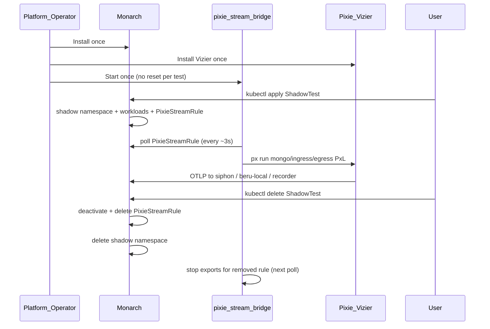

# Platform Bootstrap and ShadowTest Lifecycle

Shadow-Diff splits **platform install** (once per cluster) from **ShadowTest lifecycle** (on demand). Pixie Vizier and the pixie-stream-bridge are cluster infrastructure — they are **not** torn down when a ShadowTest is deleted, and they do **not** need to be reinstalled or reset between tests.

## Mental model

| Layer | Installed | Lifecycle |
|-------|-----------|-----------|
| **Monarch** operator | Once (`monarch-system`) | Survives all ShadowTests |
| **Pixie Vizier** (`pl` namespace) | Once | Survives all ShadowTests |
| **pixie-stream-bridge** | Once (Deployment or supervised host daemon) | Survives all ShadowTests; polls `PixieStreamRule` CRs |
| **Beru** (`beru-system` or per-shadow `beru-local`) | Once shared, or per test via Monarch | `beru-local` removed with shadow namespace |
| **ShadowTest** CR | Per test | Create → Ready → Delete |

Monarch writes a **`PixieStreamRule`** custom resource per ShadowTest. It does **not** push PxL scripts into Pixie. The bridge reads those CRs and runs `px run` / `px.export` on a polling loop.



---

## Phase 1 — Platform bootstrap (one time)

Install these components **before** any ShadowTest. Do **not** restart or reinstall Pixie when adding a new test.

### 1. Monarch operator

```bash
make -C pipeline/monarch install    # ShadowTest + PixieStreamRule CRDs
make -C pipeline/monarch deploy IMG=<registry>/monarch:<tag>
```

Set `MONARCH_MODE=dev` on the controller Deployment when using local `:dev` helper images (Minikube/Kind E2E). Production charts should pin image tags via CR overrides or operator env vars.

### 2. Beru analysis sink

```bash
kubectl apply -f pipeline/beru/deploy/
```

When `spec.beruGRPCAddress` is unset on a ShadowTest, Monarch provisions **beru-local** inside each shadow namespace automatically.

### 3. Pixie Vizier (eBPF PEM)

Pixie requires a VM-capable cluster node (Minikube `kvm2` / `virtualbox`; not Kind/docker driver).

```bash
# Pixie Cloud account: px auth login or export PIXIE_API_KEY
MINIKUBE_DRIVER=kvm2 ./testing/bats/setup/setup-local-pixie.sh --no-bridge
```

This installs Vizier into namespace `pl` and applies bridge RBAC + PxL templates (`monarch-system/pixie-stream-bridge` ConfigMap). Use `--no-bridge` when the bridge is packaged separately (Helm Deployment).

**Helm / production:** install the Pixie operator chart with your deploy key; ensure PEM pods are `Running` and `px get viziers` reports `CS_HEALTHY`.

### 4. pixie-stream-bridge (long-lived daemon)

The bridge is **not** deployed by Monarch. It must run continuously:

```bash
./testing/bats/setup/start-pixie-stream-bridge.sh
```

Or run in foreground for debugging:

```bash
./testing/bats/pixie-stream-bridge.sh
```

**Production / Helm:** package as a single-replica Deployment in `monarch-system` with:

- ServiceAccount bound to [`pixie-stream-bridge` RBAC](/testing/bats/manifests/pixie-bridge/rbac.yaml) (`get/list/watch` on `pixiestreamrules`)
- `PIXIE_API_KEY` (or Pixie deploy key) as a Secret
- `px` CLI + `kubectl` in the container image
- **No** aggressive `pkill` + short sleep restart between ShadowTests — use normal rolling updates with adequate `terminationGracePeriodSeconds` (≥30s) so in-flight `px run` can finish

The bridge polls all `PixieStreamRule` objects cluster-wide every `PIXIE_EXPORT_INTERVAL_SEC` (default 3s).

### 5. Siphon OTLP receiver (HTTP Pixie ingress only)

When HTTP ingress capture is enabled, Monarch creates `Service/siphon` and `Deployment/siphon` in the shadow namespace. The Deployment receives OTLP on `:4317` and POSTs to the shadow Igris Service (`SIPHON_IGRIS_BASE_URL`). No separate bats/chart apply is required.

MongoDB egress and AMQP paths do not require Siphon.

### Bootstrap verification

```bash
kubectl get pods -n monarch-system
kubectl get pods -n pl -l name=vizier-pem
pgrep -af pixie-stream-bridge || kubectl get pods -n monarch-system -l app=pixie-stream-bridge
px get viziers    # expect CS_HEALTHY
```

---

## Phase 2 — Creating a ShadowTest (no Pixie reset)

Once the platform is up, users only apply a ShadowTest CR. **Do not** rerun `setup-local-pixie.sh`, restart Vizier, or kill the bridge unless troubleshooting.

### Apply the CR

```bash
kubectl apply -f my-shadowtest.yaml
kubectl wait --for=condition=Ready shadowtest/my-app-shadow -n default --timeout=300s
```

Example fields: `targetDeployment`, `oldImage` / `newImage`, `inputs`, `dependencies` (MongoDB, RabbitMQ, etc.). See [pipeline/monarch/DEPLOYMENT.md](https://github.com/shadow-diff/monarch/tree/main/pipeline/monarch/DEPLOYMENT.md).

### What Monarch creates

| Resource | Location |
|----------|----------|
| Shadow namespace | `shadow-<crNamespace>-<crName>` |
| Three shadow Deployments | `control-a`, `control-b`, `candidate` (+ Envoy sidecar) |
| Ingress hub | Igris or igris-rabbitmq |
| Dependencies | Per-role MongoDB, RabbitMQ, Redis, … |
| beru-local | Shadow namespace (when no shared Beru gRPC address) |
| **PixieStreamRule** | `pixie-<shadowtest-name>` in the **same namespace as the ShadowTest CR** |

### PixieStreamRule endpoints (set by Monarch)

| Field | When set | OTLP destination |
|-------|----------|------------------|
| `spec.otelEndpoint` | HTTP ingress Siphon enabled (`http_request`/`tcp_stream` on servicePort, applicationPort, or container port) | `siphon.<shadow-ns>.svc.cluster.local:4317` |
| `spec.targetPorts` | When ingress Siphon enabled | `applicationPort` (prod app port for Pixie `local_port`, not Envoy `servicePort`) |
| `spec.recorderOtelEndpoint` | Always (Shop+Recorder always-on; no `spec.recordAndReplay` field) | `<shadowtest>-recorder.<shadow-ns>:4317` |
| `spec.mongoOtelEndpoint` | MongoDB `dependencies[]` | `beru-local.<shadow-ns>.svc.cluster.local:4317` |
| `spec.shadowNamespace` | MongoDB dependency | Filters mongo PxL to shadow pods only |

### What the bridge does automatically

Within one poll cycle after the CR exists and `spec.active=true`:

1. Renders `${PIXIE_BRIDGE_STATE_DIR}/<crNs>-pixie-<name>-{ingress,egress,mongo}.pxl`
2. Runs `px run -f <pxl>` for each non-empty endpoint
3. Patches `PixieStreamRule.status.phase` to `Active`, `Error`, or `Inactive`

**No manual script step is required.** E2E test scripts that `pkill` the bridge are a test-harness workaround, not the production pattern.

### Verify a new ShadowTest

```bash
SHADOW_NS=$(kubectl get shadowtest my-app-shadow -n default -o jsonpath='{.status.shadowNamespace}')
kubectl get pixiestreamrule pixie-my-app-shadow -n default -o yaml
kubectl get pods -n "$SHADOW_NS"
./testing/bats/debug-mongo-egress.sh my-app-shadow default   # when Mongo dependency present
```

### MongoDB capture note

Pixie decodes Mongo wire protocol only for TCP connections observed from the handshake. If shadow workers connected to MongoDB before the bridge was exporting, restart the shadow worker Deployments once (or ensure the bridge is up before workers start). This is a timing concern, not a Pixie reinstall.

### Multiple concurrent ShadowTests

Supported. Each test gets its own shadow namespace, `PixieStreamRule`, and `beru-local`. The bridge loops all active rules. Avoid pointing multiple ShadowTests at the same prod Deployment unless intentional duplicate capture is desired.

---

## Phase 3 — Deleting a ShadowTest

Deletion is CR-driven. Pixie Vizier and the bridge stay running.

### Delete command

```bash
kubectl delete shadowtest my-app-shadow -n default
# or
./testing/bats/setup/delete-shadowtest.sh my-app-shadow default
```

### Monarch cleanup order (`reconcileDelete`)

1. Delete prod AMQP shadow queue `shadow-diff-<uid>` (if AMQP ingress)
2. **Deactivate** `PixieStreamRule` (`spec.active=false`)
3. **Delete** `PixieStreamRule` CR
4. Delete shadow namespace (all pods, Services, beru-local, dependencies)
5. Remove ShadowTest finalizer

### Mid-bring-up delete (race contract)

`Reconcile` checks `deletionTimestamp` only at the **start** of each pass. An in-flight create reconcile that already passed that check can still create later resources (Deployments, `PixieStreamRule`, …) after `kubectl delete` has been issued.

Contract:

| Claim | Guaranteed? |
|-------|-------------|
| Bring-up freezes at the stage where delete was requested | **No** — stage-precise stop is not promised |
| Next reconcile enters `reconcileDelete` and does not resume bring-up to `Ready` | **Yes** |
| Late creates after `deletionTimestamp` are still removed (explicit Pixie delete + shadow namespace wipe) | **Yes** |
| Same-name recreate while the CR still has a finalizer | **Blocked** by the API until the finalizer is removed (after the shadow namespace is gone) |

Unit coverage (fake client): `pipeline/monarch/internal/controller/shadowtest_delete_lifecycle_test.go` — late creates after `deletionTimestamp` still cleaned; delete path never recreates the shadow namespace or marks `Ready`.

Integration coverage (bats): `testing/bats/integration/monarch/lifecycle.bats` — real-cluster delete mid-bring-up, re-apply while deleting (same UID), recreate after clean → Ready, delete after Ready. Asserts CR / shadow namespace / `PixieStreamRule` gone; does not claim stage-precise freeze.

### Bridge behavior on delete

On the next poll (~3s):

- If the rule was deactivated first: removes local `.pxl` files, sets status `Inactive`
- When the CR is gone: stops running exports for that test entirely

There is **no** separate Pixie API call to unregister scripts — PxL exports are ephemeral `px run` invocations, not persistent Vizier cron jobs.

### Verify removal

```bash
kubectl get shadowtest my-app-shadow -n default          # NotFound
kubectl get pixiestreamrule pixie-my-app-shadow -n default  # NotFound
kubectl get ns shadow-default-my-app-shadow               # NotFound (after finalizer)
```

Stale `.pxl` files under `.cache/pixie-bridge/` are harmless if the bridge was down during delete; they are not executed once the CR is removed.

---

## Anti-patterns (E2E vs production)

| E2E test harness | Production / Helm |
|------------------|-------------------|
| `pkill pixie-stream-bridge` + `sleep 2` before each test | Bridge runs continuously; rolling restart only on upgrade |
| Re-run `setup-local-pixie.sh` per test | Vizier installed once |
| Delete ShadowTest + wait + re-apply in a loop without bridge health check | Create/delete ShadowTests freely; monitor bridge pod |

The E2E restart race (`pkill` while `px run` blocks up to 25s) can leave **no bridge running**. Production should use a supervised Deployment with proper graceful shutdown instead.

---

## Troubleshooting quick reference

| Symptom | Check |
|---------|-------|
| `PixieStreamRule` missing | ShadowTest `phase=Ready`? Mongo/HTTP capture enabled? `kubectl logs -n monarch-system deploy/monarch-controller-manager` |
| Rule exists, no mongo egress in Beru | Bridge running? `*.pxl` rendered? `debug-mongo-egress.sh` layers 1–5 |
| `PixieStreamRule.status.phase=Error` | `bridge.log` — `px run` / OTLP export failure |
| Ingress not reaching Igris | Siphon Deployment in shadow namespace? `otelEndpoint` points at `siphon.<shadow-ns>:4317`? |

---

# Citations

- [monarch-security-model.md](/control-plane/monarch-security-model.md) — Monarch does not manage Pixie PEM; bridge is out-of-band
- [ARCHITECTURE.md](/architecture/ARCHITECTURE.md) — pixie-stream-bridge layer table and Mongo egress path
- [pipeline/monarch/internal/controller/shadowtest_resources.go](https://github.com/shadow-diff/monarch/tree/main/pipeline/monarch/internal/controller/shadowtest_resources.go) — `reconcileDelete` PixieStreamRule cleanup
- [pipeline/monarch/internal/controller/shadowtest_delete_lifecycle_test.go](https://github.com/shadow-diff/monarch/tree/main/pipeline/monarch/internal/controller/shadowtest_delete_lifecycle_test.go) — fake-client mid-delete / late-create cleanup
- [testing/bats/integration/monarch/lifecycle.bats](https://github.com/shadow-diff/monarch/tree/main/testing/bats/integration/monarch/lifecycle.bats) — integration lifecycle delete / recreate
- [pipeline/monarch/internal/controller/shadowtest_siphon.go](https://github.com/shadow-diff/monarch/tree/main/pipeline/monarch/internal/controller/shadowtest_siphon.go) — `reconcilePixieStreamRule`, `deletePixieStreamRule`
- [testing/bats/pixie-stream-bridge.sh](https://github.com/shadow-diff/monarch/tree/main/testing/bats/pixie-stream-bridge.sh) — poll loop and PxL export
- [testing/bats/debug-mongo-egress.sh](https://github.com/shadow-diff/monarch/tree/main/testing/bats/debug-mongo-egress.sh) — layer-by-layer Pixie → Beru diagnostics
