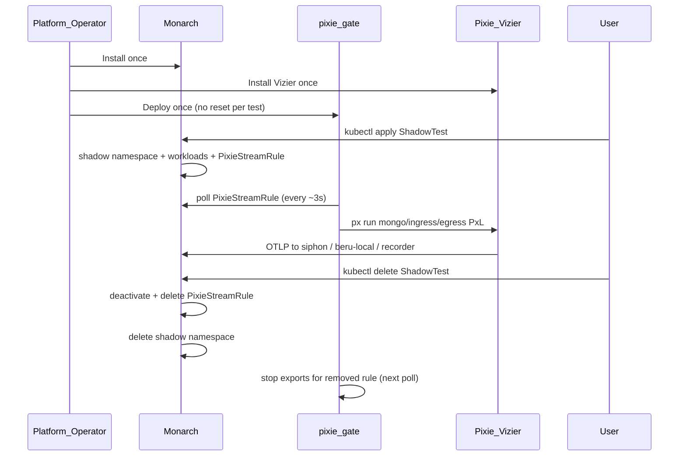

# Platform Bootstrap and ShadowTest Lifecycle

Shadow-Diff splits **platform install** (once per cluster) from **ShadowTest lifecycle** (on demand). Pixie Vizier and **pixie-gate** are cluster infrastructure — they are **not** torn down when a ShadowTest is deleted, and they do **not** need to be reinstalled or reset between tests.

## Mental model

| Layer | Installed | Lifecycle |
|-------|-----------|-----------|
| **Monarch** operator | Once (`monarch-system`) | Survives all ShadowTests |
| **Pixie Vizier** (`pl` namespace) | Once | Survives all ShadowTests |
| **pixie-gate** | Once (`monarch-system` Deployment) | Survives all ShadowTests; polls `PixieStreamRule` CRs |
| **Beru** (`beru-system` or per-shadow `beru-local`) | Once shared, or per test via Monarch | `beru-local` removed with shadow namespace |
| **ShadowTest** CR | Per test | Create → Ready → Delete |

Monarch writes a **`PixieStreamRule`** custom resource per ShadowTest. It does **not** push PxL scripts into Pixie. **pixie-gate** reads those CRs and runs `px run` / `px.export` on a polling loop.



---

## Phase 1 — Platform bootstrap (one time)

Install these components **before** any ShadowTest. Do **not** restart or reinstall Pixie when adding a new test.

### 1. Monarch operator

```bash
make -C pipeline/monarch install    # ShadowTest + PixieStreamRule CRDs
make -C pipeline/monarch deploy IMG=<registry>/monarch:<tag>
```

Set `MONARCH_MODE=dev` on the controller Deployment when using local `:dev` helper images (Minikube/Kind E2E). Production charts should pin image tags via CR overrides or operator env vars.

### 2. Beru analysis sink

```bash
kubectl apply -f pipeline/beru/deploy/
```

When `spec.beruGRPCAddress` is unset on a ShadowTest, Monarch provisions **beru-local** inside each shadow namespace automatically.

### 3. Pixie Vizier (eBPF PEM)

Pixie requires a VM-capable cluster node (Minikube `kvm2` / `virtualbox`; not Kind/docker driver).

```bash
# Pixie Cloud account: px auth login or export PIXIE_API_KEY
MINIKUBE_DRIVER=kvm2 ./testing/bats/setup/setup-local-pixie.sh --no-bridge
```

This installs Vizier into namespace `pl`. Use `--no-bridge` when deploying pixie-gate separately (next step). Full setup without `--no-bridge` also deploys pixie-gate.

**Helm / production:** install the Pixie operator chart with your deploy key; ensure PEM pods are `Running` and `px get viziers` reports `CS_HEALTHY`.

### 4. pixie-gate (long-lived Deployment)

pixie-gate is **not** deployed by Monarch. It must run continuously in `monarch-system`:

```bash
export PIXIE_API_KEY=...
make pixie-gate-docker-build PIXIE_GATE_IMG=pixie-gate:dev
./testing/bats/setup/start-pixie-stream-bridge.sh   # applies deploy/ + waits Ready
```

Or apply directly:

```bash
kubectl apply -k pipeline/pixie-gate/deploy/
kubectl set image deployment/pixie-gate -n monarch-system pixie-gate=pixie-gate:dev
```

Hardening (see [pixie-gate.md](/control-plane/pixie-gate.md)):

- ServiceAccount bound to [`pixie-gate` RBAC](../../pipeline/pixie-gate/deploy/rbac.yaml) (`get/list/watch` on `pixiestreamrules`; status patch)
- `PIXIE_API_KEY` as Secret `monarch-system/pixie-gate`
- Image contains Go binary + `px` CLI (no kubectl)
- Rolling updates with `terminationGracePeriodSeconds: 35` so in-flight `px run` can finish

pixie-gate polls all `PixieStreamRule` objects cluster-wide every `PIXIE_EXPORT_INTERVAL_SEC` (default 3s).

### 5. Siphon OTLP receiver (HTTP Pixie ingress only)

When HTTP ingress capture is enabled, Monarch creates `Service/siphon` and `Deployment/siphon` in the shadow namespace. The Deployment receives OTLP on `:4317` and POSTs to the shadow Igris Service (`SIPHON_IGRIS_BASE_URL`). No separate bats/chart apply is required.

MongoDB egress and AMQP paths do not require Siphon.

### Bootstrap verification

```bash
kubectl get pods -n monarch-system
kubectl get pods -n pl -l name=vizier-pem
kubectl get pods -n monarch-system -l app.kubernetes.io/name=pixie-gate
px get viziers    # expect CS_HEALTHY
```

---

## Phase 2 — Creating a ShadowTest (no Pixie reset)

Once the platform is up, users only apply a ShadowTest CR. **Do not** rerun `setup-local-pixie.sh`, restart Vizier, or restart pixie-gate unless troubleshooting.

### Apply the CR

```bash
kubectl apply -f my-shadowtest.yaml
kubectl wait --for=condition=Ready shadowtest/my-app-shadow -n default --timeout=300s
```

Example fields: `targetDeployment`, `oldImage` / `newImage`, `inputs`, `dependencies` (MongoDB, RabbitMQ, etc.). See [pipeline/monarch/DEPLOYMENT.md](https://github.com/shadow-diff/monarch/tree/main/pipeline/monarch/DEPLOYMENT.md).

### What Monarch creates

| Resource | Location |
|----------|----------|
| Shadow namespace | `shadow-<crNamespace>-<crName>` |
| Three shadow Deployments | `control-a`, `control-b`, `candidate` (+ Envoy sidecar) |
| Ingress hub | Igris or igris-rabbitmq |
| Dependencies | Per-role MongoDB, RabbitMQ, Redis, … |
| beru-local | Shadow namespace (when no shared Beru gRPC address) |
| **PixieStreamRule** | `pixie-<shadowtest-name>` in the **same namespace as the ShadowTest CR** |

### PixieStreamRule endpoints (set by Monarch)

| Field | When set | OTLP destination |
|-------|----------|------------------|
| `spec.otelEndpoint` | HTTP ingress Siphon enabled (`http_request`/`tcp_stream` on servicePort, applicationPort, or container port) | `siphon.<shadow-ns>.svc.cluster.local:4317` |
| `spec.targetPorts` | When ingress Siphon enabled | `applicationPort` (prod app port for Pixie `local_port`, not Envoy `servicePort`) |
| `spec.recorderOtelEndpoint` | Always (Shop+Recorder always-on) | `<shadowtest>-recorder.<shadow-ns>:4317` |
| `spec.mongoOtelEndpoint` | MongoDB `dependencies[]` | `beru-local.<shadow-ns>.svc.cluster.local:4317` |
| `spec.shadowNamespace` | MongoDB dependency | Filters mongo PxL to shadow pods only |

### What pixie-gate does automatically

Within one poll cycle after the CR exists and `spec.active=true`:

1. Renders PxL under `/tmp/pixie-gate/<crNs>-pixie-<name>-{ingress,egress,mongo}.pxl`
2. Runs `px run -f <pxl>` for each non-empty endpoint
3. Patches `PixieStreamRule.status.phase` to `Active`, `Error`, or `Inactive`

**No manual script step is required.**

### Concurrent ShadowTests

Supported. Each test gets its own shadow namespace, `PixieStreamRule`, and `beru-local`. pixie-gate loops all active rules. Avoid pointing multiple ShadowTests at the same prod Deployment unless intentional duplicate capture is desired.

---

## Phase 3 — Deleting a ShadowTest

```bash
kubectl delete shadowtest my-app-shadow -n default
```

Monarch:

1. Tears down the shadow namespace and owned workloads
2. Deactivates `PixieStreamRule` (`spec.active=false`)
3. Deletes `PixieStreamRule` CR

**Leave Pixie Vizier and pixie-gate running.** The next poll stops exports for the removed rule.

### Delete race note

`Reconcile` checks `deletionTimestamp` only at the **start** of each pass. An in-flight create reconcile that already passed that check can still create later resources (Deployments, `PixieStreamRule`, …) after `kubectl delete` has been issued. Prefer waiting for the ShadowTest to reach Ready before deleting in automation, or re-delete if orphans appear.

---

## Anti-patterns

| Avoid | Prefer |
|-------|--------|
| Restart Vizier between ShadowTests | Leave Vizier up for the cluster lifetime |
| Rollout-restart pixie-gate before each test | Leave Deployment running; wait on `PixieStreamRule.status.phase` |
| Folding eBPF / `px run` into Monarch | Keep Monarch unprivileged; pixie-gate + Vizier own capture |

---

## Related

- [pixie-gate.md](/control-plane/pixie-gate.md) — service security and control loop
- [ARCHITECTURE.md](/architecture/ARCHITECTURE.md) — layer stack
- [pipeline/pixie-gate/deploy/](https://github.com/shadow-diff/monarch/tree/main/pipeline/pixie-gate/deploy) — RBAC, ConfigMap, Deployment
