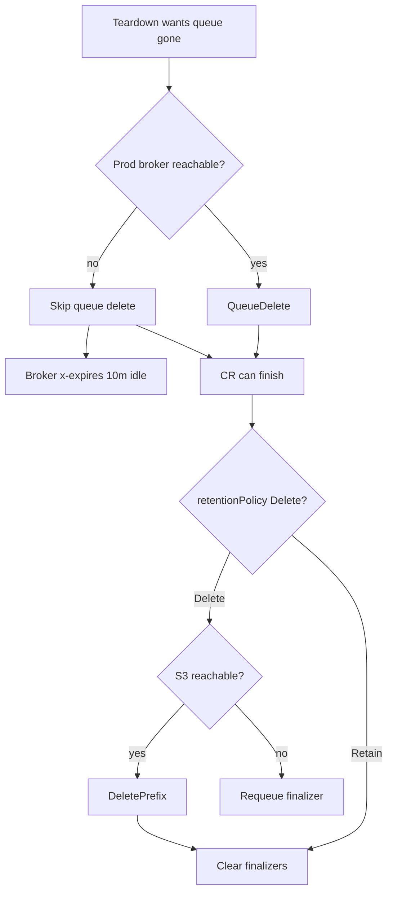

# ShadowTest Teardown Edge Cases — Queue Leak vs Stuck CR

## Context

Every AMQP ShadowTest declares a **prod-side** durable shadow queue (`shadow-diff-<uid>`) on the production RabbitMQ broker. Teardown must remove that queue. Session artifacts live under BYOB S3 at `shadow-diff/<cr-ns>/<cr-name>/`.

Two failure modes collide with operator UX:

1. **Network partition to prod RabbitMQ** during queue delete — if Monarch blocks the CR until the broker answers, ShadowTests stick in `Terminating` / Failed cleanup forever.
2. **Network partition to S3** during prefix delete — if Monarch skips cleanup, retained objects violate `retentionPolicy: Delete` and leave silent cost/leak in the customer bucket.

Boot failure (`markBootFailed`) also tears down runtime (queue, KaiselRule, shadow namespace) but must leave the CR as an **autopsy** (finalizers kept, no S3 cleanup) so operators can inspect status without losing session data early.

## Decision

### Prod AMQP queue delete — fail open on unreachable broker

[`deleteProdShadowQueue`](https://github.com/shadow-diff/monarch/tree/main/pipeline/monarch/internal/controller/shadowtest_rabbitmq.go) dials the resolved production DSN (`prodUrl` host plus `credentialsSecretRef` username/password). If the broker is **unreachable**, Monarch **logs and skips** queue delete (returns success) so:

- `kubectl delete` can finish (finalizers clear after NS + optional S3).
- Sticky `Failed` cleanup can finish tearing down the shadow namespace.

Monarch still attempts a **graceful** `QueueDelete` whenever the broker is reachable (normal delete and `markBootFailed`).

**Broker-side fail-safe:** newly declared prod shadow queues include `x-expires: 600000` (10 minutes idle TTL — no consumers). If teardown skipped delete and nothing consumes the queue, RabbitMQ deletes it automatically. Queues keep `autoDelete=false` so a transient `igris-rabbitmq` restart does not drop the queue immediately.

Other declare args unchanged: `x-max-length: 500`, `x-overflow: drop-head`.

### S3 prefix delete — fail closed under the finalizer

[`cleanupS3IfNeeded`](https://github.com/shadow-diff/monarch/tree/main/pipeline/monarch/internal/controller/shadowtest_s3_cleanup.go) runs only on **normal delete**, after the shadow namespace is gone, and only when `retentionPolicy: Delete`.

If S3 is unreachable or delete fails, Monarch **requeues** (~5s). Finalizers stay; the CR remains **Terminating** until cleanup succeeds (or an operator force-removes finalizers).

`Retain` / unset → skip object delete; finalizers still clear.

### Failed autopsy vs delete

| Step | `markBootFailed` | `kubectl delete` (finalizers) |
|------|------------------|-------------------------------|
| Prod shadow queue | Attempt delete (skip if broker down) | Same |
| KaiselRule + shadow NS | Tear down | Tear down |
| S3 prefix | **Not** cleaned | Clean only if `Delete` |
| Finalizers | **Kept** | Removed after NS gone (+ S3 policy) |
| CR | Sticky `Failed` autopsy | Removed when finalizers clear |

## Consequences

| Trade-off | Choice | Why |
|-----------|--------|-----|
| Stuck CR vs leaked queue | Prefer **leak briefly** | Prod broker partitions must not freeze cluster inventory; `x-expires` bounds leak to ~10m idle |
| Stuck CR vs leaked S3 | Prefer **stuck Terminating** | Customer opted into `Delete`; silent Retain would violate the contract |
| Autopsy vs auto S3 wipe on boot fail | Prefer **keep S3** | Failed CRs need retained session artifacts; wipe only on explicit delete + `Delete` policy |
| Idle TTL vs autoDelete | Prefer **`x-expires` + autoDelete=false** | Survive igris restarts; expire only when consumerless for the full window |

**Operational notes**

- After a skipped queue delete, expect the queue to vanish within ~10 minutes of no consumers (or sooner if a later reconcile reaches the broker while the CR still exists — Failed sticky cleanup retries delete).
- Once the CR is fully gone, Monarch will not retry that queue name; rely on `x-expires` or manual `rabbitmqadmin delete queue`.
- Force-removing `shadow-diff.io/s3-cleanup` abandons prefix cleanup — use only when S3 is permanently gone.

## Edge-case matrix

| Scenario | Behavior |
|----------|----------|
| Delete CR; broker up | `QueueDelete` then NS; S3 per policy |
| Delete CR; broker unreachable | Skip queue; NS/S3 proceed; queue may idle-expire via `x-expires` |
| Delete CR; S3 down; policy `Delete` | NS gone; finalizer retries S3 forever until success |
| Delete CR; policy `Retain` | No S3 object delete; finalizers clear |
| Boot fail after queue declared | Queue delete attempted; NS/Kaisel torn down; finalizers + S3 kept |
| Declare never succeeded | Delete uses `status.amqpQueueName` or convention name; missing queue should be treated as already gone when reachable (broker NOT_FOUND is an error path today if dial succeeds) |

# Citations

- [/control-plane/platform-bootstrap-and-shadowtest-lifecycle.md](/control-plane/platform-bootstrap-and-shadowtest-lifecycle.md) — record/replay create and delete order
- [/control-plane/monarch-controller.md](/control-plane/monarch-controller.md) — boot failure gates; Spike Guard (`x-expires`, max-length)
- [shadowtest_rabbitmq.go](https://github.com/shadow-diff/monarch/tree/main/pipeline/monarch/internal/controller/shadowtest_rabbitmq.go) — declare args; `deleteProdShadowQueue`
- [shadowtest_fail_cleanup.go](https://github.com/shadow-diff/monarch/tree/main/pipeline/monarch/internal/controller/shadowtest_fail_cleanup.go) — `markBootFailed` teardown without S3
- [shadowtest_resources.go](https://github.com/shadow-diff/monarch/tree/main/pipeline/monarch/internal/controller/shadowtest_resources.go) — `reconcileDelete` finalizer path
- [shadowtest_s3_cleanup.go](https://github.com/shadow-diff/monarch/tree/main/pipeline/monarch/internal/controller/shadowtest_s3_cleanup.go) — retention-gated `DeletePrefix`
