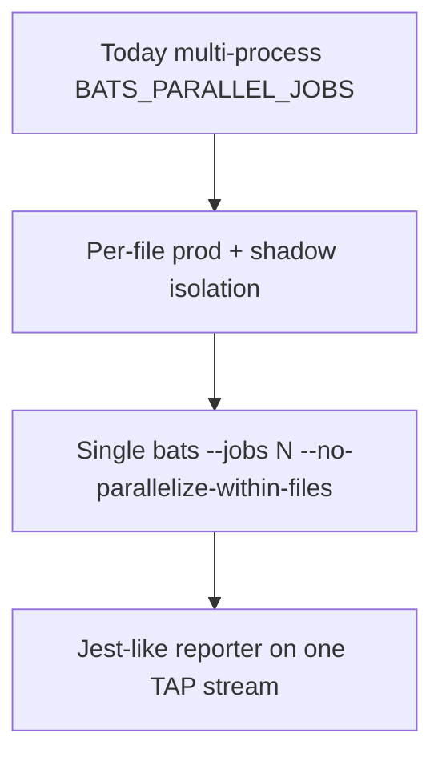

# Bats Parallel Isolation Roadmap

**Status: not implemented.** This document is a future plan. Do not assume `bats --jobs` or Jest-like output under parallel today.

## Today (current behavior)

| Behavior | Reality |
|----------|---------|
| Parallelism | Custom multi-process runner in [`testing/bats/run.sh`](https://github.com/shadow-diff/monarch/tree/main/testing/bats/run.sh) via `BATS_PARALLEL_JOBS` (N separate `bats` processes) |
| Native `bats --jobs` | **Not used** |
| Within-file `@test`s | Always sequential (shared `setup_file` ShadowTest) |
| Jest-like reporter (`tap-mocha-reporter spec`) | **Only when `BATS_PARALLEL_JOBS=1`** (single TAP stream). When jobs>1, TAP from multiple processes is interleaved and the reporter is disabled |

Shadow namespaces are already per ShadowTest name (`shadow-<ns>-<name>`), but **prod** stacks still contend (shared `rmq-prod-broker`, `mongo-prod`, hybrid suites delete competing language workers).

## Goal

Make cross-file parallel E2E safe and compatible with a single Jest-like summary:

1. **Full isolation** per `.bats` file (prod RMQ/mongo/workers as well as shadow stack)
2. **One bats process** with `bats --jobs N --no-parallelize-within-files` so there is one TAP stream
3. Re-enable `tap-mocha-reporter` under parallel (same pipe as jobs=1 today)



## Target runner (future)

```bash
# NOT wired yet — illustrative only
bats --jobs "${BATS_PARALLEL_JOBS}" \
  --no-parallelize-within-files \
  --formatter tap --timing \
  testing/bats/e2e/http-ingress \
  testing/bats/e2e/rabbitmq-ingress \
  | tap-mocha-reporter spec
```

- **Across files:** parallel (requires isolation below)
- **Inside a file:** serial `@test`s — preserve shared `setup_file` ShadowTest
- **Do not** parallelize within files (would race traces, beru-local, and prod traffic)

## Work items (checklist — not done)

- [ ] Per-suite prod RabbitMQ (or non-overlapping exchanges/queues/vhosts)
- [ ] Per-suite MongoDB (or dedicated database names)
- [ ] Unique prod Deployment/Service names per suite (no clobbering)
- [ ] Remove hybrid “delete competing language worker” teardown race
- [ ] Replace multi-process `run_e2e_suite` with one `bats --jobs` invocation
- [ ] Re-enable Jest-like reporter when jobs>1 (single TAP stream)
- [ ] Document GNU parallel (or compatible) as a host prerequisite for `--jobs`

## Non-goals

- Parallelizing `@test` blocks inside one `.bats` file
- Replacing bats with Jest/mocha as the test runner

## Related

- Current framework: [/infrastructure/bats-testing-framework.md](/infrastructure/bats-testing-framework.md)
- Runner: [`testing/bats/run.sh`](https://github.com/shadow-diff/monarch/tree/main/testing/bats/run.sh)
- Reporter helper: [`testing/bats/lib/reporter.bash`](https://github.com/shadow-diff/monarch/tree/main/testing/bats/lib/reporter.bash)

# Citations

- [bats-core parallel usage](https://github.com/bats-core/bats-core/blob/master/docs/source/usage.md) — `--jobs`, `--no-parallelize-within-files`
- [/control-plane/platform-bootstrap-and-shadowtest-lifecycle.md](/control-plane/platform-bootstrap-and-shadowtest-lifecycle.md)
