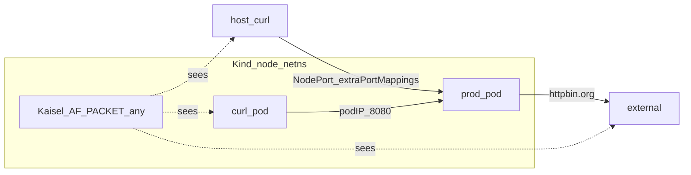

# Minikube to Kind Local E2E Migration

**Status: Phase 1 implemented; Phase 2 complete (2a–2e done).** Local E2E is **Kind-only**. One-shot reset: `./testing/tools/e2e-reset-kind.sh` (host Postgres DSN `localhost:15432`). Kaisel smoke: `make test-bats-kaisel-kind`. Full suites: `make test-bats`.

## Context

Local Shadow-Diff E2E runs on Kind (host docker + `kind load`):

| Piece | Role |
| --- | --- |
| [`testing/tools/e2e-reset-kind.sh`](https://github.com/shadow-diff/monarch/tree/main/testing/tools/e2e-reset-kind.sh) | One-shot Kind cluster + platform bootstrap |
| [`testing/tools/lib/e2e-reset-deploy.sh`](https://github.com/shadow-diff/monarch/tree/main/testing/tools/lib/e2e-reset-deploy.sh) | Shared deploy stack for the Kind reset driver |
| [`testing/bats/helpers/cluster-kind.sh`](https://github.com/shadow-diff/monarch/tree/main/testing/bats/helpers/cluster-kind.sh) | `ensure_kind_ready`, `kind load docker-image` |
| [`testing/bats/kind/config.yaml`](https://github.com/shadow-diff/monarch/tree/main/testing/bats/kind/config.yaml) | Cluster create + `extraPortMappings` (host `18080`→`30080`, `15432`→`30432`) |
| `make test-bats` / `make test-bats-kaisel` | Integration and E2E on Kind |

On WSL2 with Docker, Kind is the lower-friction local cluster; the former Minikube kvm2/none driver matrix and WSL shims were removed in Phase **2e**.

Kaisel binds `iface: any` (AF_PACKET ifindex 0) with Ethernet `l2_off` and excludes loopback by ifindex. Phase 1 proved visibility of in-cluster and host-mapped NodePort paths on a Kind node before Minikube bootstrap was deleted.

## Decision

1. **Gate** the switch on a slim Kind Kaisel smoke that proves three traffic paths (below).
2. **Make Kind the default** local E2E cluster and remove Minikube bootstrap via sub-phases **2a–2e**.
3. **Do not maintain** dual long-lived reset scripts (completed in **2e**).

## Traffic gate (locked)

Phase 1 shows Kaisel on a Kind node sees all three paths. DaemonSet stays on `iface: any`.

| Label | Path | Driver | Assert |
| --- | --- | --- | --- |
| Inside | pod → pod | ephemeral curl pod → prod **pod IP**:8080 | Kaisel log `uri=…` |
| Outside (egress) | pod → outside | prod → `httpbin.org` (existing external egress scenario) | `"egress recorded"` / Shop mock host `httpbin.org` |
| Outside (ingress) | outside → pod | **host** curl → Kind-mapped **NodePort** → prod Service | Kaisel log `uri=…` |

**Rule:** do not use `kubectl port-forward` for outside ingress. That path does not exercise the node AF_PACKET tap the way real NodePort (or Kind `extraPortMappings`) traffic does.



## Phase 1 — Slim Kind Kaisel smoke

**Implemented.**

| Artifact | Purpose |
| --- | --- |
| [`testing/bats/helpers/cluster-kind.sh`](https://github.com/shadow-diff/monarch/tree/main/testing/bats/helpers/cluster-kind.sh) | `ensure_kind_ready`, `kind load docker-image` |
| [`testing/bats/kind/config.yaml`](https://github.com/shadow-diff/monarch/tree/main/testing/bats/kind/config.yaml) | Cluster create + `extraPortMappings` |
| [`testing/bats/e2e/kaisel-kind-smoke/`](https://github.com/shadow-diff/monarch/tree/main/testing/bats/e2e/kaisel-kind-smoke) | Three `@test`s — inside ingress, outside egress, outside ingress |
| `make test-bats-kaisel-kind` | Entry point |

```bash
make test-bats-kaisel-kind
# warm images:
SKIP_BUILD=1 SKIP_LOAD=1 make test-bats-kaisel-kind
```

If host `:18080` does not reach the NodePort, recreate the cluster from `testing/bats/kind/config.yaml` (`kind delete cluster --name shadow-diff`).

## Phase 2 — Full switch to Kind (2a–2e)

**Complete.** Host Postgres uses Kind `extraPortMappings` **host `15432` → node `30432`**.


| ID | Name | Intent | Exit | Status |
| --- | --- | --- | --- | --- |
| **2a** | Kind platform path | Platform bootstrap + image load on Kind; Postgres port mapping | Deep Kaisel / platform path on Kind | **Done** |
| **2b** | One-shot Kind reset | `testing/tools/e2e-reset-kind.sh` | Script brings ShadowTest Ready; host DSN `localhost:15432` | **Done** |
| **2c** | Default flip + suites green | Kind default; fix Kind-specific bats failures | Integration + e2e green on Kind | **Done** |
| **2d** | Docs / DX retarget | Single bootstrap story in docs and READMEs | Docs point at Kind reset / `localhost:15432` | **Done** |
| **2e** | Delete Minikube bootstrap | Drop `e2e-reset-minikube.sh` / `cluster-minikube.sh` | Kind-only local E2E | **Done** |

## Out of scope (both phases)

- Fixing stale CI `pipeline/monarch` `make test-e2e` / missing Kind controller suite
- Multi-node Kind / cross-node pod→pod (single-node smoke is enough for the gate)
- Changing Kaisel BPF, `l2_off`, or DaemonSet `securityContext` unless Phase 1 proves a Kind-specific bug

## Citations

- [/data-plane/kaisel-ebpf.md](/data-plane/kaisel-ebpf.md) — AF_PACKET, `iface: any`, framing constants
- [/data-plane/kernel-compatibility.md](/data-plane/kernel-compatibility.md) — Kaisel Tier 1 cluster E2E
- [/infrastructure/bats-testing-framework.md](/infrastructure/bats-testing-framework.md) — bats harness
- [/verification/VERIFICATION.md](/verification/VERIFICATION.md) — Kaisel install and local reset
- [`pipeline/kaisel/deploy/configmap.yaml`](https://github.com/shadow-diff/monarch/tree/main/pipeline/kaisel/deploy/configmap.yaml) — `iface: any`
