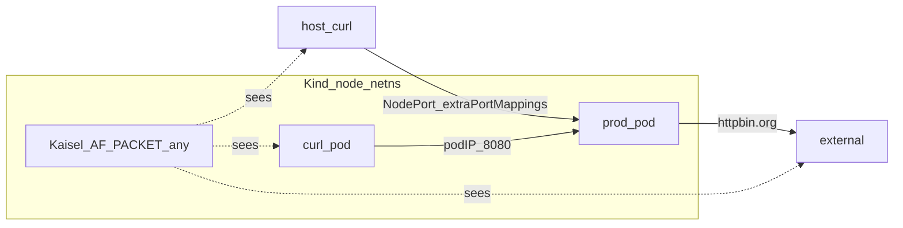

# Minikube to Kind Local E2E Migration

**Status: Phase 1 implemented; Phase 2 in progress (2a–2b done; 2c–2e not started).** Local E2E still defaults to Minikube until **2c**. Kind one-shot reset: `./testing/tools/e2e-reset-kind.sh` (host DSN `localhost:15432`). Kind Kaisel smoke: `make test-bats-kaisel-kind`. Opt-in deep Kaisel on Kind: `E2E_CLUSTER=kind make test-bats-kaisel`.

## Context

Local Shadow-Diff E2E still defaults to Minikube; Kind reset and platform path are available:

| Piece | Role |
| --- | --- |
| [`testing/tools/e2e-reset-kind.sh`](https://github.com/shadow-diff/monarch/tree/main/testing/tools/e2e-reset-kind.sh) | One-shot Kind cluster + platform bootstrap (host docker + `kind load`) |
| [`testing/tools/e2e-reset-minikube.sh`](https://github.com/shadow-diff/monarch/tree/main/testing/tools/e2e-reset-minikube.sh) | One-shot Minikube cluster + platform bootstrap (kept until **2e**) |
| [`testing/tools/lib/e2e-reset-deploy.sh`](https://github.com/shadow-diff/monarch/tree/main/testing/tools/lib/e2e-reset-deploy.sh) | Shared deploy stack for both reset drivers |
| [`testing/bats/helpers/cluster-minikube.sh`](https://github.com/shadow-diff/monarch/tree/main/testing/bats/helpers/cluster-minikube.sh) | Driver matrix (kvm2 / none), image load |
| `make test-bats-kaisel` | Deep Kaisel capture suite (Minikube default until **2c**) |

Kind appears in comments, ad-hoc `kind load` docs, and stale CI scaffolding. On WSL2 with Docker, Kind is the lower-friction local cluster; Minikube kvm2/none carries host-specific shims that do not transfer cleanly.

Kaisel binds `iface: any` (AF_PACKET ifindex 0) with Ethernet `l2_off` and excludes loopback by ifindex. That design is cluster-runtime-agnostic for default Kindnet/bridge + veth framing, but visibility of in-cluster and host-mapped NodePort paths on a Kind node must be proven before deleting Minikube bootstrap.

## Decision

1. **Gate** the switch on a slim Kind Kaisel smoke that proves three traffic paths (below).
2. **Then** make Kind the default local E2E cluster and remove Minikube bootstrap via sub-phases **2a–2e**.
3. Do not maintain dual long-lived reset scripts after **2e**.

## Traffic gate (locked)

Phase 1 must show Kaisel on a Kind node sees all three paths. DaemonSet stays on `iface: any`.

| Label | Path | Driver | Assert |
| --- | --- | --- | --- |
| Inside | pod → pod | ephemeral curl pod → prod **pod IP**:8080 | Kaisel log `uri=…` |
| Outside (egress) | pod → outside | prod → `httpbin.org` (existing external egress scenario) | `"egress recorded"` / Shop mock host `httpbin.org` |
| Outside (ingress) | outside → pod | **host** curl → Kind-mapped **NodePort** → prod Service | Kaisel log `uri=…` |

**Rule:** do not use `kubectl port-forward` for outside ingress. That path does not exercise the node AF_PACKET tap the way real NodePort (or Kind `extraPortMappings`) traffic does.



## Phase 1 — Slim Kind Kaisel smoke

**Implemented.** Minikube remains the default until Phase **2c**.

| Artifact | Purpose |
| --- | --- |
| `E2E_CLUSTER=kind` | Opt-in Kind bootstrap/load in bats helpers |
| [`testing/bats/helpers/cluster-kind.sh`](https://github.com/shadow-diff/monarch/tree/main/testing/bats/helpers/cluster-kind.sh) | `ensure_kind_ready`, `kind load docker-image` |
| [`testing/bats/kind/config.yaml`](https://github.com/shadow-diff/monarch/tree/main/testing/bats/kind/config.yaml) | Cluster create + `extraPortMappings` (host `18080` → node `30080`; host `15432` → node `30432` for Postgres) |
| [`testing/bats/e2e/kaisel-kind-smoke/`](https://github.com/shadow-diff/monarch/tree/main/testing/bats/e2e/kaisel-kind-smoke) | Three `@test`s — inside ingress, outside egress, outside ingress |
| `make test-bats-kaisel-kind` | Entry point (`E2E_CLUSTER=kind`) |

Reuses `kaisel_setup_platform`, DaemonSet deploy, MinIO, and record-mode ShadowTest. Prod Service NodePort `30080` matches Kind mappings.

```bash
make test-bats-kaisel-kind
# warm images:
SKIP_BUILD=1 SKIP_LOAD=1 make test-bats-kaisel-kind
```

If host `:18080` does not reach the NodePort, recreate the cluster from `testing/bats/kind/config.yaml` (`kind delete cluster --name shadow-diff`). Do not use `kubectl port-forward` for outside ingress.

## Phase 2 — Full switch to Kind (2a–2e)

**In progress.** Minikube stays opt-in until **2e**. Host Postgres uses Kind `extraPortMappings` **host `15432` → node `30432`** (never port-forward for Kaisel capture asserts; port-forward only as a documented fallback for host Go conformance clients).


| ID | Name | Intent | Exit | Status |
| --- | --- | --- | --- | --- |
| **2a** | Kind platform path (opt-in) | Platform bootstrap + image load work on Kind; Postgres port mapping in Kind config | `E2E_CLUSTER=kind` deep Kaisel / platform path succeeds; default still Minikube | **Done** |
| **2b** | One-shot Kind reset | `testing/tools/e2e-reset-kind.sh` (shared deploy + Kind load) | Script brings ShadowTest Ready; host DSN `localhost:15432` | **Done** |
| **2c** | Default flip + suites green | Default `E2E_CLUSTER=kind`; fix Kind-specific bats failures | `make test-bats` and `make test-bats-kaisel` green with no override | Not started |
| **2d** | Docs / DX retarget | Single bootstrap story in docs and READMEs | Docs point at Kind reset / `localhost:15432` | Not started |
| **2e** | Delete Minikube bootstrap | Drop `e2e-reset-minikube.sh` / `cluster-minikube.sh` | Kind-only local E2E; this ADR status → Phase 2 complete | Not started |

Cursor plans: `phase_2a_kind_platform`, `phase_2b_e2e_reset_kind`, `phase_2c_default_kind`, `phase_2d_kind_docs`, `phase_2e_drop_minikube`. Execute in order.

## Out of scope (both phases)

- Fixing stale CI `pipeline/monarch` `make test-e2e` / missing Kind controller suite
- Multi-node Kind / cross-node pod→pod (single-node smoke is enough for the gate)
- Changing Kaisel BPF, `l2_off`, or DaemonSet `securityContext` unless Phase 1 proves a Kind-specific bug

## Citations

- [/data-plane/kaisel-ebpf.md](/data-plane/kaisel-ebpf.md) — AF_PACKET, `iface: any`, framing constants
- [/data-plane/kernel-compatibility.md](/data-plane/kernel-compatibility.md) — Kaisel Tier 1 cluster E2E
- [/infrastructure/bats-testing-framework.md](/infrastructure/bats-testing-framework.md) — bats harness
- [/verification/VERIFICATION.md](/verification/VERIFICATION.md) — Kaisel install and local reset
- [`pipeline/kaisel/deploy/configmap.yaml`](https://github.com/shadow-diff/monarch/tree/main/pipeline/kaisel/deploy/configmap.yaml) — `iface: any`
- [`testing/tools/e2e-reset-minikube.sh`](https://github.com/shadow-diff/monarch/tree/main/testing/tools/e2e-reset-minikube.sh) — current Minikube local reset (removed in 2e)
