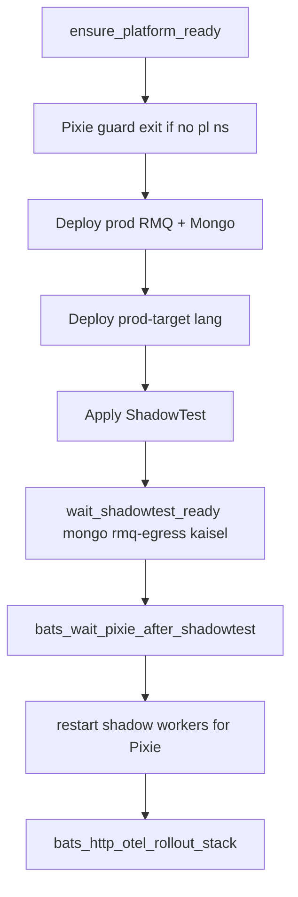
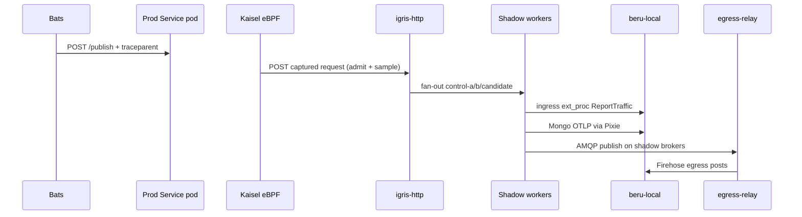

# HTTP Ingress E2E Test Flow

Three bats suites prove the full **Kaisel HTTP ingress** path across Node.js, Python, and Go workers. Each suite shares prod RMQ + Mongo and applies a language-specific prod target + ShadowTest.

| Suite | Bats file | Prod deploy | Worker image |
|-------|-----------|-------------|--------------|
| Node | [`http_otel_rmq_nodejs.bats`](https://github.com/shadow-diff/monarch/tree/main/testing/bats/e2e/http-ingress/http_otel_rmq_nodejs.bats) | `http-rmq-nodejs-prod` | `http-rmq-test-app:dev` |
| Python | [`http_otel_rmq_python.bats`](https://github.com/shadow-diff/monarch/tree/main/testing/bats/e2e/http-ingress/http_otel_rmq_python.bats) | `http-rmq-python-prod` | `http-rmq-python-worker:dev` |
| Go | [`http_ingress_rmq_go.bats`](https://github.com/shadow-diff/monarch/tree/main/testing/bats/e2e/http-ingress/http_ingress_rmq_go.bats) | `http-rmq-go-prod` | `http-rmq-go-worker:dev` |

Run:

```bash
# All E2E (includes these suites)
make test-bats-e2e

# Single suite
SKIP_BUILD=1 SKIP_LOAD=1 make test-bats-one FILE=e2e/http-ingress/http_ingress_rmq_go.bats
```

**Pixie is required.** `setup_file` calls `bats_pixie_mongo_enabled` after `ensure_platform_ready` and exits 1 if the `pl` namespace is missing — no synthetic-traffic fallback.

---

## What this suite covers

1. **HTTP ingress** — `publish_prod_http` → prod Service → Kaisel → igris-http → three shadows → beru-local ingress diff  
2. **Mongo egress** — shadow workers insert under Pixie observation → OTLP to beru-local  
3. **RabbitMQ egress** — shadow workers publish → Firehose → egress-relay → Beru  

Unlike [/verification/hybrid-rmq-e2e-flow.md](/verification/hybrid-rmq-e2e-flow.md), ingress is **HTTP via igris-http** (not RMQ fan-in), and these suites assert **clean** diffs (no intentional candidate N+1).

---

## Setup flow (`setup_file`)



1. `ensure_platform_ready`  
2. Pixie guard — fail if `pl` absent  
3. Apply shared `prod-rabbitmq.yaml` + `prod-mongodb.yaml`  
4. Apply `prod-target-<lang>.yaml` (Deployment + ClusterIP `:8080`)  
5. Apply fixture ShadowTest — shadow ns, igris-http, egress-relay, Shop/Recorder, beru-local  
6. `wait_shadowtest_ready --require-mongo --require-rmq-egress --require-kaisel` — waits for `status.kaiselPhase == Ready` (`KaiselRule` reconciled)
7. `bats_wait_pixie_after_shadowtest` — Mongo / egress PxL ready  
8. `bats_http_otel_restart_workers_for_pixie` — Mongo connections start under eBPF  
9. `bats_http_otel_rollout_stack` — igris + egress-relay + workers + wait for `KaiselRule`; warm beru-local ext_proc  

---

## Per-request runtime flow

Every `@test` starts with `publish_prod_http(trace_id)` (`POST /publish` + W3C `traceparent`). Expects HTTP **200** from the prod app.



---

## What each `@test` asserts

| # | Test | Checks |
|---|------|--------|
| 1 | HTTP ingress via igris is clean in Beru | beru-local: `No regression for Trace <id>` within 120s |
| 2 | Shadow workers publish RMQ egress without logging trace id | All roles: `rmq egress published exchange=egress-events`; trace ID absent from app logs |
| 3 | Mongo egress is clean for isolated trace | All roles: `mongo insert ok`; beru-local: `No egress regression (mongodb)` within 120s |
| 4 | RabbitMQ egress is clean for isolated trace | beru-local: `No egress regression (rabbitmq)` within 120s |

`beru_wait_log` uses `--timeout=120` on all four tests to absorb Pixie capture + bridge export latency.

---

## Manifests and workers

```
testing/bats/manifests/http-otel-rmq-e2e/
├── prod-rabbitmq.yaml / prod-mongodb.yaml   # shared
├── prod-target-{nodejs,python,go}.yaml
└── shadowtest-{nodejs,python}.yaml          # also mirrored under fixtures/
```

Fixtures: `testing/bats/fixtures/e2e/http-otel-rmq-{nodejs,python,go}/shadowtest.yaml`.

| App | Source | Endpoint | Egress |
|-----|--------|----------|--------|
| `http-rmq-test-app` | `testing/example-apps/http-rmq-test-app/` | `POST /publish` | Mongo + amqplib |
| `http-rmq-python-worker` | `testing/example-apps/http-rmq-python-worker/` | `POST /publish` | Mongo + pika (AMQP connect per publish) |
| `http-rmq-go-worker` | `testing/example-apps/http-rmq-go-worker/` | `POST /publish` | Mongo + amqp091-go |

Workers crash at startup if `AMQP_URL` is empty or RMQ is unreachable — `rmq-prod-broker` must be Ready first. The Python worker opens a fresh pika connection on each `/publish` so long `setup_file` idle windows cannot kill a heartbeat-starved `BlockingConnection` (unlike Go/Node clients that keep IO alive in the background).

---

## Timing / debug

If ingress diffs time out, check Kaisel and the rule:

```bash
kubectl get kaiselrule -A
kubectl logs -n kaisel-system -l app.kubernetes.io/name=kaisel --tail=100
```

Confirm Pixie is required (must exit 1):

```bash
USE_PIXIE=0 SKIP_BUILD=1 SKIP_LOAD=1 make test-bats-one FILE=e2e/http-ingress/http_otel_rmq_nodejs.bats
```

---

## Citations

- Suite directory: [`testing/bats/e2e/http-ingress/`](https://github.com/shadow-diff/monarch/tree/main/testing/bats/e2e/http-ingress)
- Traffic helper: [`testing/bats/lib/traffic.bash`](https://github.com/shadow-diff/monarch/tree/main/testing/bats/lib/traffic.bash) — `publish_prod_http`
- Hybrid contrast: [/verification/hybrid-rmq-e2e-flow.md](/verification/hybrid-rmq-e2e-flow.md)
- Bats harness: [/infrastructure/bats-testing-framework.md](/infrastructure/bats-testing-framework.md)
- Egress record/replay (always-on Shop on these ShadowTests too): [/data-plane/egress-record-replay.md](/data-plane/egress-record-replay.md)
