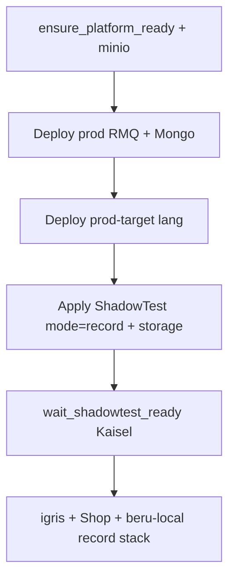
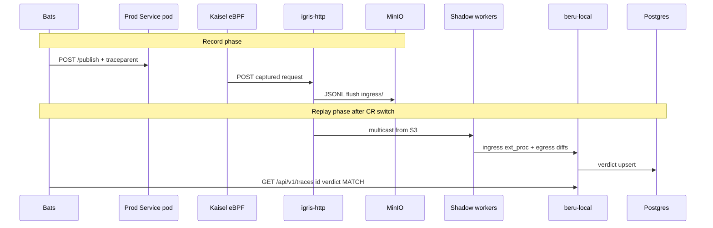

# HTTP Ingress E2E Test Flow

Three bats suites prove the **Kaisel HTTP ingress** path across Node.js, Python, and Go workers under async **record → replay**. Each suite shares prod RMQ + Mongo, applies a language-specific prod target + one ShadowTest CR (`mode: record` + MinIO `storage`), and switches that CR to `replay` for analysis. Durable asserts use `beru_wait_verdict_settled` (Postgres via beru-local HTTP).

| Suite | Bats file | Prod deploy | Worker image |
|-------|-----------|-------------|--------------|
| Node | [`http_otel_rmq_nodejs.bats`](https://github.com/shadow-diff/monarch/tree/main/testing/bats/e2e/http-ingress/http_otel_rmq_nodejs.bats) | `http-rmq-nodejs-prod` | `http-rmq-test-app:dev` |
| Python | [`http_otel_rmq_python.bats`](https://github.com/shadow-diff/monarch/tree/main/testing/bats/e2e/http-ingress/http_otel_rmq_python.bats) | `http-rmq-python-prod` | `http-rmq-python-worker:dev` |
| Go | [`http_ingress_rmq_go.bats`](https://github.com/shadow-diff/monarch/tree/main/testing/bats/e2e/http-ingress/http_ingress_rmq_go.bats) | `http-rmq-go-prod` | `http-rmq-go-worker:dev` |
| Sampling | [`http_sampling.bats`](https://github.com/shadow-diff/monarch/tree/main/testing/bats/e2e/http-ingress/http_sampling.bats) | `http-rmq-go-prod` | `http-rmq-go-worker:dev` |

Run:

```bash
# All E2E (http-ingress + rabbitmq-ingress + record)
make test-bats-e2e

# Single suite
SKIP_BUILD=1 SKIP_LOAD=1 make test-bats-one FILE=e2e/http-ingress/http_ingress_rmq_go.bats
```

`setup_file` calls `ensure_platform_ready` + `minio_ensure`. Fixtures require BYOB MinIO (`shadow-diff-s3`).

---

## What this suite covers

1. **Record** — `publish_prod_http` → prod Service → Kaisel → igris-http → S3 (`sessions/<id>/ingress/`); no A/B/C  
2. **Switch** — same CR patched to `mode: replay` + `sessionID`; Monarch GC KaiselRule, spins A/B/C, starts Igris replay  
3. **Replay analysis** — ingress ext_proc + Firehose/Mongo egress → beru-local → Postgres; assert `MATCH` via `beru_wait_verdict_settled`

Unlike [/verification/hybrid-rmq-e2e-flow.md](/verification/hybrid-rmq-e2e-flow.md), ingress is **HTTP via igris-http** (not RMQ fan-in). These suites assert **clean** diffs (no intentional candidate N+1). Switch uses `kaisel_switch_to_replay ingress` (no Shop HTTP egress objects on this path).

---

## Setup flow (`setup_file`)



1. `ensure_platform_ready` + `minio_ensure`  
2. Apply shared `prod-rabbitmq.yaml` + `prod-mongodb.yaml`  
3. Apply `prod-target-<lang>.yaml` (Deployment + ClusterIP `:8080`)  
4. Apply fixture ShadowTest — record sinks only (no ABC)  
5. `wait_shadowtest_ready --require-kaisel` + `OPERATING_MODE=record` + no ABC  

---

## Per-request runtime flow

**Record `@test`s** publish and assert MinIO. **Replay `@test`s** call `e2e_http_record_then_replay` (ensure record → publish → switch → firehose ready).



---

## What each `@test` asserts

| Phase | Test | Checks |
|-------|------|--------|
| Record | traced HTTP ingress flushes to MinIO | `e2e_assert_session_objects ingress` |
| Replay | HTTP ingress verdict MATCH | `beru_wait_verdict_settled … http --expect-status=MATCH` |
| Replay | workers publish RMQ without logging trace id | role logs: `rmq egress published…`; trace id absent |
| Replay | RabbitMQ egress MATCH | `beru_wait_verdict_settled … rabbitmq --expect-status=MATCH` |
| Replay | MongoDB egress MATCH (Node/Python) | `beru_wait_verdict_settled … mongodb --expect-status=MATCH` |

Sampling suite: record asserts keep-trace MinIO objects; replay asserts keep `MATCH` and drop never reaches shadow workers.

---

## Manifests and workers

```
testing/bats/manifests/http-otel-rmq-e2e/
├── prod-rabbitmq.yaml / prod-mongodb.yaml   # shared
└── prod-target-{nodejs,python,go}.yaml
```

Fixtures: `testing/bats/fixtures/e2e/http-otel-rmq-{nodejs,python,go}/shadowtest.yaml` and `http-sampling/` — each with `mode: record` + MinIO `storage`.

| App | Source | Endpoint | Egress |
|-----|--------|----------|--------|
| `http-rmq-test-app` | `testing/example-apps/http-rmq-test-app/` | `POST /publish` | Mongo + amqplib |
| `http-rmq-python-worker` | `testing/example-apps/http-rmq-python-worker/` | `POST /publish` | Mongo + pika |
| `http-rmq-go-worker` | `testing/example-apps/http-rmq-go-worker/` | `POST /publish` | Mongo + amqp091-go |

---

## Timing / debug

```bash
kubectl get kaiselrule -A
kubectl logs -n kaisel-system -l app.kubernetes.io/name=kaisel --tail=100
kubectl -n "$SHADOW_NS" port-forward svc/beru-local 8080:8080
# GET /api/v1/traces/<id>?protocol=http
```

---

## Citations

- Suite directory: [`testing/bats/e2e/http-ingress/`](https://github.com/shadow-diff/monarch/tree/main/testing/bats/e2e/http-ingress)
- Helpers: [`testing/bats/lib/kaisel.bash`](https://github.com/shadow-diff/monarch/tree/main/testing/bats/lib/kaisel.bash) — `e2e_http_record_then_replay`, `e2e_assert_session_objects`
- Verdicts: [`testing/bats/lib/beru_assert.bash`](https://github.com/shadow-diff/monarch/tree/main/testing/bats/lib/beru_assert.bash) — `beru_wait_verdict_settled`
- Hybrid: [/verification/hybrid-rmq-e2e-flow.md](/verification/hybrid-rmq-e2e-flow.md)
- Bats harness: [/infrastructure/bats-testing-framework.md](/infrastructure/bats-testing-framework.md)
