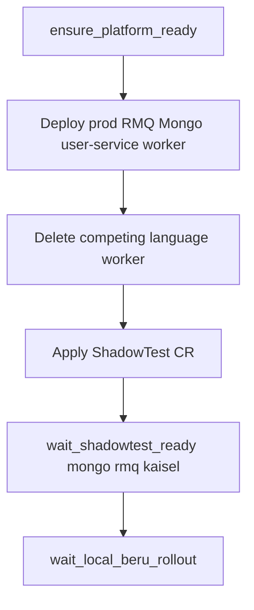
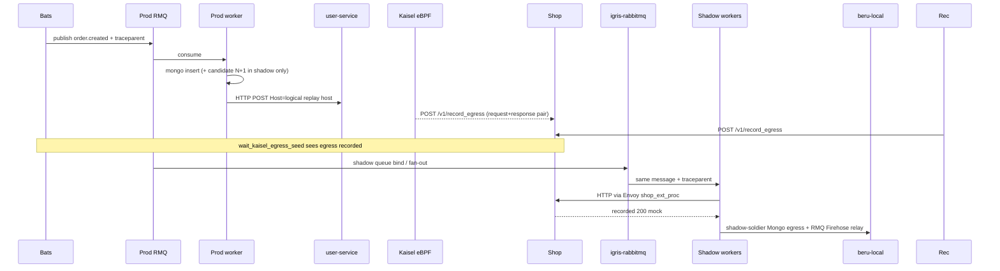

# Hybrid RMQ E2E Test Flow

The hybrid suites exercise a **RabbitMQ-ingress** ShadowTest with Mongo + HTTP egress record/replay. Node and Python share the same shape; only prod manifests and worker images differ. A separate sampling suite proves the same path under `samplePercentage: 10`.

| Suite | Bats file | ShadowTest | Prod worker | Downstream HTTP |
|-------|-----------|------------|-------------|-----------------|
| Node | [`nodejs_hybrid.bats`](https://github.com/shadow-diff/monarch/tree/main/testing/bats/e2e/rabbitmq-ingress/nodejs_hybrid.bats) | `bats-nodejs-hybrid` | `nodejs-prod-worker` | `user-service-nodejs` / Host `user-service-nodejs.default.internal` |
| Python | [`python_hybrid.bats`](https://github.com/shadow-diff/monarch/tree/main/testing/bats/e2e/rabbitmq-ingress/python_hybrid.bats) | `bats-python-hybrid` | `python-prod-worker` | `user-service-python` / Host `user-service-python.default.internal` |
| Sampling hybrid | [`rmq_sampling_hybrid.bats`](https://github.com/shadow-diff/monarch/tree/main/testing/bats/e2e/rabbitmq-ingress/rmq_sampling_hybrid.bats) | `bats-rmq-sampling-hybrid` | `nodejs-prod-worker` | `user-service-nodejs` / Host `user-service-nodejs.default.internal` |

Run one suite:

```bash
SKIP_BUILD=1 SKIP_LOAD=1 make test-bats-one FILE=e2e/rabbitmq-ingress/nodejs_hybrid.bats
SKIP_BUILD=1 SKIP_LOAD=1 make test-bats-one FILE=e2e/rabbitmq-ingress/python_hybrid.bats
SKIP_BUILD=1 SKIP_LOAD=1 make test-bats-one FILE=e2e/rabbitmq-ingress/rmq_sampling_hybrid.bats
```
---

## What “hybrid” means

One ShadowTest wires **four concerns** in a single prod worker path:

1. **Ingress** — prod RMQ `orders` → igris-rabbitmq fan-out → three shadow workers  
2. **HTTP egress record/replay** — prod worker HTTP → Kaisel (request+response paired) → Shop; shadows get mocks via Envoy `shop_ext_proc`  
3. **RabbitMQ egress** — shadow Firehose → egress-relay → Beru; candidate intentionally publishes twice  
4. **MongoDB egress** — shadow-soldier proxies each role's Mongo connection and reports the decoded command to beru-local; candidate intentionally inserts a second document per order

There is **no** `igris-http` on these fixtures (RMQ-only input); the "HTTP ingress" test name is inherited from the shared helper naming, not an actual igris-http path.

---

## Setup flow (`setup_file`)



Prod stack (default namespace):

- `rmq-prod-broker`, `mongo-prod`
- Downstream stub (`user-service-*`)
- Language worker that consumes `order.created` and performs Mongo + HTTP + RMQ egress

Monarch materializes `shadow-default-<shadowtest>` with control-a / control-b / candidate, igris-rabbitmq, Shop, beru-local, per-role Mongo/RMQ, egress-relay-rabbitmq, and a `KaiselRule` (ingress + egress URLs).

Competing workers share the same prod `orders` queue — each suite deletes the other language’s prod Deployment so only one consumer is active.

---

## Per-order runtime flow

Every `@test` that drives traffic starts with `publish_rmq_order(trace_id, order_id)` (W3C `traceparent` on the AMQP message).



HTTP capture uses the dual-branch egress PxL (client `trace_role==1` + server `trace_role==2` scoped by remote client pod). See [/data-plane/egress-record-replay.md](/data-plane/egress-record-replay.md).

---

## What each `@test` asserts

### 1. HTTP ingress reaches all shadow roles

Misleading name historically — this is **RMQ ingress + HTTP replay**, not HTTP ingress via igris-http.

1. `publish_rmq_order`
2. `wait_kaisel_egress_seed` (skip if the egress seed is not observed)
3. For control-a, control-b, candidate: `assert_worker_http_replay`  
   - log contains `order_id=…`  
   - log contains `http egress via=replay status=200`

### 2. RabbitMQ egress count regression

Same publish/seed/process path; wait Beru log for RabbitMQ egress count regression. Candidate double-publishes on `egress-events` / `order.shipped`.

### 3. MongoDB egress is captured for all three roles

shadow-soldier proxies each role's Mongo connection and reports the decoded
command document to beru-local; the worker embeds the traceparent in the BSON
`$comment` field. `wait_mongodb_egress_reports` polls until all three roles
have a matching egress report for the trace.

### 4. MongoDB egress count regression

Same publish/seed/process path; wait Beru log for Mongo **egress count
regression**. Candidate unconditionally inserts a second `candidate_n1_loop`
document per order (both language workers); controls insert one — the
noise-filtered diff-of-diffs flags the count gap on every trace, not just a
specific one, so this suite asserts the regression rather than a clean trace.

---

## Sampling hybrid (`rmq_sampling_hybrid.bats`)

Same Node prod stack and HTTP record/replay path, with `spec.samplePercentage: 10`. Two gates share `github.com/shadow-diff/sample`: decode the 32-hex W3C trace id to 16 bytes, `V = FNV-1a-64(bytes) & 0xFF`, keep iff `(V*100)<(N*256)`:

1. **igris-rabbitmq** — drops out-of-sample AMQP fan-out to shadow brokers  
2. **Kaisel egress** — drops out-of-sample Shop seeds (`POST /v1/record_egress`)

Prod still consumes and egresses every published order; absence asserts cover shadow pods and Shop only.

| Golden trace ID | V | At 10% | Expect |
|-----------------|---|--------|--------|
| `00000000000000000000000000000087` | `0` | keep | Kaisel `egress recorded` with `trace:<id>:…`; all three roles `assert_worker_http_replay` |
| `000000000000000000000000000000f9` | `26` | drop | No shadow `order_id` / trace hex; no Kaisel `egress recorded` for `trace:<id>:` |

Beru regression asserts are omitted here — covered by the non-sampling hybrid suites.

---

## Assertion cheat sheet

| Signal | Where |
|--------|--------|
| Prod HTTP recorded | Prod worker: `http egress via=record status=200` |
| Shop seeded | Kaisel: `egress recorded ... hash=trace:<id>:POST:<host>:/v1/log` |
| Shadow HTTP replay | Shadow app: `http egress via=replay status=200` |
| Mongo / RMQ regression | beru-local logs + `/api` verdict helpers in bats |

---

## Citations

- Node suite: [`testing/bats/e2e/rabbitmq-ingress/nodejs_hybrid.bats`](https://github.com/shadow-diff/monarch/tree/main/testing/bats/e2e/rabbitmq-ingress/nodejs_hybrid.bats)
- Python suite: [`testing/bats/e2e/rabbitmq-ingress/python_hybrid.bats`](https://github.com/shadow-diff/monarch/tree/main/testing/bats/e2e/rabbitmq-ingress/python_hybrid.bats)
- Sampling hybrid suite: [`testing/bats/e2e/rabbitmq-ingress/rmq_sampling_hybrid.bats`](https://github.com/shadow-diff/monarch/tree/main/testing/bats/e2e/rabbitmq-ingress/rmq_sampling_hybrid.bats)
- Traffic helpers: [`testing/bats/lib/traffic.bash`](https://github.com/shadow-diff/monarch/tree/main/testing/bats/lib/traffic.bash) — `publish_rmq_order`; and [`testing/bats/lib/kaisel.bash`](https://github.com/shadow-diff/monarch/tree/main/testing/bats/lib/kaisel.bash) — `wait_kaisel_egress_seed` / `kaisel_assert_egress_recorded`
- Node worker N+1 behavior: [`testing/example-apps/nodejs-hybrid-worker/index.js`](https://github.com/shadow-diff/monarch/tree/main/testing/example-apps/nodejs-hybrid-worker/index.js)
- Egress record/replay: [/data-plane/egress-record-replay.md](/data-plane/egress-record-replay.md)
- MongoDB egress capture: [/data-plane/shadow-soldier.md](/data-plane/shadow-soldier.md)
- Bats harness: [/infrastructure/bats-testing-framework.md](/infrastructure/bats-testing-framework.md)
