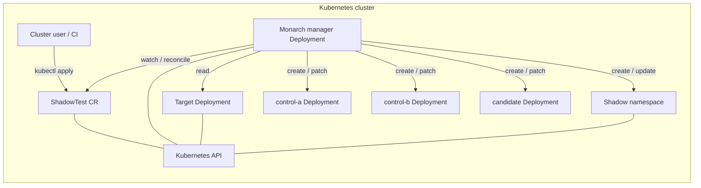
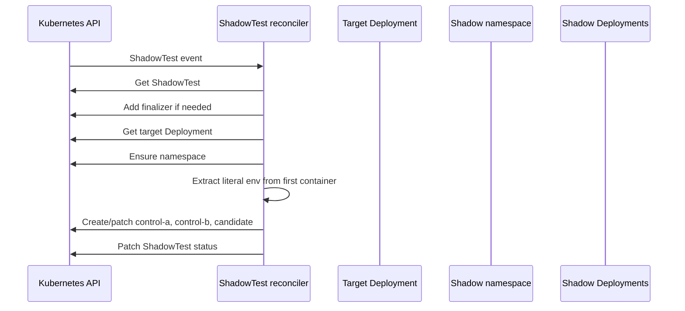

# Monarch — Architecture

Monarch is a **Kubernetes operator** (Kubebuilder / controller-runtime) published by Shadow-Diff. It runs as a single **controller manager** process in the cluster and automates **shadow testing** workloads by reconciling a custom resource: `ShadowTest` (`engine.shadow-diff.io/v1alpha1`).

This document describes how the service fits together at a high level. For directory layout and day-to-day development, see [REPO_OVERVIEW.md](./REPO_OVERVIEW.md).

## What problem it solves

Operators create a `ShadowTest` that points at an existing production-style **Deployment**. Monarch provisions an isolated **shadow namespace** and three **Deployments** that mirror the target’s pod template as much as the current MVP allows:

- **Control A** and **Control B** — both run the **old** image (`spec.oldImage`).
- **Candidate** — runs the **new** image (`spec.newImage`).

That layout supports comparing behavior between two known baselines (control A/B) and a candidate build, without mutating the original Deployment.

## System context

Monarch does **not** replace Ingress, Service mesh, or traffic splitting by itself in this description: it focuses on **materializing** the shadow Deployments (and namespace) from the `ShadowTest` spec and the target Deployment’s template.

## Runtime architecture

### Manager process (`cmd/main.go`)

The container entrypoint builds a **controller-runtime Manager** with:

- The core Kubernetes client-go scheme plus Monarch’s `ShadowTest` API type.
- Optional **metrics** and **webhook** servers (scaffolded; primary behavior today is the reconciler).
- **Health** (`/healthz`, `/readyz`) and optional **leader election** for HA deployments.

The manager registers **one controller**: `ShadowTestReconciler`, which owns the reconcile loop for all `ShadowTest` objects in namespaces where the operator is configured to watch (typically cluster-scoped CRD with namespaced resources).

### Reconcile loop (`internal/controller`)

For each `ShadowTest` event (create, update, periodic requeue, etc.), the reconciler:

1. **Loads** the `ShadowTest`; if it is being deleted, runs **delete** logic (finalizer-driven cleanup).
2. **Ensures a finalizer** on the object so shadow resources can be torn down safely before the CR disappears.
3. **Resolves the target** `Deployment` from `spec.targetNamespace` and `spec.targetDeployment`. If missing, it surfaces **Failed** status and requeues.
4. **Ensures a dedicated shadow namespace** (derived from the CR; see implementation for naming).
5. **Derives environment variables** from the target’s **first container**: MVP copies **literal `env` entries only** (`envFrom` and similar are not fully mirrored; status message may note limitations).
6. **Creates or patches three Deployments** in the shadow namespace: control-a, control-b (old image), candidate (new image), using `spec.servicePort` for the workload port.
7. **Patches `.status`** with phase (`Ready` / `Failed` / etc.), message, and `shadowNamespace`.

The loop is **idempotent**: repeated reconciles converge to the desired Deployments and namespace without requiring manual steps.

### Custom resource (`api/v1alpha1`)

| Concern | Fields |
|--------|--------|
| What to mirror | `targetDeployment`, `targetNamespace` |
| Images | `oldImage` (controls), `newImage` (candidate) |
| Networking | `servicePort` |

Status exposes a **phase**, **message** (including MVP caveats), and the **shadow namespace** name for observability and automation.

## Data flow (one reconcile)

## Lifecycle and cleanup

- **Finalizer**: While the `ShadowTest` exists, a finalizer blocks removal until the operator removes shadow resources (for example the shadow namespace).
- **Deletion**: When the user deletes the `ShadowTest`, the delete path runs so the dedicated namespace and owned objects are cleaned up in an orderly way.

## Manifests and deployment

Operational artifacts live under `config/`:

- **CRD** for `ShadowTest` (generated from Go types and markers).
- **RBAC** for the manager ServiceAccount (generated from `+kubebuilder:rbac` markers on the reconciler).
- **Deployment** for the manager image, plus optional **Prometheus** and **network policy** overlays.

Installing the operator applies these resources; applying a **sample** or custom `ShadowTest` in a namespace triggers reconciliation.

## Scope and MVP limits (behavioral)

- Env propagation from the target is **MVP**: **inline env vars only** from the **first container**; other sources may be skipped or called out in status.
- Traffic routing, metrics comparison, and automated rollout decisions are **out of scope** for this architecture description unless implemented elsewhere — Monarch’s core role here is **declarative provisioning** of shadow Deployments from the CRD and target template.

## Related reading

- [REPO_OVERVIEW.md](./REPO_OVERVIEW.md) — repository map and development workflow.
- [Kubebuilder book — architecture](https://book.kubebuilder.io/) — generic operator patterns (manager, reconciler, CRDs).
